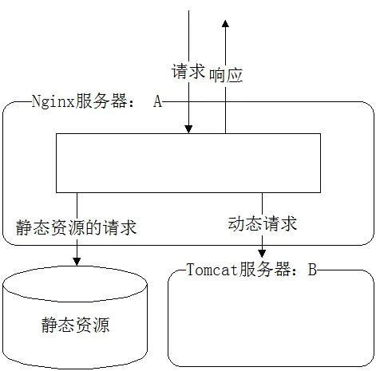
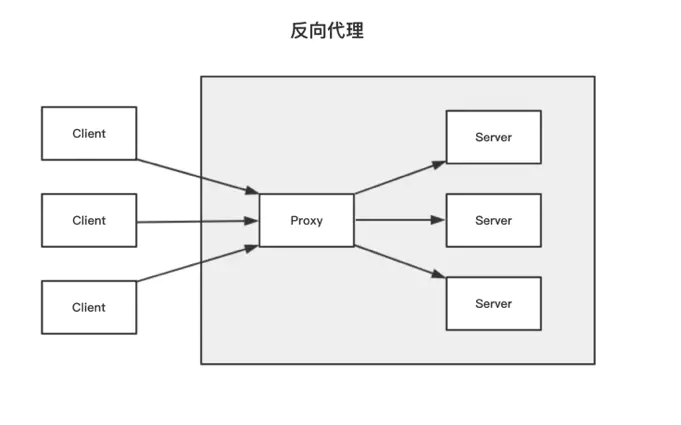
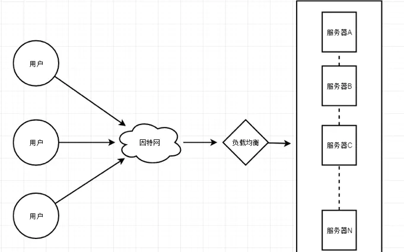
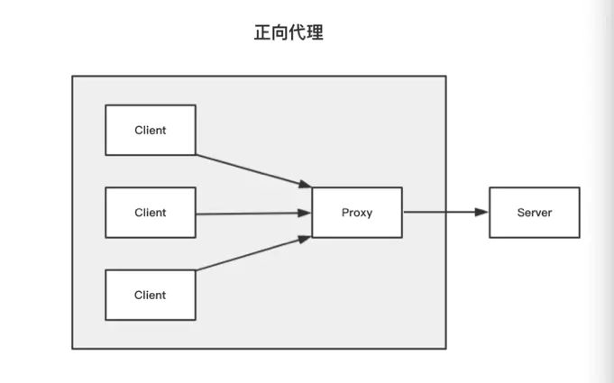

## Array.from

Array.from() 方法从一个类似数组或可迭代对象创建一个新的，浅拷贝的数组实例。

## 关于异步请求服务端不能重定向

https://blog.csdn.net/dongguabai/article/details/84328943

事情是这样的，有一天需要用 node 写一个中间件，去判断当前的用户是不是白名单中的用户，如果是 next()继续，如果不是让用户看到 404 的界面

```js
module.exports = () => async function checkWhitelist(ctx, next) {
    if (ctx.user在白名单) {
        await next()
    } else {
        ctx.redirect(404 url)
    }
}
```

大概的中间件代码这么写，但是运行的时候，客户端并没有按照服务端规定的那样，浏览器重定向到 404 界面。F12 看控制台，请求是报错的，然后返回的是一堆 html 代码。

因为 `ajax` 异步请求的原理是通过 `XmlHttpRequest` 对象来向服务器发异步请求，从服务器获得数据，然后用 `javascript` 来操作 DOM 而更新页面。

而 `response.sendRedirect` 是通过**浏览器**来做转向的，所以只有在页面处理完成后，才会有实际的动作。既然你已经要做转向了，那么后的输出还有什么意义呢？而且有可能会因为后面的输出导致转向失败。也就是说异步请求本来是拿数据的，你又要重定向，那根本就不需要数据返回了。而返回的数据是 Html 代码，其实是重定向的 url 的界面的 Html 代码

所以我们可以服务端返回错误码，然后客户端拿到之后做跳转

```js
//server
module.exports = () =>
  async function checkWhitelist(ctx, next) {
    if (ctx.user在白名单) {
      await next();
    } else {
      ctx.fail({
        code: REQUEST_ILLEGEAL,
      });
    }
  };
//client

//异步请求监听到报错之后
window.location.assign('/404');
```

## web history API

### popstate

当活动历史记录条目更改时，将触发 `popstate` 事件。如果被激活的历史记录条目是通过对 `history.pushState（）` 的调用创建的，或者受到对 `history.replaceState（）` 的调用的影响， `popstate` 事件的 `state` 属性包含历史条目的状态对象的副本。

需要注意的是调用 `history.pushState()` 或 `history.replaceState()` 不会触发 `popstate` 事件。**只有在做出浏览器动作时，才会触发该事件**，如用户点击浏览器的回退按钮（或者在 `Javascript` 代码中调用 `history.back()` 或者 `history.forward()` 方法）

不同的浏览器在加载页面时处理 popstate 事件的形式存在差异。页面加载时 Chrome 和 Safari 通常会触发(emit )popstate 事件，但 Firefox 则不会

## 相对路径，绝对路径和@

相对路径：相对这个项目哪个文件夹而言的路径

绝对路径：具体详细的路径

`'./'` 相当于当前文件夹

`'../'` 相对于当前文件夹的上一级目录

`'../../'` 同理是当前文件夹的上一级目录的上一级目录

而@来定义路径的方式：
以根目录的方式定义相对路径
vue 在 `webpack.base.conf.js` 文件中有如下配置

```js
// 连接路径并返回
function resolve(dir) {
  return path.join(__dirname, '..', dir);
}

module.exports = {
  resolve: {
    // 在导入语句没带文件后缀时，webpack会自动按照顺序添加后缀名查找
    extensions: ['.js', '.vue', '.json'],
    // 配置别名
    alias: {
      vue$: 'vue/dist/vue.esm.js',
      // 将项目根目录中，src的路径配置为别名@
      '@': resolve('src'),
    },
  },
};
```

```js
const path = require('path');
const fs = require('fs');
const rootPath = fs.realpathSync(process.cwd()) // 项目根目录
const resolve = relativePath => path.resolve(rootPath, relativePath)
const commonPath = resolve('app/web/common') // 公共目录
const projectPath = resolve('app/web/page/app') // 子项目根目录

module.exports = {
        'COMMON': commonPath,
        'XHR': path.resolve(commonPath, 'xhr'), // 公共xhr入口
        'ASSETS': path.resolve(commonPath, 'assets'), // 公共资源文件
        'COMPONENTS': path.resolve(commonPath, 'components'), // 公共组件库
        '@': projectPath, // 子项目根目录
        '@constant': path.resolve(projectPath, 'constant'), // 子项目常量
        '@layouts': path.resolve(projectPath, 'layouts'), // 子项目组件库
        '@models': path.resolve(projectPath, 'models'), // 子项目组件库
        '@router': path.resolve(projectPath, 'router'), // 子项目组件库
        '@components': path.resolve(projectPath, 'components'), // 子项目组件库
        ...
```

## element-ui 的 el-upload 覆盖 http-request 方法(主要利用那个：http-request 这个属性)

https://blog.csdn.net/m0_37893932/article/details/79237308

## node_modules 困境

https://juejin.cn/post/6914508615969669127

## 关于什么是 nginx,什么是反向代理，什么是负载均衡

https://juejin.cn/post/6844904129987526663

https://juejin.cn/post/6844904135951646733

> “Nginx 是一款轻量级的 HTTP 服务器，采用 **事件驱动** 的异步非阻塞处理方式框架，这让其具有极好的 IO 性能，(处理高并发)时常用于服务端的**反向代理**和**负载均衡**。”

Nginx 的作用：

1. 动静分离（动态请求和静态资源的请求分离）
   

静态请求直接从 nginx 服务器所设定的根目录路径去取对应的资源，动态请求转发给真实的后台（前面所说的应用服务器，如图中的 Tomcat）去处理。
这样做不仅能给应用服务器减轻压力，将后台 api 接口服务化，还能将前后端代码分开并行开发和部署。

```
server {
        listen       8080;
        server_name  localhost;

        location / {
            root   html; # Nginx默认值
            index  index.html index.htm;
        }

        # 静态化配置，所有静态请求都转发给 nginx 处理，存放目录为 my-project
        location ~ .*\.(html|htm|gif|jpg|jpeg|bmp|png|ico|js|css)$ {
            root /usr/local/var/www/my-project; # 静态请求所代理到的根目录
        }

        # 动态请求匹配到path为'node'的就转发到8002端口处理
        location /node/ {
            proxy_pass http://localhost:8002; # 充当服务代理
        }
}
```

2. 反向代理

反向代理的作用：

- 保障应用服务器的安全（增加一层代理，可以屏蔽危险攻击，更方便的控制权限）
- 实现负载均衡
- 实现跨域（号称是最简单的跨域方式）

配置反向代理

```
server {
        listen       8080;
        server_name  localhost;

        location / {
            root   html; # Nginx默认值
            index  index.html index.htm;
        }

        proxy_pass http://localhost:8000; # 反向代理配置，请求会被转发到8000端口
}

```

反向代理示意图：


### 如何理解反向代理呢？

讲一个场景，假如我们输入访问 `http://localhost:8080`,但是我们并不知道，我们是在 8080 端口拿资源，还是被代理到 8000 端口去拿资源。

左边的 3 个 client 在请求的时候向 nginx 获取内容，是感受不到三台 server 的存在的。这时候 proxy(nginx) 就充当了三个 server 的反向代理

3. 负载均衡

随着业务的不断增长和用户的不断增多，一台服务已经满足不了系统要求了。这个时候就出现了服务器 集群。

在服务器集群中，Nginx 可以将接收到的客户端请求“均匀地”（严格讲并不一定均匀，可以通过设置权重）分配到这个集群中所有的服务器上。这个就叫做负载均衡。



所以负载均衡的作用是，分摊服务器集群的压力，保证客户端访问的稳定性

配置负载均衡：

```
# 负载均衡：设置domain
upstream domain {
    server localhost:8000;
    server localhost:8001;
}
server {
        listen       8080;
        server_name  localhost;

        location / {
            # root   html; # Nginx默认值
            # index  index.html index.htm;

            proxy_pass http://domain; # 负载均衡配置，请求会被平均分配到8000和8001端口
            proxy_set_header Host $host:$server_port;
        }
}

```

4. 正向代理



正向代理跟反向代理刚好相反，刚才是客户端不知道我们拿资源的是哪台服务器或者端口，那正向代理就是客户端去哪个服务器或者端口拿资源，nginx 就去**对应的那个服务器或者端口**拿资源

科学上网 vpn（俗称翻墙）其实就是一个正向代理工具。

该 vpn 会将想访问墙外服务器 server 的网页请求，代理到一个可以访问该网站的代理服务器 proxy 上。这个 proxy 把墙外服务器 server 上获取的网页内容，再转发给客户。

代理服务器 proxy 就是 Nginx 搭建的。
