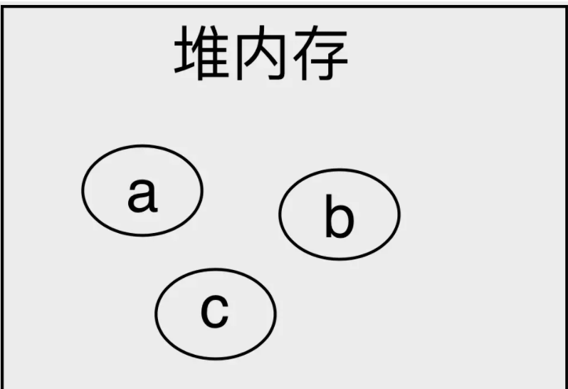
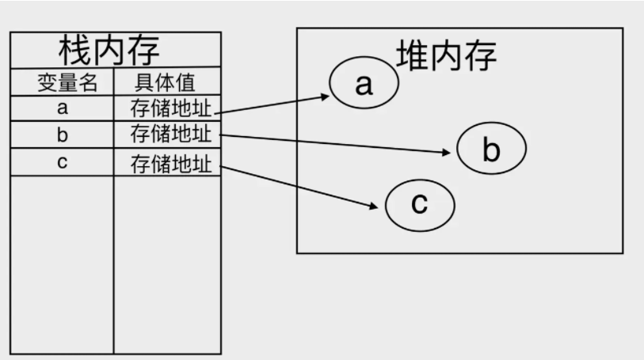

## http 强缓存和协商缓存

https://juejin.im/post/6847902216200650760

- 相同点：如果命中，都是从客户端缓存中加载资源，而不是从服务器加载资源数据
- 不同点： 强缓存不发请求到服务器，协商缓存会发请求到服务器

## 基本原理

- . 浏览器在加载资源时，根据请求头的 expires 和 cache-control 判断是否命中强缓存，是则直接从缓存读取资源，不会发请求到服务器`200 from cache`
- 如果没有命中强缓存，浏览器一定会发送一个请求到服务器，通过 last-modified 和 etag 验证资源是否命中协商缓存，如果命中，服务器会将这个请求返回，但是不会返回这个资源的数据，依然是从缓存中读取资源 `返回403`
- 如果前面两者都没有命中，直接从服务器加载资源 `返回200`

## map 和 forEach 的区别

map 函数有返回值，forEach 函数没有，而且 map 返回其原始数组的新数组，但是它们都确保了原始对象的不变性

```js
[1, 2, 3].map((d) => d + 1); // [2, 3, 4];
[1, 2, 3].forEach((d) => d + 1); // undefined;
```

如果更改数组内的值，forEach 不能确保数组的不变性。这个方法只有在你不接触里面的任何值时，才能保证不变性。

```js
[
  {
    a: 1,
    b: 2,
  },
  {
    a: 10,
    b: 20,
  },
].forEach((obj) => (obj.a += 1));
// [{a: 2, b: 2}, {a: 11, b: 21}]
// 数组已更改！这里obj.a+=1相当于给他重新赋值了,而且每个元素还是个对象
```

## 跨域

> 浏览器出于安全是支持同源策略的，协议，端口，域名不同称为跨域。一定要注意跨域是浏览器的限制，其实你用抓包工具抓取接口数据，是可以看到接口已经把数据返回回来了，只是浏览器的限制，你获取不到数据。用 postman 请求接口能够请求到数据。这些再次印证了跨域是浏览器的限制。

## jsonp 实现跨域时服务器端怎么处理数据

https://juejin.cn/post/6844904167262126087

前端 jsonp 发跨域请求配置

```html
<%@ page pageEncoding="utf-8" contentType="text/html;charset=UTF-8"
language="java" %>
<html>

<head>
    <title>跨域测试</title>
    <script src="js/jquery-1.7.2.js"></script>
    <script>
        //回调函数
        function showData(result) {
            var data = JSON.stringify(result); //json对象转成字符串
            $("#text").val(data);
        }

        $(document).ready(function() {
                    $("#btn").click(function() {
                                //向头部输入一个脚本，该脚本发起一个跨域请求
                                $("head").append(
                                        "<script src='http://localhost:9090/student?callback=showData'>
    </script>"
    );
    });
    });
    </script>
</head>

<body>
    <input id="btn" type="button" value="跨域获取数据" />
    <textarea id="text" style="width: 400px; height: 100px;"></textarea>
</body>

</html>
```

当点击"跨域获取数据"的按钮时，添加一个 `<script>` 标签，用于发起跨域请求；注意看请求地址后面带了一个 callback=showData 的参数；

showData 即是回调函数名称，传到后台，用于包裹数据。数据返回到前端后，就是 showData(result)的形式，因为是 script 脚本，所以自动调用 showData 函数，而 result 就是 showData 的参数。

至此，我们算是跨域把数据请求回来了，但是比较麻烦，需要自己写脚本发起请求，然后写个回调函数处理数据，不是很方便。

服务端做的对数据的处理

```java
protected void doGet(HttpServletRequest request, HttpServletResponse response) throws ServletException, IOException {
    response.setCharacterEncoding("UTF-8");
    response.setContentType("text/html;charset=UTF-8");

    //数据
    List<Student> studentList = getStudentList();

    JSONArray jsonArray = JSONArray.fromObject(studentList);
    String result = jsonArray.toString();

    //前端传过来的回调函数名称,
    //拿到query参数

    String callback = request.getParameter("callback");
    //用回调函数名称包裹返回数据，这样，返回数据就作为回调函数的参数传回去了
    //result其实是一个json字符串，然后前端执行对应的回调之后会进行序列化就行了
    result = callback + "(" + result + ")";

    response.getWriter().write(result);
}
```

## 具体原理

jsonp 的执行流程其实就是简单的两步。第一，在前端预先定义好一个带参数的回调函数用来接受后端传来的数据。第二，在后端启动一个 server 服务，将要传的数据以定义好了的回调函数名加上返回结果的方式传给前端。

```js
// 前端部分
<script>
    // 1 callback
    // 2 后端 callbackName(数据)
    function onResponse(posts) {
        console.log(posts);
    }
    // 前端没有调用
</script>
<!-- 后端返回结果 -->
<!-- 调用 -->
<script src="http://localhost:9090/api"></script>

//后端部分
const http = require('http');
http.createServer((req, res) => {
    if (req.url === '/api') {
        let posts = ['js', 'php'];
        res.end(`onResponse(${JSON.stringify(posts)})`);
    }
})
.listen(9090, () => {
    console.log(9090)
})


```

前端 script 中的 src 请求完毕以后，后端会给前端返回一个字符串 `onResponse(["js","php"])`，**因为 script 标签的原因，浏览器会把这一段字符串当做 js 来执行**。这样我们一开始在前端定义好了的回调就会执行，我们就拿到数据了。

### CORS 怎样才能实现仅浏览器跨域访问携带 cookie ?

都知道 CORS 可以让 ajax 实现 cookie 跨域，但是还需要在 ajax 中设置 xhr.`withCredentials=true`。

## https://blog.csdn.net/weixin_42098339/article/details/102830381

## css 的怪异盒与标准盒，他们是怎样切换的

```css
box-sizing:content-box //标准盒模型

box-sizing:border-box //IE盒子模型
```

怪异盒模型

```html
<!DOCTYPE html>
<html lang="en">
  <head>
    <meta charset="UTF-8" />
    <title>怪异盒模型</title>
  </head>
  <style>
    .main {
      border: 5px solid black;
      display: inline-block; //将元素显示为块级元素,效果更明显一点
      background-color: #53802a;
    }

    .box {
      box-sizing: border-box; //设置怪异盒模型
      display: inline-block; //将元素显示为块级元素,效果更明显一点
      width: 200px;
      height: 200px;
      border: 10px solid #000000;
      padding: 20px;
      margin: 20px;
      background-color: red;
    }
  </style>

  <body>
    <div class="main">
      <div class="box"></div>
    </div>
  </body>
</html>
```

效果显示:


> 总结一下：在怪异盒模型下
>
> 一个块的总宽度 = width = margin(左右) + padding(左右) + border(左右) +内容宽度(content）
>
> 一个块的总高度 = height = margin(上下) + padding(上下) + border(上下) +内容高度(content）

## js 的基本数据类型和引用类型有哪些，怎么判断

js 的基本数据类型: `Boolean, Number, String, null, undefined, symbol`

```js
var x = new Boolean(false); //声明的是一个对象,任何对象的boolean转换都是true,所以下面的if语句，会输出xxxxx

if (x) {
  console.log("xxxxx");
}

var y = Boolean(0); //这个没有new ,再试试进行单纯的类型转换，转换成false,所以下面的if语句不输出

if (y) {
  console.log("yyyyy");
}
```

准确地说，引用类型的存储需要内存的栈区和堆区（堆区是指内存里的堆内存）共同完成，栈区内存保存变量标识符和指向堆内存中该对象的指针，也可以说是**该对象在堆内存的地址**。
宽松来说，JavaScript 的引用数据类型只有对象

### 为什么基础数据类型是在栈内存里面，引用数据类型是在堆内存上的。

### 栈内存

栈是一种先进后出的数据结构，栈内存是内存中用于存放临时变量的一片内存块。当声明一个基本变量时，它就会被存储到栈内存中

```
	let a = 1;
	let b = "hello";
	let c = false;

```

而当其发生复制时，会把**对应内存中的数据复制一份到新内存**中，就像下面这样

```
	let d = c;

```

很显然，c，d 两个变量**占用了不同的存储空间**，所以他们之间也并没有什么联系，这也就解释了我们上文提到的第一条特点。同时，栈内存的地址分配是连续的，所以在后续也不能对其进行进一步的扩充或者删除，**这也就解释了我们为什么不能为基本类型添加属性或者删除属性**。所以，我们可以总结一下栈内存的特点:**存取速度快，但是不灵活，同时由于结构简单，在变量使用完成后就可以将其释放，内存回收容易实现**。

### 堆内存

堆内存的存储不同与栈，虽然他们都是内存中的一片空间，但是堆内存存储变量时没有什么规律可言。它只会用一块**足够大的空间**来存储变量，就像下面这样:因为一个对象可能很大，所以需要大内存的堆来存储

```
	let a = {};
	let b = {};
	let c = {};

```


   那么问题就来了，既然它毫无规律可言，我们如何去访问存储在堆内存中的变量？这时，我们需要用 **栈内存将堆内存中的地址存储起来** ，像这样:



这时候我们再执行`let d =c`,发生的事情跟上面栈内存就不一样了，我们的 d 地址指向的是 c 堆内存

## 判断数组，数组去重

判断数组的方法有：

- Object.prototype.toString.call(obj)

```js
let arr = [1, 2, 3];
console.log(Object.prototype.toString.call(arr)); //[object Array]
```

- instanceof

```js
let arr = [1, 2, 3];
console.log(arr instanceof Array); //true
```

- Array.isArray

```js
let arr = [1, 2, 3];
console.log(Array.isArray(arr)); //true
```

## JavaScript 字符转成 ASCII 字符

```js
str.charCodeAt();

"A".charCodeAt() - 64 == 1;
```

将 ascii 码转为对应字母的方法：

```js
var num = 97;
String.fromCharCode(num); // 'a'

var num1 = 100;
String.fromCharCode(num1); // 'd'
```

数组去重的方法有：

- set

```js
let arr = [1, 1, 2, 3];
console.log([...new Set(arr)]); //[1,2,3]
```

- object

```js
function unique(arr) {
  if (!Array.isArray(arr)) {
    console.log("type error!");
    return;
  }
  var res = [];
  var obj = {};
  for (let i = 0; i < arr.length; i++) {
    if (!obj[arr[i]]) {
      res.push(arr[i]);
      obj[arr[i]] = arr[i];
    } else {
      obj[arr[i]]++;
    }
  }
  return res;
}
```

- filter

```js
//把每个元素的索引等于它本身的筛选出来
arr.filter(function (item, index, arr) {
  return arr.indexOf(item, 0) === index;
});
```

find 函数比 filter 更高效

```js
return !!whitelist.find((item) => item.email === ctx.user.email);
```

原因：1 find 找到第一个符合条件的会提前退出循环，filter 需要遍历整个数组，find 性能更好
2 代码更简洁

- includes

```js
//利用的其实根，对象那个差不多，主要是变成数组的includes方法
function unique(arr) {
  if (!Array.isArray(arr)) {
    console.log("type error!");
    return;
  }
  var res = [];
  for (let i = 0; i < arr.length; i++) {
    if (!res.includes(arr[i])) {
      res.push(arr[i]);
    }
  }
  return res;
}
```

## JavaScript 黑科技

1. +号把所有类型转换成 Number

```js
+new Date() + "ABC";
```

2. !! 号把所有类型转换成 Boolean 类型

```
 return !!whitelist.find(item => item.email === ctx.user.email)//如果存在返回true，如果不存在返回false
```
