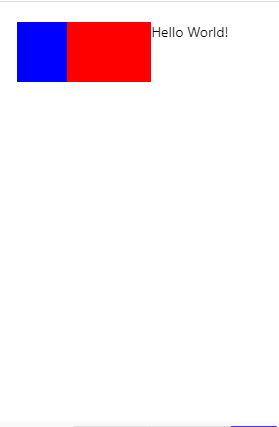
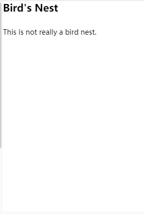
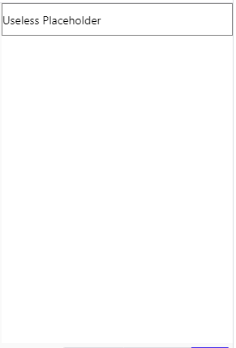

# React Native 基础组件学习

## View

> View 组件是构建 UI 的最基本的容器组件，它支持 flexbox、style、一些触摸处理和可访问性控件的布局。不论在什么平台上，View 都直接对应当前平台的原生视图，无论它是 UIView、div 还是 android.view.View。

```js
//style样式支持内联和stylesheet对象
import React from "react";
import { View, Text } from "react-native";

const ViewBoxesWithColorAndText = () => {
  return (
    <View
      style={{
        flexDirection: "row",
        height: 100,
        padding: 20,
      }}
    >
      <View style={{ backgroundColor: "blue", flex: 0.3 }} />
      <View style={{ backgroundColor: "red", flex: 0.5 }} />
      <Text>Hello World!</Text>
    </View>
  );
};

export default ViewBoxesWithColorAndText;
```



### style 属性

#### Flexbox

- flexDirection

- justifyContent

- alignItems

- alignContent

- flexWrap

http://liuwangshu.cn/rn/primer/4-flexbox.html

http://www.ruanyifeng.com/blog/2015/07/flex-grammar.html?utm_source=tuicool

#### shadow(仅 ios 平台能使用)

| 样式名        |              取值               |             说明 |
| ------------- | :-----------------------------: | ---------------: |
| shadowColor   |              color              |     设置阴影颜色 |
| shadowOffset  | {width: number, height: number} |   设置阴影位移值 |
| shadowOpacity |             number              |   设置阴影透明度 |
| shadowRadius  |             number              | 设置阴影模糊半径 |

#### elevation (Android) 原生效果远不如 shadow，所以一般采用第三方库`react-native-shadow`

elevation 取值为 number。Android 平台没有 shadow 来设置阴影，但是，可以用 elevation 属性来间接的设置阴影。它使用 Android 原生的 elevation API 来设置组件的高度，这样就会在界面上呈现出阴影的效果，此属性仅支持 Android 5.0 及以上版本。

```js
import React, { Component } from "react";
import { AppRegistry, StyleSheet, View } from "react-native";
class ViewApp extends Component {
  render() {
    return (
      <View
        style={{
          flex: 1,
          justifyContent: "center",
          alignItems: "center",
          backgroundColor: "white",
        }}
      >
        <View style={styles.shadow} />
      </View>
    );
  }
}
const styles = StyleSheet.create({
  shadow: {
    height: 120,
    width: 120,
    backgroundColor: "black",
    elevation: 20,
    shadowOffset: { width: 0, height: 0 },
    shadowColor: "black",
    shadowOpacity: 1,
    shadowRadius: 5,
  },
});
AppRegistry.registerComponent("ViewSample", () => ViewApp);
```

#### border

borderStyle 的取值为 enum(‘solid’, ‘dotted’, ‘dashed’)，用来设置边框的风格，三个值分别对应着实线边框、点状边框和虚线边框，默认值为 solid。

除了可以设置边框的风格，还可以用定义边框的颜色和边框的圆角。边框的颜色设置有 borderColor、borderTopColor 、borderRightColor 、borderBottomColor 、borderLeftColor，取值都为 string，通常情况下用 borderColor 就足够了。
边框的圆角设置有 borderRadius 、borderTopLeftRadius 、borderTopRightRadius 、borderBottomLeftRadius 、borderBottomRightRadius，取值为 number

#### transform

transform 的取值为：

```
[{perspective: number},
{rotate: string},
{rotateX: string},
{rotateY: string},
{rotateZ: string},
{scale: number},
{scaleX: number},
{scaleY: number},
{translateX: number},
{translateY: number},
{skewX: string},
{skewY: string}]
```

transform 的取值总的来说，共分为四种类型**：translate、scale、rotate 和 skew**，分别用来设置 View 组件的平移、缩放、旋转和倾斜。（大体上的取值跟 CSS transform 差别不大）

#### overflow (ios)

overflow 取值为 enum(‘visible’, ‘hidden’)。它用来定义当 View 组件的子组件的宽高超过 View 组件宽高时的行为，默认值为 hidden，即隐藏超出的部分。overflow 只在 iOS 平台有效，在 Android 平台即使设置 overflow 为 visible，呈现的还会是 hidden 的效果。

#### backgroundColor

backgroundColor 取值为 string。它用来设定背景颜色，默认的颜色为非常浅的灰色，只有 Text 和 TextInput 组件继承了父组件的背景颜色，其他的组件都要设置自己的背影颜色。

#### opacity

opacity 的取值为 0 到 1，当值为 0 时，表示组件完全透明，而值为 1 时，则表示组件完全不透明。

### props

#### 常见的属性和方法

| 名称               | 属性 or 方法 | 类型     | 说明                                                                                                                                                                                                   |
| ------------------ | ------------ | -------- | ------------------------------------------------------------------------------------------------------------------------------------------------------------------------------------------------------ |
| accessible         | 属性         | bool     | 当为 true 时，表示该元素是可以进行访问，默认情况下所有可触摸的元素控件都是可以访问的                                                                                                                   |
| onAccessibilityTap | 方法         | function | 该当 accessible 为 true 的时候并且用户对控件 View 做了一个 Tap(轻轻的触摸或者点击)的手势                                                                                                               |
| onLayout           | 方法         | function | 当组件的布局发生变动的时候，会自动调用下面的方法:{nativeEvent: { layout: {x, y, width, height}}}。该事件当重新计算布局的时候会立即进行触发，不过界面可能不会立即刷新，特别当布局动画正在加载中的时候。 |
| onMagicTap         | 方法         | function | 当 accessible 为 true 的时候，当用户双指点击(Magic Tap)的时候，进行触发                                                                                                                                |

#### 触摸事件回调函数

触摸事件回调函数用来处理用户的触摸屏幕操作，一般情况下，触摸事件都是在其他组件中完成的。关于触摸事件是一个比较大的知识点，这里只介绍这些触摸事件回调函数的作用。

onStartShouldSetResponder： 触摸事件为 touchDown 时，是否申请成为事件响应者，接收触摸事件。如果返回 true，则表示组件需要成为事件响应者。

onStartShouldSetResponderCapture：触摸事件为 touchDown 时，是否要拦截此事件，阻止子组件接收该事件，如果返回 true，则表示要进行拦截。

onMoveShouldSetResponder ： 触摸事件为 TouchMove 时，是否申请成为事件响应者，接收触摸事件。如果返回 true，则表示组件需要成为事件响应者。

onMoveShouldSetResponderCapture ：触摸事件为 TouchMove 时，是否要拦截此事件，阻止子组件接收该事件。
onResponderGrant： 申请成为事件响应者成功，组件开始接收触摸事件 。

onResponderReject： 申请成为事件响应者失败，其他组件正在进行事件处理 。

onResponderMove：触摸手指移动的事件（TouchMove）。
onResponderTerminationRequest：在组件成为事件响应者期间，其他组件申请成为响应者，返回为 true，则表示同意释放响应者角色。

onResponderTerminate：如果组件释放响应者角色，会回调该函数，通知组件事件响应处理被终止了。这个回调也会发生在系统直接终止组件的事件处理，例如用户在触摸操作过程中，突然来电话的情况。

onResponderRelease：表示触摸完成（touchUp）的时候的回调，表示用户完成了本次的触摸交互。

#### pointerEvents

pointerEvents 的取值为 enum(‘box-none’, ‘none’, ‘box-only’, ‘auto’) 。它用来控制当前视图是否可以作为触控事件的目标。

在开发中，很多组件是被布局到手机界面上的，其中一些组件会遮盖住它的位置下方的组件，有一些场景需要被遮盖住的组件来处理事件。比如一个地图组件上覆盖了一个图像组件用来显示信息，但是我们不想这个图像组件影响用户的手指拖动地图的操作，这时就可以使用图像组件从 View 组件继承得到的 pointerEvents 属性来解决这个问题。

pointerEvents 的取值含义如下所示：

none：组件自身不能作为触控事件的目标，交由父组件处理。
box-none：组件自身不能作为触控事件的目标，但其子组件可以。

box-only：组件自身可以作为触控事件的目标，但其子组件不能。

auto：组件可以作为触控事件的目标。

#### removeClippedSubviews

removeClippedSubviews 的取值为 bool。它的一个特殊的与性能优化相关的属性，通常在 ListView 和 ScrollView 中使用，当组件有很多子组件不在屏幕显示范围时，可以将 removeClippedSubviews 设置为 true，允许释放不在显示范围子组件，从而优化了性能。需要注意的是，要想让此属性生效，要确保 overflow 属性为默认的 hidden。

#### 动画相关

needsOffscreenAlphaCompositing (Android)
needsOffscreenAlphaCompositing 的取值为 bool，是 Android 平台独有的属性。它用来决定视图是否要先离屏渲染再进行半透明度处理，来确保颜色和混合效果正确。为了正确的显示透明表现而进行离屏渲染会带来极大的开销，对于非原生开发者来说很难调试，因此，它的默认值为 false。

renderToHardwareTextureAndroid (Android)
renderToHardwareTextureAndroid 的取值为 bool，同样是是 Android 平台独有的属性。它用来决定视图是否要把它本身（以及所有的子视图）渲染到一个 GPU 上的硬件纹理中。
在 Android 平台上，这对于只修改透明度、旋转、位移和缩放的动画和交互是很有用的：视图不必每次都重新绘制，显示列表也不需要重新执行，纹理可以被重用于不同的参数。负面作用是这会大量消耗显存，所以当交互/动画结束后应该把此属性设置回 false。

shouldRasterizeIOS (iOS)
shouldRasterizeIOS 的取值为 bool，是 iOS 平台独有的属性。它决定视图是否需要在被混合之前绘制到一个位图上。
这对于动画和交互来说是有很有用的，它不会修改这个组件的尺寸和它的子组件。举例来说，当我们移动一个静态视图的位置的时候，栅格化允许渲染器重用静态视图的缓存位图，并快速合成。

栅格化会导致离屏的绘图传递，位图会消耗内存。所以使用此属性需要进行充分的测试和评估。

## Text

> 一个展示文本的 react component，支持**嵌套，样式和事件绑定**

```js
import React, { useState } from "react";
import { Text, StyleSheet } from "react-native";

const TextInANest = () => {
  const [titleText, setTitleText] = useState("Bird's Nest");
  const bodyText = useState("This is not really a bird nest.");

  const onPressTitle = () => {
    setTitleText("Bird's Nest [pressed]");
  };

  return (
    <Text style={styles.baseText}>
      <Text style={styles.titleText} onPress={onPressTitle}>
        {titleText}
        {"\n"}
        {"\n"}
      </Text>
      <Text numberOfLines={5}>{bodyText}</Text>
    </Text>
  );
};

const styles = StyleSheet.create({
  baseText: {
    fontFamily: "Cochin",
  },
  titleText: {
    fontSize: 20,
    fontWeight: "bold",
  },
});

export default TextInANest;
```



### 关于 style 属性

跟文字相关的属性，大致是大小，颜色，位置，字体样式。这些跟我们 css 上文字的样式都差不多。详情见：https://www.react-native.cn/docs/text-style-props#letterspacing

### 样式继承限制

在 Web 上，要想指定整个文档的字体和大小，我们只需要写：

```css
/* 这段代码是CSS, *不是*React Native */
html {
  font-family: "lucida grande", tahoma, verdana, arial, sans-serif;
  font-size: 11px;
  color: #141823;
}
```

当浏览器尝试渲染一个文本节点的时候，它会在树中一路向上查询，直到根节点，来找到一个具备 font-size 属性的元素。这个系统一个不好的地方在于任何节点都可能会有 font-size 属性，包括`<div>`标签。这个设计为了方便而设计，但实际上语义上并不太正确。

在 React Native 中，我们把这个问题设计的更加严谨：你必须把你的文本节点放在`<Text>`组件内。你不能直接在`<View>`下放置一段文本。

```
// BAD: will raise exception, can't have a text node as child of a <View>
<View>
  Some text
</View>

// GOOD
<View>
  <Text>
    Some text
  </Text>
</View>
```

而且在 react native 里面，你也不能直接设置一整颗子树的默认样式。也就是你在父元素设置了 font-size，你的子元素并不会继承你的 font-size。但是为了实现这种能够使用一个一致的文本和尺寸的推荐方式就是：创建一个包含相关样式的组件 `MyAppText` ,然后在你的 App 中反复使用它。你还可以创建更多特殊的组件譬如`MyAppHeaderText`来表达不同样式的文本。

```
<View>
  <MyAppText>
    这个组件包含了一个默认的字体样式，用于整个应用的文本
  </MyAppText>
  <MyAppHeaderText>这个组件包含了用于标题的样式</MyAppHeaderText>
</View>
```

```
class MyAppHeaderText extends Component {
  render() {
    return (
      <MyAppText>
        <Text style={{ fontSize: 20 }}>
          {this.props.children}
        </Text>
      </MyAppText>
    );
  }
}
```

React Native 实际上还是有一部分样式继承的实现，不过仅限于文本标签的子树。在下面的代码里，第二部分会在加粗的同时又显示为红色：

```
<Text style={{ fontWeight: 'bold' }}>
  I am bold
  <Text style={{ color: 'red' }}>and red</Text>
</Text>
```

### props

#### onPress

当文本被点击以后调用此回调函数。

例如：onPress={() => console.log('1st')}

#### onLongPress

当文本被长按以后调用此回调函数。

例如：onLongPress={this.increaseSize}>

#### ellipsizeMode

这个属性通常和下面的 `numberOfLines` 属性配合使用，表示当 `Text` 组件无法全部显示需要显示的字符串时如何用省略号进行修饰。

- head - 从文本内容头部截取显示省略号。例如： "...efg"
- middle - 在文本内容中间截取显示省略号。例如： "ab...yz"
- tail - 从文本内容尾部截取显示省略号。例如： "abcd..."
- clip - 不显示省略号，直接从尾部截断。

#### numberOfLines type:number

用来当文本过长的时候裁剪文本。包括折叠产生的换行在内，总的行数不会超过这个属性的限制。

此属性一般和`ellipsizeMode`搭配使用。

## TextInput

> TextInput 是一个允许用户在应用中通过键盘输入文本的基本组件。本组件的属性提供了多种特性的配置，譬如自动完成、自动大小写、占位文字，以及多种不同的键盘类型（如纯数字键盘）等等。

最简单的用法就是丢一个 `TextInput` 到应用里，然后订阅它的 onChangeText 事件来读取用户的输入。注意，从 `TextInput` 里取值这就是目前唯一的做法！也就是使用在 `onChangeText` 中用 `setState` 把用户的输入写入到 `state` 中，然后在需要取值的地方从 `this.state` 中取出值。它还有一些其它的事件，譬如 `onSubmitEditing` 和 `onFocus`。一个简单的例子如下：

```js
import React, { Component } from "react";
import { TextInput } from "react-native";

const UselessTextInput = () => {
  const [value, onChangeText] = React.useState("Useless Placeholder");

  return (
    <TextInput
      style={{ height: 40, borderColor: "gray", borderWidth: 1 }}
      onChangeText={(text) => onChangeText(text)}
      value={value}
    />
  );
};

export default UselessTextInput;
```



### props

- inlineImageLeft (Android)
  指定一个图片放置在左侧。图片必须放置在/android/app/src/main/res/drawable 目录下，经过编译后按如下形式引用（无路径无后缀）：

```
<TextInput
 inlineImageLeft='search_icon'
/>
```

- inlineImagePadding (Android) type:number
  给放置在左侧的图片设置 padding 样式

- keyboardType (html input 可以控制 type，这边的 textinput 只能是文本输入框，但是可以控制弹出的软件键盘的类型) 譬如 numeric（纯数字键盘）

全平台可用的：default, number-pad, decimal-pad, numeric, email-address, phone-pad

iOS： ascii-capable, numbers-and-punctuation, url,name-phone-pad,twitter, web-search

android: visible-password

- returnKeyType
  决定“确定”按钮显示的内容。在 Android 上你还可以使用 returnKeyLabel。

### 常见的事件

- onChange

当文本框内容变化时调用此回调函数。回调参数为{ nativeEvent: { eventCount, target, text} }。

- onChangeText

当文本框内容变化时调用此回调函数。改变后的文字内容会作为参数传递。

- onFocus
  文本框获得焦点的时候调用这个函数

- onEndEditing
  当文本结束输入之后调用此回调函数

## Image

> 用于显示多种不同类型图片的 React 组件，包括网络图片、静态资源、临时的本地图片、以及本地磁盘上的图片（如相册）等。**image 组件的默认大小是 0，需要我们给他添加 width height 才会显示图片**

```js
import React from "react";
import { View, Image, StyleSheet } from "react-native";

const styles = StyleSheet.create({
  container: {
    paddingTop: 50,
  },
  tinyLogo: {
    width: 50,
    height: 50,
  },
  logo: {
    width: 66,
    height: 58,
  },
});

const DisplayAnImage = () => {
  return (
    <View style={styles.container}>
      //local static needs require
      <Image
        style={styles.tinyLogo}
        source={require("@expo/snack-static/react-native-logo.png")}
      />
      //http
      <Image
        style={styles.tinyLogo}
        source={{
          uri: "https://reactnative.dev/img/tiny_logo.png",
        }}
      />
      // base64
      <Image
        style={styles.logo}
        source={{
          uri: "data:image/png;base64,iVBORw0KGgoAAAANSUhEUgAAADMAAAAzCAYAAAA6oTAqAAAAEXRFWHRTb2Z0d2FyZQBwbmdjcnVzaEB1SfMAAABQSURBVGje7dSxCQBACARB+2/ab8BEeQNhFi6WSYzYLYudDQYGBgYGBgYGBgYGBgYGBgZmcvDqYGBgmhivGQYGBgYGBgYGBgYGBgYGBgbmQw+P/eMrC5UTVAAAAABJRU5ErkJggg==",
        }}
      />
    </View>
  );
};

export default DisplayAnImage;
```

### props

#### source

图片的引用地址，其值为` {uri:string}`。如果是一个本地的静态资源，那么需要使用 require('string') 包裹

目前原生支持的图片格式有 png、jpg、jpeg、bmp、gif、webp、psd (仅 iOS)。

默认情况下 `Android` 是不支持 `GIF` 和 `WebP` 格式的。你需要在`android/app/build.gradle`文件中根据需要手动添加以下模块：

```
dependencies {
  // 如果你需要支持Android4.0(API level 14)之前的版本
  implementation 'com.facebook.fresco:animated-base-support:1.3.0'

  // 如果你需要支持GIF动图
  implementation 'com.facebook.fresco:animated-gif:2.0.0'

  // 如果你需要支持WebP格式，包括WebP动图
  implementation 'com.facebook.fresco:animated-webp:2.1.0'
  implementation 'com.facebook.fresco:webpsupport:2.0.0'

  // 如果只需要支持WebP格式而不需要动图
  implementation 'com.facebook.fresco:webpsupport:2.0.0'
}
```

#### cache

React Native 框架支持对网络图片的缓存，如果图片缓存到本地，以后一直使用这个缓存，不管服务器侧该文件是否发生改变。

```
<Image style={styles.image} source={{
   uri:  'http://hangge.com/img.png' ,
   cache:  'force-cache' }} />
```

- default：使用平台默认策略
- reload：数据将从原始地址加载，不使用现有的缓存数据。
- force-cache：总是使用缓存数据，如果没有缓存，则从原始地址加载。
- only-if-cached：总是使用缓存数据，如果没有缓存，则失败。

#### resizeMode

| 类型                                                    | 默认值  |
| ------------------------------------------------------- | ------- |
| enum('cover', 'contain', 'stretch', 'repeat', 'center') | 'cover' |

#### defaultSource (ios)

表示图片未加载完成时，使用的默认图片地址。（仅 iOS 支持）(android debug 不生效，但是 release 版本生效)

#### 图片加载回调

| 事件        | 作用                                   |
| ----------- | -------------------------------------- |
| onLoadStart | 加载开始时触发该事件                   |
| onProgress  | 加载过程的进度事件。                   |
| onLoad      | 加载成功时触发该事件。                 |
| onLoadEnd   | 不管是加载成功还是失败，都会触发该事件 |

### 方法

#### prefetch()

```
Image.prefetch(url);
```

预加载一个远程图片(将其下载到本地磁盘缓存)。

#### queryCache()

```
Image.queryCache(urls);//urls type:array
```

查询图片缓存状态。根据图片 URL 地址返回缓存状态，比如"disk"（缓存在磁盘文件中）或是"memory"（缓存在内存中）。

#### getSize()

```
Image.getSize(uri, success, [failure]);
```

在**显示图片前获取图片的宽高**(以像素为单位)。如果图片地址不正确或下载失败,此方法也会失败。(因为 react native 需要设置号图片的宽高才能显示，这个函数可以提前拿到图片的宽高)

要获取图片的尺寸,首先需要加载或下载图片(同时会被缓存起来)。这意味着理论上你可以用这个方法来预加载图片，虽然此方法并没有针对这一用法进行优化，而且将来可能会换一些实现方案使得并不需要完整下载图片即可获取尺寸。所以更好的预加载方案是使用下面那个专门的预加载方法。


## 关于flex

React Native 的flex 布局大体上跟浏览器的差不多，可能有区别的是，浏览器上，主轴是x轴，在RN上，主轴是Y轴。所以在RN这里，屏幕垂直居中需要的属性是 `justify-content:center;`
## react native 透明度

react native 不能直接在父元素设置 opacity，这会让子元素同样也受到 opacity 的影响而透明

一般是在 background color 设置对应的 opacity 值。例如 `rgba(207, 207, 207, 0.54)`，或者 `'#CFCFCF54'`
