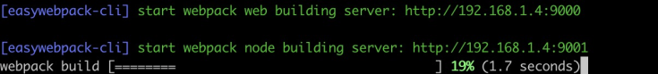
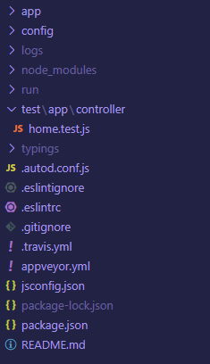
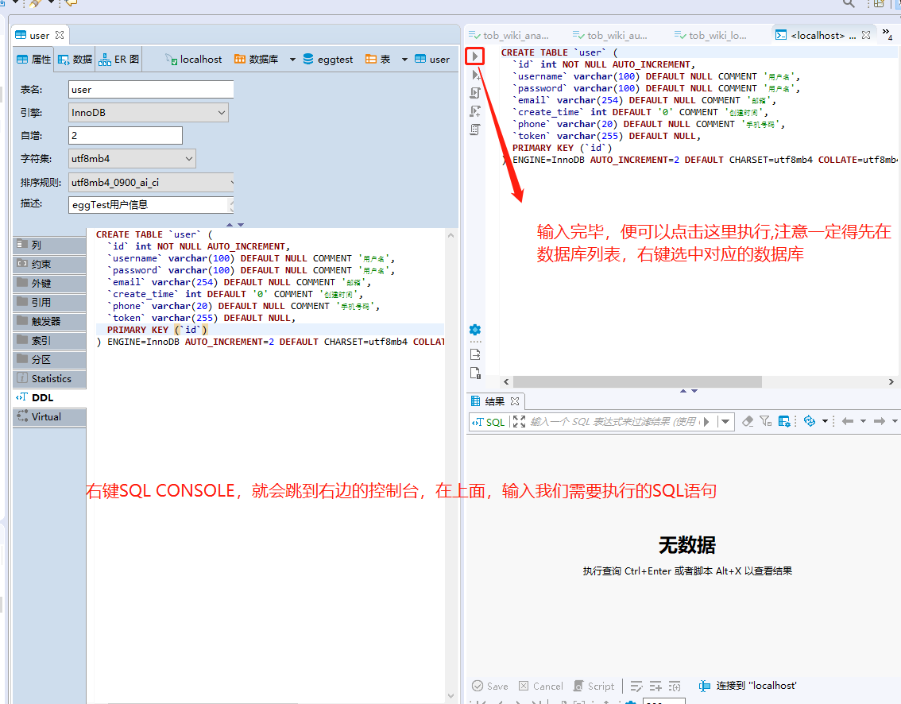

# egg.js+vue 实战项目

## 前言

最近实习，组内用的技术栈并不是纯 H5 前端开发，还涉及到 node 后台，其中后台用的框架是 `egg.js` 这是阿里的一个 node 后台框架，框架的成熟性已经像官方文档说的，得到了双十一、双十二的考验。所以技术已经算是相对比较稳定和成熟了。

需要的一些前期准备：

1. node 相关知识的了解
2. [egg.js](https://eggjs.org/zh-cn/intro/quickstart.html)
3. [sequelize](https://www.sequelize.com.cn/)
4. 数据库的，后端的一些概念
5. vue 框架

## 项目开始

### server 端, client 端

server 主要使用 `Egg.js` 、 `mysql`

client 主要使用 `vue`

### Egg Vue SSR Webpack 如何构建, 与普通 Webpack 构建有何区别？

Vue 服务端渲染构建是需要构建两份 JSBundle 文件。SSR 模式开发时，SSR 运行需要 Webapck 单独构建 target: node 和 target: web 的 JSBundle，主要的差异在于 Webpack 需要处理 require 机制以及磨平 Node 和浏览器运行环境的差异。服务端的 JSBundle 用来生产 HTML，客户端的 JSBundle 需要 script 到文档，用来进行事件绑定等操作，也就是 Vue 的 hydrate 机制。



### Webpack 本地开发构建文件是放到内存中，SSR 如何读取文件进行渲染？

在进行 Egg + Vue 进行 SSR 模式开发时，运行 npm run dev 后你会看到如下界面， 启动了两个 Webpack 构建实例：Node 模式 和 Web 模式。具体实现见 [egg-webpack 代码实现](https://github.com/easy-team/egg-webpack)。

- 本地开发启动 Webpack 构建, 默认配置文件为项目根目录 webpack.config.js 文件。 SSR 需要配置两份 Webpack 配置，所以构建会同时启动两个 Webpack 构建服务。web 表示构建 JSBundle 给前端用，构建后文件目录 public, 默认端口 9000; node 表示构建 JSBundle 给服务端用，构建后文件目录 app/view, 默认端口 9001.
- **本地构建是 Webpack 内存构建，文件不落地磁盘**，所以 `app/view` 和 `public` 在本地开发时，是看不到文件的。 只有发布模式(`npm run build`)才能在这两个目录中看到构建后的内容。

### 初始化

```

mkdir egg-example && cd egg-example
npm i egg-init -g
egg-init
```

- 选择`Simple egg app boilerplate project`初始化 egg 项目
- 新建 `${app_root}/app/view` 目录(`egg view`规范目录)，并添加`.gitkeep`文件，保证该空目录被 git 提交到仓库
- 新建 `${app_root}/app/view/layout.html` 文件，用于服务端渲染失败后，采用客户端渲染
  此时项目的目录结构如下：



### 安装相关的依赖

- 服务端渲染依赖

vue 没有内置在 egg-view-vue-ssr 里面，项目需要显式安装依赖

```
npm i vue vuex axios egg-view-vue-ssr egg-scripts egg-router-plus --save

```

- 构建开发依赖

```
npm i egg-bin cross-env easywebpack-cli easywebpack-vue egg-webpack egg-webpack-vue --save-dev
```

```
npm i vue-template-compiler --save-dev
```

### 区分开发、测试、生产环境

在正常的项目开发都需要进行环境区分，常常分成： `local` 开发环境， `test` 测试环境还有 `prod` 生产环境

在 `package.json` 文件下新增这几个 `scripts` ：

```json
  "scripts": {
    "server:local": "cross-env EGG_SERVER_ENV=local egg-bin debug",
    "server:test": "cross-env EGG_SERVER_ENV=test egg-bin debug",
    "server:prod": "cross-env EGG_SERVER_ENV=prod egg-bin debug",
    "start:dev": "cross-env EGG_SERVER_ENV=dev egg-scripts start --daemon --title=egg-server-wx-admin ",
    "start:test": "cross-env EGG_SERVER_ENV=test egg-scripts start --daemon --title=egg-server-wx-admin ",
    "start:prod": "egg-scripts start --daemon --title=egg-server-wx-admin ",
    "stop": "egg-scripts stop --title=egg-server-wx-admin "
  },

```

使用 `cross-env` ，主要是在 `winodw` 和 `mac` 系统下可以区分环境变量 `EGG_SERVER_ENV` 。

使用 `EGG_SERVER_ENV` 需要注意个问题， `EGG_SERVER_ENV=local` 时(默认 `local` )，热更新才可以使用，设置为其他的参数热更新会失效。

在 `config` 目录下新增对应环境的 `config` ， `config.default.js` 的配置是默认的，对应环境的 `config` 会覆盖 `config.default` 的配置

- 添加 `${app_root}/config/config.default.js` 配置

(默认配置的开发环境配置的例子)

```js
/* eslint valid-jsdoc: "off" */

'use strict';
const fs = require('fs');
const path = require('path');

/**
 * @param {Egg.EggAppInfo} appInfo app info
 */
module.exports = (appInfo) => {
  /**
   * built-in config
   * @type {Egg.EggAppConfig}
   **/
  const config = (exports = {});

  // use for cookie sign key, should change to your own and keep security
  config.keys = appInfo.name + '_1608725246223_8546';

  // add your middleware config here
  //全局配置的middleware,也就是每次router映射到相应的controller都会经过的middleware
  config.middleware = [];

  // add your user config here
  const userConfig = {
    // myAppName: 'egg',
  };
  // config.mysql = {
  //   // 单数据库信息配置
  //    //直接在model文件夹下面写相应的表就行了
  //   client: {
  //     // host
  //     host: 'localhost',
  //     // 端口号
  //     port: '3306',
  //     // 用户名
  //     user: 'root',
  //     // 密码
  //     password: 'myshard',
  //     // 数据库名
  //     database: 'eggTest',
  //   },
  //   // 是否加载到 app 上，默认开启
  //   app: true,
  //   // 是否加载到 agent 上，默认关闭
  //   agent: false,
  // };

  config.sequelize = {
    dialectOptions: {
      connectTimeout: 60000,
      requestTimeout: 999999,
    },
    datasources: [
      //多数据库配置
      {
        delegate: 'dbEggTest', // load all models to app.adminModel and ctx.adminModel
        baseDir: 'model/dbEggTest', // load models from `app/admin_model/*.js`
        dialect: 'mysql',
        database: 'eggTest',
        host: 'localhost',
        port: 3306,
        username: 'root',
        password: 'myshard',
        dbtype: 'myshard',
        define: {
          timestamps: false,
          freezeTableName: true,
        },
      },
    ],
  };

  // 跨域配置
  // config.cors = {
  //   origin: ['*'],
  //   allowMethods: 'GET,HEAD,PUT,POST,DELETE,PATCH,OPTIONS',
  //   credentials: true,
  // };
  config.vuessr = {
    layout: path.join(appInfo.baseDir, 'app/web/view/layout.html'),
    renderOptions: {
      basedir: path.join(appInfo.baseDir, 'app/view'),
    },
    afterRender(html) {
      return html.replace(/__BASE_URL__/g, '');
    },
  };
  config.security = {
    // csrf: false,
    csrf: {
      enable: false, // 前后端分离，post请求不方便携带_csrf
      ignoreJSON: true,
      headerName: 'authorization',
    },
    methodnoallow: {
      enable: false,
    },
  };
  return {
    ...config,
    ...userConfig,
  };
};
```

- 测试环境配置 ( `config.test.js` )默认配置相同的部分，会被测试环境配置文件覆盖

```js
'use strict'
module.exports = () => {
 const config = (exports = {})
 ...
}
```

- 添加`${app_root}/config/plugin.local.js` 配置

```js
exports.webpack = {
  enable: true,
  package: 'egg-webpack',
};

exports.webpackvue = {
  enable: true,
  package: 'egg-webpack-vue',
};
```

- 添加 `${app_root}/config/plugin.js` 配置

```js
'use strict';

/** @type Egg.EggPlugin */
'use strict';

exports.validate = {
  enable: true,
  package: 'egg-validate',
};
// 跨域
exports.cors = {
  enable: true,
  package: 'egg-cors',
};
// mysql

// 上传
exports.multipart = {
  enable: true,
};
//打开服务端ssr
exports.vuessr = {
  enable: true,
  package: 'egg-view-vue-ssr',
};
exports.sequelize = {
  enable: true,
  package: 'egg-sequelize',
};
//使用router.namespace的插件，方便路由管理
exports.routerPlus = {
  enable: true,
  package: 'egg-router-plus',
};
```

- 添加` ${app_root}/.babelrc` 文件

```
{
  "presets": [["env",{ "modules": false }]],
  "plugins": [
    "transform-object-rest-spread",
    "syntax-dynamic-import",
    "transform-object-assign"
  ],
  "comments": false
}
```

安装 babel 相关依赖

```
npm i babel-core@6  babel-loader@7  --save-dev
```

```
npm i babel-preset-env babel-plugin-syntax-dynamic-import babel-plugin-transform-object-assign babel-plugin-transform-object-rest-spread --save-dev
```

- 添加`${app_root}/postcss.config.js` 文件

```js
module.exports = {
  plugins: [require('autoprefixer')],
};
```

- 安装 autoprefixer 依赖

```
npm i autoprefixer  --save-dev
```

- 添加`${app_root}/.gitignore` 配置

```
.DS_Store
.happypack/
node_modules/
npm-debug.log
.idea/
dist
static
public
private
run
*.iml
*tmp
_site
logs
.vscode
config/manifest.json
app/view/*
!app/view/layout.html
!app/view/.gitkeep
package-lock.json
```

### webpack 配置

- yuque 官网配置

```js
module.exports = {
  egg: true,
  framework: 'vue', // 使用 easywebpack-vue 构建解决方案
  entry: {
    'home/index': 'app/web/page/home/index.js',
  },
};
```

- 我的配置

```js
/**
 * 文档链接：https://www.yuque.com/easy-team/easywebpack/build
 */
const alias = require('./webpack/alias');

module.exports = {
  egg: true,
  framework: 'vue',
  resolve: {
    alias,
  },
  entry: {
    app: 'app/web/page/app/index.js',
  },
  devtool: 'source-map',
  deploy: {
    installNode: false,
    installDeps: false,
    nodejs: false, // 是否把 node 打进 node_modules, 默认 false
    filename: 'dist',
    source: [
      'app',
      'config',
      'public',
      'app.js',
      'favicon.ico',
      'package.json',
    ],
    target: './',
    done: async function (filepath) {
      console.log('>>filepath', filepath);
    },
  },
};
```

### 前端代码

#### yuque 官网上面的配置如下：

- 编写 vue 服务端公共入口 `${app_root}/app/web/framework/vue/entry/server.js`

```js
import Vue from 'vue';
export default function render(options) {
  if (options.store && options.router) {
    return (context) => {
      options.router.push(context.state.url);
      const matchedComponents = options.router.getMatchedComponents();
      if (!matchedComponents) {
        return Promise.reject({ code: '404' });
      }
      return Promise.all(
        matchedComponents.map((component) => {
          if (component.preFetch) {
            return component.preFetch(options.store);
          }
          return null;
        })
      ).then(() => {
        context.state = options.store.state;
        return new Vue(options);
      });
    };
  }
  return (context) => {
    const VueApp = Vue.extend(options);
    const app = new VueApp({ data: context.state });
    return new Promise((resolve) => {
      resolve(app);
    });
  };
}
```

- 编写 vue 客户端公共入口 `${app_root}/app/web/framework/vue/entry/client.js`

```js
import Vue from 'vue';
export default function (options) {
  Vue.prototype.$http = require('axios');
  if (options.store) {
    options.store.replaceState(window.__INITIAL_STATE__ || {});
  } else if (window.__INITIAL_STATE__) {
    options.data = Object.assign(
      window.__INITIAL_STATE__,
      options.data && options.data()
    );
  }
  const app = new Vue(options);
  app.$mount('#app');
}
```

- 新建`${app_root}/app/web/page/home/home.js`页面文件

```js
import Home from './home.vue';
import serverRender from '~/app/web/framework/vue/entry/server.js';
import clientRender from '~/app/web/framework/vue/entry/client.js';
export default EASY_ENV_IS_NODE
  ? serverRender({ ...Home })
  : clientRender({ ...Home });
```

#### 我的项目入口配置方式

但是我们的项目是前端渲染，而且是前端项目和后端项目在同一个项目下，所以我们还是采取一种我们熟悉 vue 的入口文件方式,这种方式固定了客户端渲染:

我们新建 `${app_root}/app/web/page/index.js`

```js
import Vue from 'vue';
import store from '@store';
import '@assets/css/global.css';
import 'element-ui/lib/theme-chalk/index.css';
import router from '@router';
import App from './App.vue';
import ElementUI from 'element-ui';
Vue.use(ElementUI);

const clientRender = () => {
  new Vue({
    el: '#app',
    store,
    router,
    render: (h) => h(App),
  });
};

export default clientRender();
```

然后修改`webpack.config.js`的`entry`

```js
...
  entry: {
    app: "app/web/page/app/index.js",
  },

```

### Node 端代码

通过 `egg-view-vue-ssr` 插件 `render` 方法实现

```js
module.exports = (app) => {
  return class HomeController extends app.Controller {
    async server() {
      const { ctx } = this;
      // home/index.js 对应 webpack entry 的 home/index, 构建后文件存在 app/view 目录
      await ctx.render('home/index.js', {
        message: 'egg vue server side render',
      });
    }

    async client() {
      const { ctx } = this;
      // renderClient 前端渲染，Node层只做 layout.html和资源依赖组装，渲染交给前端渲染。与服务端渲染的差别你可以通过查看运行后页面源代码即可明白两者之间的差异
      await ctx.renderClient('home/index.js', {
        message: 'egg vue client render render',
      });
    }
  };
};
```

我的项目的配置，对应的 node 端配置(详细参考文末 github 项目地址)

```js
//${app}/controller/index.js
'use strict';

const Controller = require('egg').Controller;
const path = require('path');
class AppController extends Controller {
  async render(ctx) {
    //客户端渲染
    const { app } = this;
    const { mode = 'csr' } = ctx.query;
    if (mode === 'csr') {
      this.ctx.logger.info(`AppController, ctx.url is ${this.ctx.request.url}`);
      // renderClient 前端渲染，Node层只做 layout.html和资源依赖组装，渲染交给前端渲染。与服务端渲染的差别你可以通过查看运行后页面源代码即可明白两者之间的差异
      // app.js 对应 webpack entry 的 app, 构建后文件存在 app/view 目录
      await this.ctx.renderClient(
        'app.js',
        {
          //这一部分是注入到前端页面的全局变量中，前端可以通过window.__INITIAL_STATE__访问得到
          url: this.ctx.url,
          env: this.ctx.app.config.env,
        },
        { layout: path.join(app.baseDir, 'app/web/view/layout.html') }
      );
    } else {
      await this.ctx.render('app.js', { url: this.ctx.url });
    }
  }
}

module.exports = AppController;
```

- 添加路由配置

```js
app.get('/', app.controller.home.server);
app.get('/client', app.controller.home.client);
```

- 我的目的路由配置

```js
//${app}/router/index.js
('use strict');

/**
 * @param {Egg.Application} app - egg application
 */
module.exports = (app) => {
  const { router, controller } = app;

  //除了api之外的路由，跳到index controller，根据传递的参数，看是服务端渲染还是客户端渲染
  router.get(/^(?!\/api).*/, controller.index.render);
};
```

### 本地运行

```
npm run dev
```

npm run dev 做的三件事:

- 首先启动 egg 应用，本地开发启动 `webpack(egg-webpack)` 构建, 默认 webpack 配置文件为项目根目录 `webpack.config.js` 文件。 SSR 需要配置两份 `Webpack` 配置，所以构建会同时启动两个 Webpack 构建服务。web 表示构建 `JSBundle` 给前端用，构建后文件目录 public, 默认端口 `9000`; node 表示构建 `JSBundle` 给前端用，构建后文件目录 `app/view`, 默认端口 `9001`.
- 本地构建是 Webpack 内存构建，文件不落地磁盘，所以 `app/view` 和 `public` 在本地开发时，是看不到文件的。 只有发布模式(`npm run build`)才能在这两个目录中看到构建后的内容。
- 构建完成，Egg 应用正式可用，自动打开浏览器

## 简单登录功能的实现

相信在这之前看过 egg.js 或者有后端开发经验的同学，都知道接下来做一个登录功能需要做的事情，前端造页面，后端建表，写接口，提供接口，前后端联调。只不过上面这些事情，接下来我们都需要做。

### 建表，建立 model

用户的登录，我们首先新建项目目录 `app/model/dbEggTest`,然后新建 文件 user.js

```js
'use strict';
module.exports = (app) => {
  const { STRING, BIGINT, INTEGER } = app.Sequelize;
  const user = app.dbEggTest.define(
    'user',
    {
      id: {
        type: INTEGER(11),
        primaryKey: true,
      },
      username: STRING(100),
      password: STRING(100),
      email: STRING(254),
      createTime: INTEGER(11),
      phone: STRING(20),
    },
    {
      freezeTableName: true,
      tableName: 'user',
      timestamps: false,
      underscored: true,
    }
  );
  return user;
};

/**
 * 
 * 用户表:MYSQL
 *
 #
  CREATE TABLE eggTest.`user` (
`id` int(11) NOT NULL AUTO_INCREMENT,
`username` varchar(100) DEFAULT NULL COMMENT '用户名',
`password` varchar(100) DEFAULT NULL COMMENT '用户名',
`email` varchar(254) DEFAULT NULL COMMENT '邮箱',
`createTime`  INT(11) DEFAULT 0 COMMENT '创建时间',
`phone` varchar(20) DEFAULT NULL COMMENT '手机号码',
 PRIMARY KEY (`id`)
)
ENGINE=InnoDB
DEFAULT CHARSET=utf8mb4
COLLATE=utf8mb4_0900_ai_ci
COMMENT='eggTest用户信息';
 */
```

然后我们需要上 MySQL，我这边推荐使用 `DBeaver` 客户端，在起项目的时候，我们已经新建了名为`eggTest`的数据库。接下来我们需要建一个 user 表，具体的 SQL 语句上面已经写好了,照着复制粘贴就行了。只需要打开 `Dbeaver` 的 `SQL console`，就可以针对我们选中的表做对应的 SQL 操作


### 写接口 controller 还有 service

controller 和 service 具体的区别可以看 egg.js 的官方文档,简单点说就是，controller 是接口，而具体涉及到操作表的事情交给 service 来做，所以 service 层相对来更加抽象，更加可复用一点。

新建目录 `app/controller/user`新建文件 `index.js`

```js
'use strict';

const controller = require('egg').Controller;

class UserController extends controller {
  /**
   * 接口描述
   * 用户登录
   * 请求方式：post
   * 参数：{
   * account：string
   *
   * password: string
   * }
   */

  async login() {
    const { ctx, app } = this;
    const query = ctx.request.body;
    //this.logger.info('[UserController]')
    const option = {
      account: query.account,
      password: query.password,
    };
    if (!query.account) {
      app.throwError(400, '账号不能为空');
    }
    if (!query.password) {
      app.throwError(400, '密码不能为空');
    }
    const user = await ctx.service.user.index.get(option);
    if (!user) {
      return ctx.fail({ msg: '账号密码错误' });
    } else {
      //封装过的context上下文，具体看github项目目录extend
      return ctx.success({ msg: ' 登录成功 ' });
    }
  }
}

module.exports = UserController;
```

新建目录 `app/service/user` 新建文件`index.js`

```js
'use strict';

const service = require('egg').Service;

class UserService extends service {
  //查询用户是否存在
  async get(params) {
    const { app } = this;
    //User要大写
    const user = await app.dbEggTest.User.findAll({
      where: {
        username: params.account,
        password: params.password,
      },
    });

    return !!user.length;
  }
}
//写完要暴露出去
module.exports = UserService;
```

### 后端路由配置

新建 `app/router/user` 目录，新建文件`index.js`

```js
'use strict';
module.exports = (app) => {
  const { router, controller } = app;
  //这里router.namespace 需要的插件是 routerPlus
  const subRouter = router.namespace('/api/user');
  subRouter.post('/login', controller.user.index.login);
};
```

## 前端配置登录界面

在`app/web/page/app/views` 目录下新建`login.vue`和`project.vue`,记得在 App.vue 配置 `routerview` ，然后配置好 `router` 路由

```js
//route.js
export default [
  {
    name: 'home',
    path: '/',
    redirect: '/login',
  },
  {
    name: 'login',
    path: '/login',
    component: () => import('@views/login.vue'),
  },
  {
    name: 'project',
    path: '/project',
    component: () => import('@views/project.vue'),
  },
];
```

```vue
//login.vue
<template>
  <div class="login-wrap">
    <div class="login-mask"></div>
    <div class="ms-login">
      <div class="ms-title">后台管理系统</div>
      <el-form
        :model="ruleForm"
        :rules="rules"
        ref="ruleForm"
        label-width="0px"
        class="ms-content"
      >
        <el-form-item prop="username">
          <el-input v-model="ruleForm.username" placeholder="username">
            <el-button slot="prepend" icon="el-icon-user"></el-button>
          </el-input>
        </el-form-item>
        <el-form-item prop="password">
          <el-input
            type="password"
            placeholder="password"
            v-model="ruleForm.password"
            @keyup.enter.native="submitForm('ruleForm')"
          >
            <el-button slot="prepend" icon="el-icon-lock"></el-button>
          </el-input>
        </el-form-item>
        <div class="login-btn">
          <el-button type="primary" @click="submitForm('ruleForm')"
            >登录</el-button
          >
        </div>
      </el-form>
    </div>
  </div>
</template>

<script>
import { login } from '../services/user';
export default {
  data: function () {
    return {
      ruleForm: {
        username: 'admin',
        password: 'admin',
      },
      rules: {
        username: [
          { required: true, message: '请输入用户名', trigger: 'blur' },
        ],
        password: [{ required: true, message: '请输入密码', trigger: 'blur' }],
      },
    };
  },
  created() {},
  methods: {
    submitForm(formName) {
      this.$refs[formName].validate((valid) => {
        if (valid) {
          login({
            account: this.ruleForm.username,
            password: this.ruleForm.password,
          }).then((res) => {
            console.log(res);
            if (res.data.code === 0) {
              this.$router.push('/project');
            }
          });
        } else {
          return false;
        }
      });
    },
  },
};
</script>

<style scoped>
.login-wrap {
  position: relative;
  width: 100%;
  height: 100%;
  background-image: url('../assets/imgs/IU.jpeg');
  background-size: 100%;
}
.login-mask {
  position: absolute;
  width: 100%;
  height: 100%;
  top: 0;
  left: 0;
  background-color: rgba(0, 0, 0, 0.3);
}
.ms-title {
  width: 100%;
  line-height: 50px;
  text-align: center;
  font-size: 20px;
  color: #fff;
  border-bottom: 1px solid #ddd;
}
.ms-login {
  position: absolute;
  left: 50%;
  top: 50%;
  width: 350px;
  margin: -190px 0 0 -175px;
  border-radius: 5px;
  background: rgba(255, 255, 255, 0.3);
  overflow: hidden;
}
.ms-content {
  padding: 30px 30px;
}
.login-btn {
  text-align: center;
}
.login-btn button {
  width: 100%;
  height: 36px;
  margin-bottom: 10px;
}
.login-tips {
  font-size: 12px;
  line-height: 30px;
  color: #fff;
}
</style>
```

```vue
//project.vue
<template>
  <div class="container">项目首页</div>
</template>
```

然后新建 `app/web/page/app/services`目录,配置一些公共服务，新建 index.js

```js
import xhr from 'axios';

xhr.defaults.baseURL = process.env.NODE_ENV === 'development' ? '/' : `/`; //还没配置生产环境的baseUrl
xhr.defaults.withCredentials = true; // 允许携带cookie
// 公共get
export const get = (url, params = {}, config = {}) =>
  xhr({
    url,
    params,
    method: 'get',
    ...config,
  }).catch((err) => {
    console.log(
      `${err.status || ''}：${err.statusText || ''} ${err.message || ''}`
    );
    return Promise.reject(err);
  });

// 公共post
export const post = (url, data = {}, config = {}) =>
  xhr({
    url,
    data: data || {},
    method: 'post',
    ...config,
  }).catch((err) => {
    console.log(
      `${err.status || ''}：${err.statusText || ''} ${err.message || ''}`
    );
    return Promise.reject(err);
  });

export const jsonPost = (url, data = {}, config = {}) =>
  xhr({
    url,
    data: data || {},
    method: 'post',
    headers: {
      'Content-Type': 'application/json; charset=UTF-8',
    },
    transformRequest: (val) => JSON.stringify(val),
    ...config,
  }).catch((err) => {
    console.log(
      `${err.status || ''}：${err.statusText || ''} ${err.message || ''}`
    );
    return Promise.reject(err);
  });

// 公共put
export const put = (url, data = {}, config = {}) =>
  xhr({
    url,
    data: data || {},
    method: 'put',
    ...config,
  }).catch((err) => {
    console.log(
      `${err.status || ''}：${err.statusText || ''} ${err.message || ''}`
    );
    return Promise.reject(err);
  });

// 公共delete
export const del = (url, params = {}) =>
  xhr({
    url,
    params,
    method: 'delete',
  }).catch((err) => {
    console.log(
      `${err.status || ''}：${err.statusText || ''} ${err.message || ''}`
    );
    return Promise.reject(err);
  });
```

接着在这个目录下，新建 user 目录,新建 index.js

```js
'use strict';
import { post } from '../index';

//判断用户登录
export const login = (requestParams) => post('/api/user/login', requestParams);
```

这样前后端基本就打通了，接下来就是大家熟悉的联调，看接口问题还是前端传的参数有问题环节。

## 最后附上项目地址

https://github.com/yinjiangqaq/eggExample

## 真的最后了

起完这个项目架构之后，然后你再试试用 easywebpack-cli 这个脚手架起。会帮你做完前面大部分的事情，当然有人会问，为什么不一开始就说用 easywebpack 起。 用 easywebpack 起，我就扯不了这么多了

```
npm i easywebpack-cli -g


如果在vscode，输入easy init 报错说该powershell不支持脚本

首先确保你现在的vscode是有管理员权限的
然后输入

get-ExecutionPolicy

get-ExecutionPolicy

//最后
easy init //初始化项目

```
