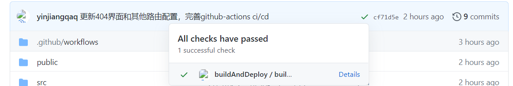
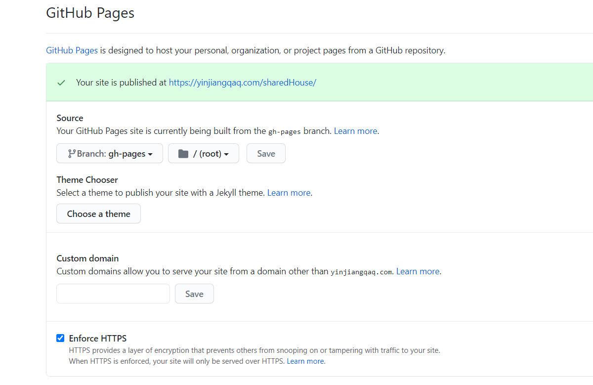

# Github Action

## 简单介绍

首先企业中，用到的大部分是 gitlab 的 CI/CD，但是最近 github 也出了自己的 CI/CD,全世界开发者花时间最多的应该是 github 了吧。所以比较有学习一下的价值.

我们知道 CI/CD 的全称是(Continuous Integretion / Continuous Deployment)持续集成/持续部署

而持续集成/部署是由很多操作组成的，如抓取代码、运行测试、登录远程服务器、发布到第三方服务等等，而 github 把这些操作称为 `Actions`

很多操作在不同项目里面是类似的，完全可以共享。GitHub 注意到了这一点，想出了一个很妙的点子，允许开发者把每个操作写成独立的脚本文件，存放到代码仓库，使得其他开发者可以引用。

如果你需要某个 action，不必自己写复杂的脚本，直接引用他人写好的 action 即可，整个持续集成过程，就变成了一个 actions 的组合。这就是 `GitHub Actions` 最特别的地方。

GitHub 做了一个官方市场，可以搜索到他人提交的 actions。另外，还有一个` awesome actions` 的仓库，也可以找到不少 action。

上面说了，每个 `action` 就是一个独立脚本，因此可以做成代码仓库，使用`userName/repoName`的语法引用 `action`。比如，`actions/setup-node`就表示`github.com/actions/setup-node`这个仓库，它代表一个 action，作用是安装` Node.js`。事实上，GitHub 官方的 actions 都放在` github.com/actions` 里面。

既然 action 其实是一个代码仓库，那么 action 也就有了具体版本，下面都是合法的 action 引用,用的就是 git 指针的概念。

```
actions/setup-node@74bc508 # 指向一个 commit
actions/setup-node@v1.0    # 指向一个标签
actions/setup-node@master  # 指向一个分支
```

## 基本概念

GitHub Actions 有一些自己的术语。

- workflow （工作流程）：持续集成一次运行的过程，就是一个 workflow。

- job （任务）：一个 workflow 由一个或多个 jobs 构成，含义是一次持续集成的运行，可以完成多个任务。

- step（步骤）：每个 job 由多个 step 构成，一步步完成。

- action （动作）：每个 step 可以依次执行一个或多个命令（action）。

## workflow 文件

GitHub Actions 的配置文件叫做 workflow 文件，存放在代码仓库的`.github/workflows` 目录。具体编辑是在你的代码仓库的 Actions 项。

workflow 文件采用 `YAML` 格式，文件名可以任意取，但是后缀名统一为`.yml`，比如 `foo.yml`。一个库可以有多个 workflow 文件。GitHub 只要发现`.github/workflows` 目录里面有.yml 文件，就会自动运行该文件

下面针对一份 yaml 文件，做具体的一些字段的讲解

```yaml
# This is a basic workflow to help you get started with Actions

name: buildAndDeploy #工作流的名称

# Controls when the action will run.

on: # 触发工作流的条件
  # Triggers the workflow on push or pull request events but only for the master branch
  push:
    branches: [master] # 监听的具体分支

#   # Allows you to run this workflow manually from the Actions tab
#   workflow_dispatch:

# A workflow run is made up of one or more jobs that can run sequentially or in parallel
jobs: #这个工作留下的jobs
  # This workflow contains a single job called "build"
  build-and-deploy: # job的名字
    # The type of runner that the job will run on
    runs-on: ubuntu-latest #指定运行所需要的虚拟机环境

    # Steps represent a sequence of tasks that will be executed as part of the job
    steps: # 指定每个job的运行步骤
      # Checks-out your repository under $GITHUB_WORKSPACE, so your job can access it
      - name: checkout # step的名字
        uses: actions/checkout@master # 使用了github中的action,具体是把仓库的代码拷贝虚拟机

      # Runs a single command using the runners shell
      - name: buildAndDeploy step的名字
        uses: JamesIves/github-pages-deploy-action@master
        env:
          ACCESS_TOKEN: ${{secrets.SHAREDHOUSE_ACCESS_TOKEN}} #自己存放的一个private token
          BRANCH: gh-pages # 存放产物的分支名称，也就是发布分支
          FOLDER: build # 存放build后产物的目录
          BUILD_SCRIPT: npm install && npm run build ## 执行的脚本
```

## 实践：把 React 项目发布到 github pages

### 准备工作

本地计算机使用 `create-react-app` ，生成一个标准的 React 应用.然后打开`package.json`
增加一个 homepage 字段，表示该应用发布之后的**根目录**

```json
  "name": "shared-house",
  "version": "0.1.0",
  "private": true,
  "homepage":"https://[username].github.io/[repo名]",
```

然后我们需要登录我们的 github 账号，然后新近一个 repo 仓库,然后把刚才的项目代码发布到这个仓库

```
git init
git add .
git commit -m "first commit"
git remote add origin [仓地址]
git push -u origin master

```

在这之前，我们需要先申请一个 private token。

1. 点击 github 上我们的**小头像**，然后点击`settings`,点击左侧列表中的`Developer settings`

2. 然后在左侧列表选择 `Personal access tokens`

3. 最后我们点击`Generate new token`按钮，选择好权限，生成一个新的 token，记下生成的 token，一会我们还需要用到。

4. 我们肯定是不可能把 token 暴露在开源的项目中的 yaml 文件里的，所以我们需要把 token 保存在 secret 中。

5. 回到我们创建的仓库，点击 settings

6. 点击左侧的 Secrets 按钮，点击点击`Add a new secret`按钮，自己起个 Secret 名称（我这就叫 ACCESS_TOKEN 了）并填入刚申请的 token 值，点击`Add secret`按钮。

### 编写 actions

回到我们的仓库，点击 Actions 按钮，进入到 Actions 页面，点击`Set up a workflow yourself`

现在让我们开始编写 yml 文件吧，输入以下内容，并给 yml 文件换个名字，我们就叫 `buildAndDeploy.yml`

```
name: buildAndDeploy
on:
  push
jobs:
  build-and-deploy:
    runs-on: ubuntu-latest # 我们选择使用最新的ubuntu系统
    steps:
    - name: checkout
      uses: actions/checkout@master # 将代码拷贝到虚机中

    - name: buildAndDeploy
      uses: JamesIves/github-pages-deploy-action@master
      env:
        ACCESS_TOKEN: ${{ secrets.ACCESS_TOKEN }} # 使用刚新建的secret
        BRANCH: gh-pages # 存放产物的分支名称
        FOLDER: dist # 存放build后产物的目录
        BUILD_SCRIPT: npm install && npm run build # 执行的命令
```

点击 `Start commit`按钮，接着点击` Commit new file`按钮。

回到我们的仓库，我们会发现我们的 action 已经跑起来了


点击 details 可以看详情

### 开启 github Pages

1. 进入仓库的 settings 界面
2. 找到 GitHub Pages 设置，Source 选择我们在 yml 文件中指定的那个分支(也就是 build 之后的产物的那个分支)，设置完成后可以看到一行蓝色的提示：Your site is ready to be published at xxxxxx



最后我们访问 `https://[用户名].github.io/[项目名]` 就可以看到自己的网站啦。

## 参考
https://lanniu.blog.csdn.net/article/details/103681903?utm_medium=distribute.pc_relevant_t0.none-task-blog-BlogCommendFromMachineLearnPai2-1.control&depth_1-utm_source=distribute.pc_relevant_t0.none-task-blog-BlogCommendFromMachineLearnPai2-1.control

http://www.ruanyifeng.com/blog/2019/09/getting-started-with-github-actions.html