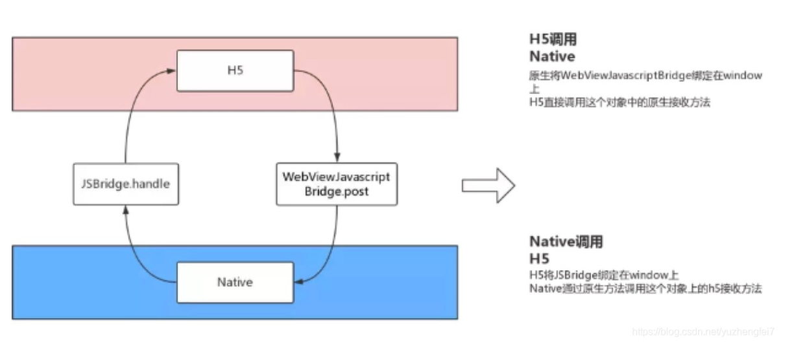

## 前端的混合开发

## JSBridge

主要是给 JavaScript 提供调用 Native 的接口，让混合开发中的前端部分可以方便地使用 Native 的功能（例如：地址位置、摄像头）。

而且 JSBridge 的功能不止调用 Native 功能这么简单宽泛。实际上，JSBridge 就像其名称中的 Bridge 的意义一样，是 `Native` 和非 `Native` 之间的桥梁，它的核心是构建 `Native` 和非 `Native` 间消息通信的通道，而且这个通信的通道是双向的。

H5 与 Native 的交互如下图：

