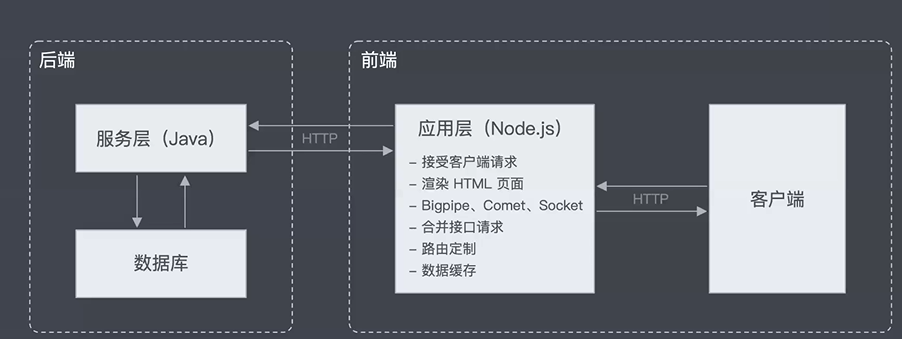

## 后端做的事情

1. 路由监控
2. restful API(系统的业务逻辑相关)
3. 数据持久化，联系数据库(ORM)，建立数据模型
4. 解决高并发，以及安全相关问题

## 关于大前端



现在的前端做的事情不只是做客户端页面这么简单，有部分后端内容也是可以给前端做的。例如服务端渲染，数据缓存，接受客户端请求，合并接口请求，这样相当于充当一个中间层的作用

大前端的特征：

1. 泛客户端开发

* 小程序
* Hybrid App 开发
* React Native (混合开发，输出的是一个 js 文件，需要编译之后才能调用原生之类的组件，效率比较低)
* flutter 原生 app 开发，编译出来的是原生代码，而且是一套代码解决安卓和 ios 的两端代码

* electron 桌面应用开发

2. web 技术

首先，后端开发工程师需要完成整个软件的逻辑处理过程，涉及到大量资源的整合、计算、存储等操作，另外后端工程师还需要考虑业务处理的性能问题、安全问题、并发问题、扩展性问题、稳定性问题等等

## node 中台

关于中台这个概念，因为前端工作人员的产出不应该只是造页面，与后端联调，解决性能化等问题，在node.js出来之后，前端人员也可以参与到后端，node层一般认为是中间层，做路由转发，数据处理，但是不亲自参与到读写 `redis db` 。这边的node中台工作流主要是：

这种模式主要面对那种企业内部，交互压力并不是很大的，因为node作为后台语言并没有Java和c++那么久，还没有那么成熟，所以常规的应用，toC的系统，更多的是采用常规的客户端服务器规格，真正写后台的是Java和C++，node并不参与其中。因为他们更能支撑起高并发等等这些用户量大起来所产生出来的压力。

``` 

        ssr(服务端渲染)            联系        读写redis db(自己维护一个表)
frontEnd<------------->node中台<--------->  java 后台(通过读取你的表，写接口)
                                            c++ 后台 (通过读取你的表，写接口)
```

## node.js 怎么新建线程，开启多线程

https://juejin.im/post/6844903808330366989

## Node.js 框架的 express 与 koa 对比分析

https://juejin.im/entry/6844903573755527176

* 偏向于使用 koa 的原因是 express 对异步的处理没有 koa 那么优雅, 尽管 express 的生态很好

* 中间件执行顺序

**express 中间件是一个接一个的顺序执行 koa 中间件是按照圆圈循环进行，即从外层到内层，又从内层回到外层来结束。**

koa2 的中间件是通过 `async await` 实现的，中间件执行顺序是“洋葱圈”模型。

``` js
var koa = reuqire('koa');
var app = koa()

//这个里的function* 都可以换成 async await
app.use(function* responseTime(next) {
    var start = new Date //1
    yield next; //2
    var ms = new Date - start //12
    this.set('X-Response-Time', ms + 'ms') //13

})

app.use(function* logger(next) {
    var start = new Date //3
    yield next //4
    var used = new Date - start //10
    console.log('%s %s %s %sms', this.method, this.originalUrl, this.status, used) //11
})

app.use(function* contentLength(next) {
    yield next //5
    if (!this.body) return; //9
    this.set('Content-Length', this.body.length)

})
app.use(function* body(next) {
    yield next; //6
    if (this.path !== '/') return; //7
    this.body = 'Hello World' //8
})

app.listen(3000)
```

所有的请求经过一个中间件的时候都会执行两次，对比 Express 形式的中间件，**Koa 的模型可以非常方便的实现后置处理逻辑**，对比 Koa 和 Express 的 Compress 中间件就可以明显的感受到 Koa 中间件模型的优势。

中间件之间通过 next 函数联系, 当一个中间件调用 next() 后，会将控制权交给下一个中间件, **直到下一个中间件不再执行 next() 后, 将会沿路折返, 将控制权依次交换给前一个中间件**
与 koa2 中间件不同的是，express 中间件一个接一个的顺序执行, 通常会将 response 响应写在最后一个中间件中
主要特点：
`app.use` 用来注册中间件
遇到 http 请求，根据 path 和 method 判断触发哪些中间件
实现 next 机制，即上一个中间件会通过 next 触发下一个中间件

* context

和 Express 只有 Request 和 Response 两个对象不同，Koa 增加了一个 Context 的对象，作为这次请求的上下文对象（在 Koa 1 中为中间件的 this，在 Koa 2 中作为中间件的第一个参数传入）。我们可以将一次请求相关的上下文都挂载到这个对象上。类似 traceId 这种需要贯穿整个请求（在后续任何一个地方进行其他调用都需要用到）的属性就可以挂载上去。相较于 request 和 response 而言更加符合语义。

* 异常处理

通过同步方式编写异步代码带来的另外一个非常大的好处就是异常处理非常自然，使用 `try catch` 就可以将按照规范编写的代码中的所有错误都捕获到。这样我们可以很便捷的编写一个自定义的错误处理中间件。

``` js
async function onerror(ctx, next) {
    try {
        await next(); //跳到后面
    } catch (err) {
        //前面的代码执行错误，这边就会捕捉到
        ctx.app.emit('error', err);
        ctx.body = 'server error';
        ctx.status = err.status || 500;
    }
}
```

只需要将这个中间件放在其他中间件之前，就可以捕获它们所有的同步或者异步代码中抛出的异常了。

## Egg继承于koa

https://eggjs.org/zh-cn/intro/quickstart.html

如上述，Koa 是一个非常优秀的框架，然而对于企业级应用来说，它还比较基础。

而 Egg 选择了 Koa 作为其基础框架，在它的模型基础上，进一步对它进行了一些增强。

### 扩展

在基于 Egg 的框架或者应用中，我们可以通过定义 `app/extend/{application, context, request, response}.js` 来扩展 Koa 中对应的四个对象的原型，通过这个功能，我们可以快速的增加更多的辅助方法，例如我们在 `app/extend/context.js` 中写入下列代码： 

``` js
// app/extend/context.js
module.exports = {
    get isIOS() {
        const iosReg = /iphone|ipad|ipod/i;
        return iosReg.test(this.get('user-agent'));
    },
};
```

在 Controller 中，我们就可以使用到刚才定义的这个便捷属性了：

``` js
// app/controller/home.js
exports.handler = ctx => {
    ctx.body = ctx.isIOS ?
        'Your operating system is iOS.' :
        'Your operating system is not iOS.';
};
```

### 插件

众所周知，在 Express 和 Koa 中，经常会引入许许多多的中间件来提供各种各样的功能，例如引入 `koa-session` 提供 `Session` 的支持，引入 `koa-bodyparser` 来解析请求 `body。而` Egg 提供了一个更加强大的插件机制，让这些独立领域的功能模块可以更加容易编写。插件一般在的目录是 `config/plugin.js`

**注意：是 `config` 目录，不是 `app/config` !**

一个插件可以包含：

* extend：扩展基础对象的上下文，提供各种工具类、属性。
* middleware：增加一个或多个中间件，提供请求的前置、后置处理逻辑。
* config：配置各个环境下插件自身的默认配置项。

### MVC的egg

egg其实是一个MVC框架，对此我们一般需要考虑的主要有 `controller` ， `router` ， `service` , 这三个对象分布在app文件夹下， `app/controller` , `app/router` , `app/service`

* controller 控制器，可以理解成后端的API，匹配对应的路由

* router router对象，匹配前端发过来的对应的url，然后跳到与之绑定的controller

``` js
 router.get('/news', controller.news.list)
```

* 在实际应用中，Controller 一般不会自己产出数据，也不会包含复杂的逻辑，复杂的过程应抽象为业务逻辑层 Service。这一层跟数据读写相关

###  egg如何编写中间件

写一个简单的gzip中间件, 来看看中间件的写法

``` js
// app/middleware/gzip.js
const isJSON = require('koa-is-json');
const zlib = require('zlib');

async function gzip(ctx, next) {
    await next();

    // 后续中间件执行完成后将响应体转换成 gzip
    let body = ctx.body;
    if (!body) return;
    if (isJSON(body)) body = JSON.stringify(body);

    // 设置 gzip body，修正响应头
    const stream = zlib.createGzip();
    stream.end(body);
    ctx.body = stream;
    ctx.set('Content-Encoding', 'gzip');
}
```

可以看到，框架的中间件和 Koa 的中间件写法是一模一样的，所以任何 Koa 的中间件都可以直接被框架使用。

####  配置

一般来说中间件也会有自己的配置。在框架中，一个完整的中间件是包含了配置处理的。我们约定一个中间件是一个放置在 `app/middleware` 目录下的单独文件，它需要 `exports` 一个普通的 `function` ，接受两个参数：

* options: 中间件的配置项，框架会将` app.config[${middlewareName}]` 传递进来。
* app: 当前应用 Application 的实例。

我们将上面的 `gzip` 中间件做一个简单的优化，让它支持指定只有当 `body` 大于配置的 `threshold` 时才进行 `gzip` 压缩，我们要在 `app/middleware` 目录下新建一个文件 `gzip.js`

``` js
// app/middleware/gzip.js
const isJSON = require('koa-is-json');
const zlib = require('zlib');

module.exports = options => {
    return async function gzip(ctx, next) {
        await next();

        // 后续中间件执行完成后将响应体转换成 gzip
        let body = ctx.body;
        if (!body) return;

        // 支持 options.threshold
        if (options.threshold && ctx.length < options.threshold) return;

        if (isJSON(body)) body = JSON.stringify(body);

        // 设置 gzip body，修正响应头
        const stream = zlib.createGzip();
        stream.end(body);
        ctx.body = stream;
        ctx.set('Content-Encoding', 'gzip');
    };
};
```

#### 使用中间件

中间件编写完成后，我们还需要手动挂载，支持以下方式：

* 在**应用中**使用中间件

在应用中，我们可以完全通过配置来加载自定义的中间件，并决定它们的顺序。

如果我们需要加载上面的 gzip 中间件，在 `config.default.js` 中加入下面的配置就完成了中间件的开启和配置：

``` js
module.exports = {
    // 配置需要的中间件，数组顺序即为中间件的加载顺序
    middleware: ['gzip'],

    // 配置 gzip 中间件的配置
    //gzip中间件的options参数
    gzip: {
        threshold: 1024, // 小于 1k 的响应体不压缩
    },
};
```

该配置最终将在启动时合并到 `app.config.appMiddleware` 。

* 在**框架和插件**(插件也可以配置中间件的)中使用中间件

框架和插件不支持在 `config.default.js` 中匹配 `middleware` ，需要通过以下方式：

``` js
// app.js
module.exports = app => {
    // 在中间件最前面统计请求时间
    app.config.coreMiddleware.unshift('report');
};

// app/middleware/report.js
module.exports = () => {
    return async function(ctx, next) {
        const startTime = Date.now();
        await next();
        // 上报请求时间
        reportTime(Date.now() - startTime);
    }
};
```

**应用层**定义的中间件（ `app.config.appMiddleware` ）和框架默认中间件（ `app.config.coreMiddleware` ）都会被加载器加载，并挂载到 `app.middleware` 上。

* router 中使用中间件

以上**两种方式配置的中间件是全局的，会处理每一次请求**。 如果你只想针对**单个路由**生效，可以直接在 app/router.js 中实例化和挂载，如下：

``` js
module.exports = app => {
    const gzip = app.middleware.gzip({
        threshold: 1024
    });
    app.router.get('/needgzip', gzip, app.controller.handler);
};
```

### egg.js的内置对象

1. Application

Application 是全局应用对象，在一个应用中，只会实例化一个，它继承自 Koa. Application，在它上面我们可以挂载一些全局的方法和对象。我们可以轻松的在插件或者应用中扩展 Application 对象。

在框架运行时，会在 Application 实例上触发一些事件，应用开发者或者插件开发者可以监听这些事件做一些操作。作为应用开发者，我们一般会在启动自定义脚本中进行监听。

* server: 该事件一个 worker 进程只会触发一次，在 HTTP 服务完成启动后，会将 HTTP server 通过这个事件暴露出来给开发者。
* error: 运行时有任何的异常被 onerror 插件捕获后，都会触发 error 事件，将错误对象和关联的上下文（如果有）暴露给开发者，可以进行自定义的日志记录上报等处理。
* request 和 response: 应用收到请求和响应请求时，分别会触发 request 和 response 事件，并将当前请求上下文暴露出来，开发者可以监听这两个事件来进行日志记录。

``` js
// app.js

module.exports = app => {
    app.once('server', server => {
        // websocket
    });
    app.on('error', (err, ctx) => {
        // report error
    });
    app.on('request', ctx => {
        // log receive request
    });
    app.on('response', ctx => {
        // ctx.starttime is set by framework
        const used = Date.now() - ctx.starttime;
        // log total cost
    });
};
```

Application 对象几乎可以在编写应用时的任何一个地方获取到，下面介绍几个经常用到的获取方式：

几乎所有被框架 Loader 加载的文件（Controller，Service，Schedule 等），都可以 export 一个函数，这个函数会被 Loader 调用，并使用 app 作为参数：

* 启动自定义脚本

``` js
// app.js
module.exports = app => {
    app.cache = new Cache();
};
```

* Controller文件

``` js
// app/controller/user.js
class UserController extends Controller {
    async fetch() {
        this.ctx.body = this.app.cache.get(this.ctx.query.id);
    }
}
```

和 Koa 一样，在 `Context` 对象上，可以通过 `ctx.app` 访问到 `Application` 对象。以上面的 `Controller` 文件举例：

``` js
// app/controller/user.js
class UserController extends Controller {
    async fetch() {
        this.ctx.body = this.ctx.app.cache.get(this.ctx.query.id);
    }
}
```

**在继承于 Controller, Service 基类的实例中**，可以通过 `this.app` 访问到 Application 对象。

``` js
// app/controller/user.js
class UserController extends Controller {
    async fetch() {
        this.ctx.body = this.app.cache.get(this.ctx.query.id);
    }
};
```

2. Controller

框架提供了一个 Controller 基类，并推荐所有的 Controller 都继承于该基类实现。这个 Controller 基类有下列属性：

* ctx - 当前请求的 Context 实例。
* app - 应用的 Application 实例。
* config - 应用的配置。
* service - 应用所有的 service。
* logger - 为当前 controller 封装的 logger 对象。

在 Controller 文件中，可以通过两种方式来引用 Controller 基类：

``` js
// app/controller/user.js

// 从 egg 上获取（推荐）
const Controller = require('egg').Controller;
class UserController extends Controller {
    // implement
}
module.exports = UserController;

// 从 app 实例上获取
module.exports = app => {
    return class UserController extends app.Controller {
        // implement
    };
};
```

3. Service

框架提供了一个 Service 基类，并推荐所有的 Service 都继承于该基类实现。

Service 基类的属性和 Controller 基类属性一致，访问方式也类似：

``` js
// app/service/user.js

// 从 egg 上获取（推荐）
const Service = require('egg').Service;
class UserService extends Service {
    // implement
}
module.exports = UserService;

// 从 app 实例上获取
module.exports = app => {
    return class UserService extends app.Service {
        // implement
    };
};
```

4. Helper
Helper 用来提供一些实用的 utility 函数。它的作用在于我们可以将一些常用的动作抽离在 helper.js 里面成为一个独立的函数，这样可以用 JavaScript 来写复杂的逻辑，避免逻辑分散各处，同时可以更好的编写测试用例。

Helper 自身是一个类，有和 Controller 基类一样的属性，它也会在每次请求时进行实例化，因此 Helper 上的所有函数也能获取到当前请求相关的上下文信息。

获取方式

可以在 Context 的实例上获取到当前请求的 Helper(ctx.helper) 实例。

```js
// app/controller/user.js
class UserController extends Controller {
  async fetch() {
    const { app, ctx } = this;
    const id = ctx.query.id;
    const user = app.cache.get(id);
    ctx.body = ctx.helper.formatUser(user);
  }
}
```
除此之外，Helper 的实例还可以在模板中获取到，例如可以在模板中获取到 security 插件提供的 shtml 方法。

自定义 helper 方法

应用开发中，我们可能经常要自定义一些 helper 方法，例如上面例子中的 formatUser，我们可以通过框架扩展的形式来自定义 helper 方法。
```js
// app/extend/helper.js
module.exports = {
  formatUser(user) {
    return only(user, [ 'name', 'phone' ]);
  }
};
```


### egg.js 怎么在控制器中拿到前端传的参数

框架通过在 Controller 上绑定的 Context 实例，提供了许多便捷方法和属性获取用户通过 HTTP 请求发送过来的参数

* query（get）

获取 url 的 ？后面的数据，通过 `ctx.query` 拿到数据：

``` js
// GET /posts?category=egg&language=node
class PostController extends Controller {
    async listPosts() {
        const query = this.ctx.query;
        // {
        //   category: 'egg',
        //   language: 'node',
        // }
    }
}
```

* Router params（get）

获取 Router 上也可以申明参数，通过 ctx.params 拿到数据：

``` js
// app.get('/projects/:projectId/app/:appId', 'app.listApp');
// GET /projects/1/app/2
class AppController extends Controller {
    async listApp() {
        // assert.equal 相当于 ==
        assert.equal(this.ctx.params.projectId, '1');
        assert.equal(this.ctx.params.appId, '2');
        // 或用解构赋值
        const {
            projectId,
            appId
        } = this.ctx.params
    }
}
```

* body（post）

也就是 `post、put、delete` 等方法，框架内置了 `bodyParser` 中间件来对这两类格式的请求 body 解析成 `object` 挂载到 `ctx.request.body` 上。

``` js
// POST /api/posts HTTP/1.1
// Host: localhost:3000
// Content-Type: application/json; charset=UTF-8
//
// {"title": "controller", "content": "what is controller"}
class PostController extends Controller {
    async listPosts() {
        assert.equal(this.ctx.request.body.title, 'controller');
        assert.equal(this.ctx.request.body.content, 'what is controller');
    }
}
```

可以在 `config/config.default.js` 配置解析请求的大小，会覆盖框架默认值 100kb：

``` js
module.exports = {
    bodyParser: {
        jsonLimit: '1mb',
        formLimit: '1mb',
    },
};
```

> 注意区分：ctx.request.body 和 ctx.body ：
> ctx.body 是 ctx.response.body 的简写。

* egg的file模式
1. 在 config 文件中启用 file 模式：

``` js
// config/config.default.js
exports.multipart = {
    mode: 'file',
};
```

2. 上传 / 接收文件：

前端

``` html
<form method="POST" action="/upload?_csrf={{ ctx.csrf | safe }}" enctype="multipart/form-data">
    title: <input name="title" />
    file: <input name="file" type="file" />
    <button type="submit">Upload</button>
</form>
```

后端

``` js
// app/controller/upload.js
const Controller = require('egg').Controller;
const fs = require('mz/fs');

module.exports = class extends Controller {
    async upload() {
        const {
            ctx
        } = this;
        const file = ctx.request.files[0];
        const name = 'egg-multipart-test/' + path.basename(file.filename);
        let result;
        try {
            // 处理文件，比如上传到云端
            result = await ctx.oss.put(name, file.filepath);
        } finally {
            // 需要删除临时文件
            await fs.unlink(file.filepath);
        }

        ctx.body = {
            url: result.url,
            // 获取所有的字段值
            requestBody: ctx.request.body,
        };
    }
};
```

* stream模式获取file

``` js
const path = require('path');
const sendToWormhole = require('stream-wormhole');
const Controller = require('egg').Controller;

class UploaderController extends Controller {
    async upload() {
        const ctx = this.ctx;
        const stream = await ctx.getFileStream();
        const name = 'egg-multipart-test/' + path.basename(stream.filename);
        // 文件处理，上传到云存储等等
        let result;
        try {
            result = await ctx.oss.put(name, stream);
        } catch (err) {
            // 必须将上传的文件流消费掉，要不然浏览器响应会卡死
            await sendToWormhole(stream);
            throw err;
        }

        ctx.body = {
            url: result.url,
            // 所有表单字段都能通过 `stream.fields` 获取到
            fields: stream.fields,
        };
    }
}

module.exports = UploaderController;
```

通过 ctx.getFileStream 获取文件的前提：

1. 只支持上传一个文件。
2. 上传文件必须在所有其他的 fields 后面，否则在拿到文件流时可能还获取不到 fields。

* 获取header值

`ctx.headers，ctx.header，ctx.request.headers，ctx.request.header` 等价
`ctx.get(name)` ， `ctx.request.get(name)` 获取 `header` 某一个字段
stream 模式上传多个文件使用 `ctx.multipart()`

## nrm

这个东西相当于维护一个npm registry也就是npm 源的一个hash table

``` 

# 安装

npm install -g nrm
 

# 添加一个名为taobao的仓库，地址为私有仓库地址

 nrm  add taobao http://registry.npm.taobao.org/
 

# 查看现有的仓库，出现 taobao项说明添加成功

nrm ls
#-> * npm ---- https://registry.npmjs.org/

      cnpm --- http://r.cnpmjs.org/
      taobao - https://registry.npm.taobao.org/
      nj ----- https://registry.nodejitsu.com/
      rednpm - http://registry.mirror.cqupt.edu.cn/
      npmMirror  https://skimdb.npmjs.com/registry/
      edunpm - http://registry.enpmjs.org/
    

## 切换到taobao源

nrm use taobao

 

# 安装项目依赖

npm install
```

## 为什么npm install之后有.staging这一目录

因为你的npm install 还没下载完，所以有.staging这个目录
