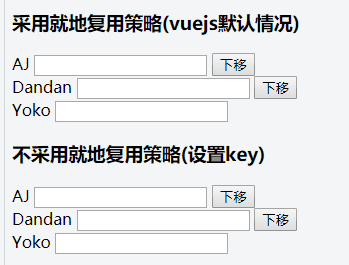

## nginx 代理

nginx 代理分为正向代理和反向代理，正向代理和反向代理的区别就是代理的对象不一样，正向代理代理的对象是客户端，反向代理代理的对象是服务端。

### 正向代理

我们日常的科学上网就可以用 Nginx 做正向代理

```
server {
    location / {
        proxy_pass http://$http_host$request_uri;
    }
}
```

### 反向代理

nginx 作为 web 服务器的一个重要功能就是反向代理。

nginx 反向代理的指令不需要新增额外的模块，默认自带 proxy_pass 指令，只需要修改配置文件就可以实现反向代理

### 什么是反向代理服务器

反向代理的功能是 nginx 的三大主要功能之一（静态 web 服务器、反向代理、负载均衡）。nginx 一般同时做为静态 web 服务器和反向代理服务器，做为 web 服务器访问静态文件图片、css、js、html 等文件，做为反向代理服务器把请求发给后端业务处理服务，**如果有多个后端处理节点，会配置负载均衡功能**。

反向代理服务器是一种代理服务器，用于管理从外部网络到内部网络的连接或任何特定请求。它保护、路由和管理从外部网络到内部网络、Web 服务器或专用网络的流量。

```

外网客户机---nginx反向代理---内网web服务
```

**外网客户机**：我们平时打开浏览器输入网址访问www.nginx.cn的场景中，我们的笔记本就可以理解为一个外网客户机。

**nginx 反向代理服务**：浏览器输入网址并回车后，会发起一个 http 请求给 nginx（反向代理服务器），这个请求如果是访问静态文件，那么 nginx 作为 web 服务器直接返回请求的内容，如果是访问的后台服务逻辑，那么 nginx 把**请求转发**给后端的服务处理。

**内网 web 服务**：后端的服务可以是很多种类型，LNMP 环境下的 php-fpm 进程，Java 环境下的 tomcat、jetty 等容器，通过程序逻辑处理 http 请求，生成 html 页面或者 json 串返回给客户端。对于小型应用，后端服务可以和 nginx 部署在同一台机器上。

## 反向代理的好处

- nginx 反向代理重要的作用是配合 upstream 实现负载均衡。
- 同时增加安全性，客户端不能直接访问后端服务，多了个中间的屏障。
- 提升并发处理能力，通过异步非阻塞的方式把请求发给后端。

## set 和 map 的区别

set 是一种关联式容器，其特性如下：

- set 以 RBTree 作为底层容器
- 所得元素的只有 key 没有 value，value 就是 key
- 不允许出现键值重复
- 所有的元素都会被自动排序
- 不能通过迭代器来改变 set 的值，因为 set 的值就是键
  map 和 set 一样是关联式容器，它们的底层容器都是红黑树，区别就在于 map 的值不作为键，键和值是分开的。它的特性如下：

- map 以 RBTree 作为底层容器
- 所有元素都是键+值存在
- 不允许键重复
- 所有元素是通过键进行自动排序的
- map 的键是**不能修改**的，但是其键对应的值是可以修改的

## v-for 和 v-if 的优先级

v-for 和 v-if 如果是同一层级的话，v-for 的优先级是高于 v-if 的 .

所以想要 v-if 有用，需要把 v-if 放在上一层级

## vue 中 v-for 里面的“就地复用”策略

就地复用的官方解释是：如果数据项的顺序被改变，VUE 将**不会移动 DOM 元素来匹配数据项的顺序**，而是简单的复用此处每一个元素.因为这种就地复用的模式是**高效的**，但是**只适用于不依赖子组件状态或者临时 DOM 状态（例如表单输入值）的列表渲染输出**

举个栗子

```
<div v-for="item in list">
{{文本}}
<input/>
<button @click="将item在list中的位置下移">
</div>
```

在“就地复用”策略中，点击按钮，输入框不随文本一起下移，**因为输入框并没有跟数据 data 做绑定，所以 vue 默认使用已经渲染的 DOM，然而文本是与数据绑定的，所以文本需要重新渲染**，这种处理方式在 vue 或者 angularjs 中都是默认的列表渲染策略, 因为高效.

种"就地复用"一般在"列表展示"的场景中不会出现问题, 所以我的建议是 : **如果你的列表元素存在与用户交互的场景(比如 form 表单或者重新排序等), 那么请你为 v-for 指令设置 key 参数,key 指向列表中每个元素的唯一值.**

更形象的展示加了 key 值和不加 key 值之间的区别：


## 重写和重载的区别

重写是子类方法覆盖父类方法。

重载是同一个类中两个或两个以上的同名方法(参数数量和总类可能不同)

## 重排链表

给定一个单链表  L：L0→L1→…→Ln-1→Ln ，
将其重新排列后变为： L0→Ln→L1→Ln-1→L2→Ln-2→…

你不能只是单纯的改变节点内部的值，而是需要实际的进行节点交换。

来源：力扣（LeetCode）
链接：https://leetcode-cn.com/problems/reorder-list
著作权归领扣网络所有。商业转载请联系官方授权，非商业转载请注明出处。

```
给定链表 1->2->3->4->5, 重新排列为 1->5->2->4->3.
```

```js
/**
 * Definition for singly-linked list.
 * function ListNode(val, next) {
 *     this.val = (val===undefined ? 0 : val)
 *     this.next = (next===undefined ? null : next)
 * }
 */
/**
 * @param {ListNode} head
 * @return {void} Do not return anything, modify head in-place instead.
 */
//双指针，一个从前到后，一个从后到前，直至相遇
var reorderList = function (head) {
  var tmp = [];
  while (head) {
    let temp = head.next;
    head.next = null; //每个节点剩下的断掉了
    tmp.push(head); //放置每个节点
    head = temp;
  }
  let i = -1,
    j = tmp.length;
  while (++i < --j) {
    tmp[i].next = tmp[j];
    j !== i + 1 && (tmp[j].next = tmp[i + 1]); //为了让tmp[0]接上之后的节点
  }
  return tmp[0];
};
```

## 有多少小于当前数字的数字

```
输入：nums = [8,1,2,2,3]
输出：[4,0,1,1,3]
解释：
对于 nums[0]=8 存在四个比它小的数字：（1，2，2 和 3）。
对于 nums[1]=1 不存在比它小的数字。
对于 nums[2]=2 存在一个比它小的数字：（1）。
对于 nums[3]=2 存在一个比它小的数字：（1）。
对于 nums[4]=3 存在三个比它小的数字：（1，2 和 2）。

来源：力扣（LeetCode）
链接：https://leetcode-cn.com/problems/how-many-numbers-are-smaller-than-the-current-number
著作权归领扣网络所有。商业转载请联系官方授权，非商业转载请注明出处。
```

```js
/**
 * @param {number[]} nums
 * @return {number[]}
 */
var smallerNumbersThanCurrent = function (nums) {
  var count = 0;
  var res = [];
  for (let i = 0; i < nums.length; i++) {
    for (let j = 0; j < nums.length; j++) {
      if (j == i) continue;
      if (nums[i] > nums[j]) count++;
    }
    res.push(count);
    count = 0;
  }
  return res;
};
```

## 接雨水

```
输入：height = [0,1,0,2,1,0,1,3,2,1,2,1]
输出：6
解释：上面是由数组 [0,1,0,2,1,0,1,3,2,1,2,1] 表示的高度图，在这种情况下，可以接 6 个单位的雨水（蓝色部分表示雨水）

来源：力扣（LeetCode）
链接：https://leetcode-cn.com/problems/trapping-rain-water
著作权归领扣网络所有。商业转载请联系官方授权，非商业转载请注明出处。
```

解题思路：我们需要具体到每一列算雨水的量，然后加起来，每一列的雨水量的算法：` Math.min(left_max[i], right_max[i]) - height[i]`

```js
/**
 * @param {number[]} height
 * @return {number}
 */
var trap = function (height) {
  var n = height.length;
  let res = 0;
  var left_max = [],
    right_max = [];
  left_max[0] = height[0];
  for (let i = 1; i < n; i++) {
    left_max[i] = Math.max(left_max[i - 1], height[i]);
  }
  right_max[n - 1] = height[n - 1];
  for (let j = n - 2; j >= 0; j--) {
    right_max[j] = Math.max(right_max[j + 1], height[j]);
  }
  //统计每一列的面积之和
  for (let i = 0; i < n; i++) {
    res += Math.min(left_max[i], right_max[i]) - height[i];
  }
  return res;
};
```

## 独一无二的出现次数

```
输入：arr = [1,2,2,1,1,3]
输出：true
解释：在该数组中，1 出现了 3 次，2 出现了 2 次，3 只出现了 1 次。没有两个数的出现次数相同。

来源：力扣（LeetCode）
链接：https://leetcode-cn.com/problems/unique-number-of-occurrences
著作权归领扣网络所有。商业转载请联系官方授权，非商业转载请注明出处。
```

解题思路：哈希表

```js
/**
 * @param {number[]} arr
 * @return {boolean}
 */
var uniqueOccurrences = function (arr) {
  var obj = {};
  for (let i = 0; i < arr.length; i++) {
    if (obj[arr[i]]) {
      obj[arr[i]]++;
    } else {
      obj[arr[i]] = 1;
    }
  }
  let res = [];
  for (var i in obj) {
    res.push(obj[i]);
  }
  return [...new Set(res)].length === res.length;
};
```

## 全排列

给定一个 **没有重复** 数字的序列，返回其所有可能的全排列。

```
输入: [1,2,3]
输出:
[
  [1,2,3],
  [1,3,2],
  [2,1,3],
  [2,3,1],
  [3,1,2],
  [3,2,1]
]

来源：力扣（LeetCode）
链接：https://leetcode-cn.com/problems/permutations
著作权归领扣网络所有。商业转载请联系官方授权，非商业转载请注明出处。
```

```js
/**
 * @param {number[]} nums
 * @return {number[][]}
 */

var permute = function (nums, res = [], dfs) {
  var dfs = (h) =>
    h.length === nums.length
      ? res.push(h)
      : nums.forEach((v) => !h.includes(v) && dfs(h.concat([v])));
  dfs([]);
  return res;
};
```

## 全排列 2

给定一个可包含重复数字的序列，返回所有不重复的全排列。

```
输入: [1,1,2]
输出:
[
  [1,1,2],
  [1,2,1],
  [2,1,1]
]
```

解题思路：搜索回溯(包含剪枝)加递归

```js
/**
 * @param {number[]} nums
 * @return {number[][]}
 */
var permuteUnique = function (nums) {
  var res = [];
  var vis = new Array(nums.length).fill(false); //储存每个位置状态的数组
  var dfs = (idx, perm) => {
    if (idx == nums.length) {
      res.push(perm.slice());
    }
    for (let i = 0; i < nums.length; i++) {
      //访问过的跳过和前面访问过的，后一个跟前一个是相同值得
      if (vis[i] || (i > 0 && nums[i] === nums[i - 1] && !vis[i - 1])) {
        continue;
      }
      perm.push(nums[i]);
      vis[i] = true;
      dfs(idx + 1, perm);
      vis[i] = false;
      perm.pop();
    }
  };
  nums.sort((a, b) => a - b);
  dfs(0, []);
  return res;
};
```

## 求根到叶子节点数字之和

```
输入: [1,2,3]
    1
   / \
  2   3
输出: 25
解释:
从根到叶子节点路径 1->2 代表数字 12.
从根到叶子节点路径 1->3 代表数字 13.
因此，数字总和 = 12 + 13 = 25.

来源：力扣（LeetCode）
链接：https://leetcode-cn.com/problems/sum-root-to-leaf-numbers
著作权归领扣网络所有。商业转载请联系官方授权，非商业转载请注明出处。
```

```js
/**
 * Definition for a binary tree node.
 * function TreeNode(val) {
 *     this.val = val;
 *     this.left = this.right = null;
 * }
 */
/**
 * @param {TreeNode} root
 * @return {number}
 */
var sumNumbers = function (root) {
  var res = 0;
  var dfs = (root, temp) => {
    if (!root) return;
    temp += root.val;
    if (root.left) {
      dfs(root.left, temp);
    }
    if (root.right) {
      dfs(root.right, temp);
    }
    //结束条件，到叶子节点
    if (!root.left && !root.right) {
      res += +temp; //强制转数字然后加起来
      return;
    }
  };
  dfs(root, "");
  return res;
};
```

## 岛屿周长

```

输入:
[[0,1,0,0],
 [1,1,1,0],
 [0,1,0,0],
 [1,1,0,0]]

输出: 16

解释: 它的周长是下面图片中的 16 个黄色的边：


来源：力扣（LeetCode）
链接：https://leetcode-cn.com/problems/island-perimeter
著作权归领扣网络所有。商业转载请联系官方授权，非商业转载请注明出处。
```

```js
/**
 * @param {number[][]} grid
 * @return {number}
 */
var islandPerimeter = function (grid) {
  var x = grid[0].length;
  var y = grid.length;
  var res = 0;
  //上下左右数组
  const dx = [0, 1, 0, -1];
  const dy = [1, 0, -1, 0];
  for (let i = 0; i < y; i++) {
    for (let j = 0; j < x; j++) {
      if (grid[i][j] === 1) {
        let count = 0;
        for (let k = 0; k < 4; k++) {
          let newX = i + dx[k];
          let newY = j + dy[k];
          // 越界或者为零+1
          if (
            newX < 0 ||
            newY < 0 ||
            newX >= y ||
            newY >= x ||
            !grid[newX][newY]
          ) {
            count++;
          }
        }
        res += count;
      }
    }
  }
  return res;
};
```

## 单词拆分二

给定一个非空字符串 s 和一个包含非空单词列表的字典 wordDict，在字符串中增加空格来构建一个句子，使得句子中所有的单词都在词典中。返回所有这些可能的句子。

说明：

分隔时可以重复使用字典中的单词。
你可以假设字典中没有重复的单词。

来源：力扣（LeetCode）
链接：https://leetcode-cn.com/problems/word-break-ii
著作权归领扣网络所有。商业转载请联系官方授权，非商业转载请注明出处。

```
输入:
s = "catsanddog"
wordDict = ["cat", "cats", "and", "sand", "dog"]
输出:
[
  "cats and dog",
  "cat sand dog"
]

```

```js
/**
 * @param {string} s
 * @param {string[]} wordDict
 * @return {string[]}
 */
var wordBreak = function (s, wordDict) {
  let len = s.length;
  const meno = new Array(len);

  var dfs = (start) => {
    //哈希表存储先前的结果
    if (meno[start]) {
      return meno[start];
    }
    const res = [];
    if (start > s.length - 1) {
      // 指针越界，代表整个s就是一个单词，剩余的字符串是空串，返回[[]]
      return [[]];
    }
    //递归思路
    for (let i = start + 1; i <= len; i++) {
      const word = s.substring(start, i);
      if (wordDict.includes(word)) {
        const restRes = dfs(i);
        for (const restWords of restRes) {
          res.push([word].concat(restWords));
        }
      }
    }
    //记忆化剪枝，减少耗时
    meno[start] = res;
    return res;
  };

  return dfs(0).map((item) => {
    return item.join(" ");
  });
};
```
