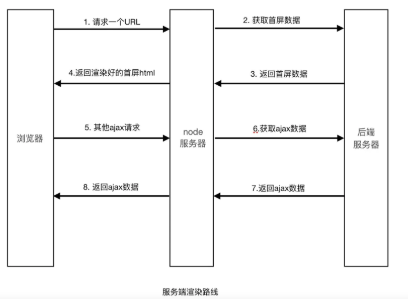
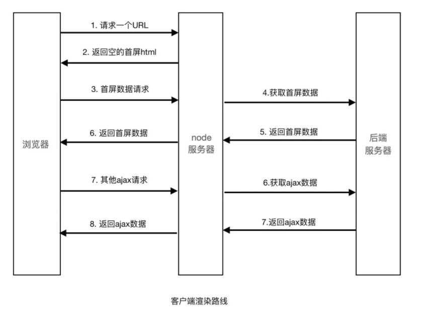

## requestAnimationFrame

`requestAnimationFrame` 是一个单回调，和 `setTimeout` 差不多区别是： `setTimeout` 的时间是你指定的 requestAnimationFrame 你不用写时间，它的重绘时间间隔是根据不同浏览器的刷新频率自行脑补的- -所以有严重兼容问题，记得有封装好的处理兼容的函数。W3C 标准，requestAnimationFrame 在浏览器**每次刷新页面之前**执行, 一般浏览器的刷新频率试 60hz. requestAnimationFrame 是一个宏任务，macro Task

## 生成括号

输入：n = 3
输出：[
"((()))", 
"(()())", 
"(())()", 
"()(())", 
"()()()"
]

``` js
/**
 * @param {number} n
 * @return {string[]}
 */
var generateParenthesis = function(n) {
    if (n == 0) {
        return [];
    } else if (n == 1) {
        return ["()"];
    }
    var res = [];
    var temp = ["()"];
    for (var i = 0; i < n - 1; i++) {
        for (var j = 0; j < temp.length; j++) {
            for (var k = 0; k < temp[j].length; k++) {
                if (temp[j][k] == "(") {
                    var str =
                        temp[j].substring(0, k + 1) + "()" + temp[j].substring(k + 1);
                    // console.log('新建的' + str)
                    res.push(str);
                } else if (k == temp[j].length - 1) {
                    var str = temp[j] + "()";
                    // console.log('最后的' + str)
                    res.push(str);
                }
            }
        }
        var t = [...new Set(res)];
        temp = t;
        res = [];
    }
    return temp;
};
```

## 最接近的三数之和

输入：nums = [-1, 2, 1, -4], target = 1
输出：2
解释：与 target 最接近的和是 2 (-1 + 2 + 1 = 2) 。

``` js
/**
 * @param {number[]} nums
 * @param {number} target
 * @return {number}
 */
var threeSumClosest = function(nums, target) {
    if (nums.length < 3) return null;
    var closest = Number.POSITIVE_INFINITY;
    var left, right;
    nums.sort((a, b) => a - b);
    for (var i = 0; i < nums.length - 2; i++) {
        left = i + 1;
        right = nums.length - 1;
        while (left < right) {
            let sum = nums[i] + nums[left] + nums[right];
            if (Math.abs(sum - target) < Math.abs(closest - target)) {
                closest = sum;
            } else if (sum == target) {
                return sum;
            } else if (sum > target) {
                right--;
            } else if (sum < target) {
                left++;
            }
        }
    }
    return closest;
};
```

## 二叉树的深度遍历

如果出现了环，怎么避免陷入死循环里，遍历过的节点设置 visited 属性为 true

``` js
var res = [];
var dfs = function(root) {
    if (!root) return null;
    if (root.visited === true) return null;
    res.push(root.val);
    root.visited = true;
    if (root.left) dfs(root.left);
    if (root.right) dfs(root.right);
    return res;
};
```

## html5 的新特性

https://www.cnblogs.com/binguo666/p/10928907.html

html5 总的来说比 html4 多了十个新特性，但其不支持 ie8 及 ie8 以下版本的浏览器

### 语义标签

例如 `<header>，<footer>`

### 增强型表单

修改一些新的 input 输入特性，改善更好的输入控制和验证，例如 `color，url,range`

### 视频和音频

音频： `<audio src=" "></audio>`

音频： `<audio src=" "></audio>`

### Canvas 绘图

### SVG 绘图

### 地理定位

 `使用getCurrentPosition()方法来获取用户的位置。以实现“LBS服务”`

``` html
<script>
    var x = document.getElementById("demo");

    function getLocation() {
        if (navigator.geolocation) {
            navigator.geolocation.getCurrentPosition(showPosition);
        } else {
            x.innerHTML = "Geolocation is not supported by this browser.";
        }
    }

    function showPosition(position) {
        x.innerHTML =
            "Latitude: " +
            position.coords.latitude +
            "<br />Longitude: " +
            position.coords.longitude;
    }
</script>
```

### 拖放 API

拖放是一种常见的特性，即捉取对象以后拖到另一个位置。

在 html5 中，拖放是标准的一部分，任何元素都能够拖放。

 `<div draggable="true"></div>`

当元素拖动时，我们可以检查其拖动的数据。

``` html
<div draggable="true" ondragstart="drag(event)"></div>
<script>
    function drap(ev) {
        console.log(ev);
    }
</script>
```

### WebWorker

Web Worker 可以通过加载一个脚本文件，进而创建一个独立工作的线程，在主线程之外运行。

基本使用：

     Web Worker的基本原理就是在当前javascript的主线程中，使用Worker类加载一个javascript文件来开辟一个新的线程，

起到互不阻塞执行的效果，并且提供主线程和新线程之间数据交换的接口： `postMessage` 、 `onmessage` 。

javascript:

``` js
onmessage = function(evt) {
    var d = evt.data; //通过evt.data获得发送来的数据
    postMessage(d); //将获取到的数据发送会主线程
};
```

html:

``` html
<!DOCTYPE html>
<html>

<head>
    <meta http-equiv="Content-Type" content="text/html; charset=utf-8" />
    <script type="text/javascript">
        //WEB页主线程
        var worker = new Worker("worker.js"); //创建一个Worker对象并向它传递将在新线程中执行的脚本的URL
        worker.postMessage("hello world"); //向worker发送数据
        worker.onmessage = function(evt) {
            //接收worker传过来的数据函数
            console.log(evt.data); //输出worker发送来的数据
        };
    </script>
</head>

<body></body>

</html>
```

### WebStorage

WebStorage 是 HTML 新增的本地存储解决方案之一，但并不是取代 cookie 而指定的标准，cookie 作为 HTTP 协议的一部分用来处理客户端和服务器的通信是不可或缺的，session 正式依赖与实现的客户端状态保持。WebSorage 的意图在于解决**本来不应该 cookie 做，却不得不用 cookie 的本地存储**。

websorage 拥有 5M 的存储容量，而 cookie 却只有 4K，这是完全不能比的。

客户端存储数据有两个对象，其用法基本是一致。

`localStorage` ：没有时间限制的数据存储

`sessionStorage` : 在浏览器关闭的时候就会清除

### WebSocket

WebSocket 协议为 web 应用程序客户端和服务端之间提供了一种全双工通信机制。

特点：

（1）握手阶段采用 HTTP 协议，默认端口是 80 和 443

（2）建立在 TCP 协议基础之上，和 http 协议同属于应用层

（3）可以发送文本，也可以发送二进制数据。

（4）没有同源限制，客户端可以与任意服务器通信。

（5）协议标识符是 ws（如果加密，为 wss），如 ws://localhost:8023


## 箭头函数 this 加上 call

``` js
let obj1 = {
    name: "obj1_name",
    print: function() {
        return () => console.log(this.name);
    },
};
let obj2 = {
    name: "obj2_name",
};
obj1.print()(); //obj1_name   this绑定在obj1
obj1.print().call(obj2); //obj1_name  obj1.print()返回的是箭头函数，无法绑定this,所以还是obj1的this
obj1.print.call(obj2)(); //obj2_name,this 绑定到了obj2
```

## 前端如何优化首屏加载时间

白屏时间是指浏览器从响应用户输入网址地址，到浏览器**开始显示内容的时间**。

首屏时间是指浏览器从响应用户输入网址地址，到首屏内容渲染完成的时间，此时整个网页不一定要全部渲染完成，但在当前视窗的内容需要。

白屏时间是首屏时间的一个子集。

### 如何计算白屏时间和首屏时间

白屏时间： `performance.timing.responseStart - performance.timing.navigationStart`

首屏时间：目前来说，没有明确的衡量标准，大概意思就是第一屏的内容已经加载完成并且用户可以使用其中的功能。我们可以通过 `DOMContentLoad` 或者 `window.onload` 来标记首屏完成加载的时刻，或者求这两者的平均值- `performance.timing.navigationStart` 来获取首屏时间，但这些都是模糊的衡量。

### 如何优化首屏加载时间

* cdn 分发: 通过在多台服务器部署相同的副本，当用户访问时，服务器根据用户跟哪台服务器地理距离小或者哪台服务器此时的压力小，来决定哪台服务器去响应这个请求。

* 后端在业务层的缓存：数据库查询缓存是可以设置缓存的，这个对于处于高频率的请求很有用。值得注意的是，接口也是可以设置缓存的，比如获取一定时间内不会变的资源，设置缓存会很有用。

* 静态文件缓存方案：这个最常看到。现在流行的方式是文件 hash+强缓存的一个方案。比如 hash+ cache control: max-age=1 年。

* 前端的资源动态加载：

a. 路由动态加载，最常用的做法，以页面为单位，进行动态加载。

b. 组件动态加载(offScreen Component)，对于不在当前视窗的组件，先不加载。

c. 图片懒加载(offScreen Image)，同上。值得庆幸的是，越来越多的浏览器支持原生的懒

加载，通过给 img 标签加上 loading="lazy"来开启懒加载模式。

* 利用好 async 和 defer 这两个属性：如果是独立功能的 js 文件，可以加入 async 属性。如果是优先级低且没有依赖的 js，我们可以加入 defer 属性。

* 渲染的优先级：浏览器有一套资源的加载优先级策略。也可以通过 js 来自己控制请求的顺序和渲染的顺序。一般我们不需要这么细粒度的控制，而且控制的代码也很不好写。

* 前端做一些接口缓存：前端也可以做**接口缓存**，缓存的位置有两个，一个是内存，即保存给变量，另一个是 localStorage。比如用户的签到日历（展示用户是否签到），我们可以缓存这样的接口到 localStorage，有效期是当天。或者有个列表页，我们总是缓存上次的列表内容到本地，**下次加载时，我们先从本地读取缓存，并同时发起请求到服务器获取最新列表。**(目的其实很简单，先让用户能看到东西)

* 页面使用骨架屏：意思是在首屏加载完成之前，通过渲染一些简单元素进行占位。骨架屏虽然不能提高首屏加载速度，但可以减少用户在首屏等待的急躁情绪。这点很有效，在很多成熟的网站都有大量应用。

* 使用 `ssr` 渲染：服务器性能一般都很好，那么可以先在服务器先把 vdom 计算完成后，再输出给前端，这样可以节约的时间为：计算量/(服务器计算速度 - 客户端计算速度)。第二个是服务器可以把首屏的 ajax 请求在服务端阶段就完成，这样可以省去和客户端通过 tcp 传输的时间。

### 什么是 ssr 服务端渲染

服务端渲染是先向后端服务器请求数据，然后生成完整首屏 html 返回给浏览器；而客户端渲染是等 js 代码下载、加载、解析完成后再请求数据渲染，等待的过程页面是什么都没有的，就是用户看到的白屏。就是服务端渲染不需要等待 **js 代码下载完成并请求数据**，就可以返回一个已有完整数据的首屏页面。

联想到 vue，一个 html 文件其实是空的，都是需要 js 代码的执行，才会生成最后完整的 Html 文件

### ssr 服务端渲染的好处

1.  更利于 SEO

    不同爬虫工作原理类似，只会爬取源码，不会执行网站的任何脚本（Google 除外，据说 Googlebot 可以运行 javaScript）。使用了 React 或者其它 MVVM 框架之后，页面大多数 DOM 元素都是在客户端根据 js 动态生成，可供爬虫抓取分析的内容大大减少(如图一)。另外，浏览器爬虫不会等待我们的数据完成之后再去抓取我们的页面数据。服务端渲染返回给客户端的是已经获取了异步数据并执行 JavaScript 脚本的最终 HTML，网络爬中就可以抓取到完整页面的信息。

2.  更利于首屏渲染

    首屏的渲染是 node 发送过来的 html 字符串，并不依赖于 js 文件了，这就会使用户更快的看到页面的内容。尤其是针对大型单页应用，打包后文件体积比较大，普通客户端渲染加载所有所需文件时间较长，首页就会有一个很长的白屏等待时间。

### ssr 服务端渲染的弊端

1. 服务端的压力较大，本来是通过客户端完成渲染，现在统一到服务端 node 服务去做。尤其是高并发访问的情况，会大量占用服务端 CPU 资源
2. 在服务端渲染中，只会执行到 componentDidMount 之前的生命周期钩子，因此项目引用的第三方的库也不可用其它生命周期钩子，这对引用库的选择产生了很大的限制
3. 除了对 webpack、React 要熟悉，还需要掌握 node、Koa2 等相关技术。相对于客户端渲染，项目构建、部署过程更加复杂

ssr:



客户端渲染:



### 具体怎么实现服务端渲染

可以参照https://ssr.vuejs.org/zh/

* 引入 http2.0：http2.0 对比 http1.1，最主要的提升是传输性能，特别是在接口小而多的时候。

* 选择先进的图片格式：使用 JPEG 2000, JPEG XR, and WebP 的图片格式来代替现有的 jpeg 和 png，当页面图片较多时，这点作用非常明显。把部分大容量的图片从 BaseLine JPEG 切换成 Progressive JPEG（理解这两者的差别）也能缩小体积。

* 利用好 http 压缩：使用 http 压缩的效果非常明显。

## 前端缓存

https://www.jianshu.com/p/256d0873c398

## 前端怎么实现让秒杀，活动倒计时更准

https://www.cnblogs.com/kunmomo/p/12661333.html

可能存在的问题

* 定时器的执行时间其实一般都是不能准确按照给的参数时间 wait 来执行的，只能是 wait 时间后执行

* 系统时间不准确
* 代码执行时间和线程占用事件，例如循环等等

* 同步的 UI 事件，导致执行渲染事件，定时器停止，失效

这些问题会导致时间延迟越来越严重

### 解决思路

分析一下从获取服务器时间到前端显示倒计时的过程

* 客户端 http 请求服务器时间
* 服务器响应完成
* 服务器通过网络传输时间数据到客户端
* 客户端根据活动开始时间和服务器时间差做倒计时显示

服务器响应完成的时间其实就是服务器时间，但经过网络传输这一步，就会产生误差了，误差大小视网络环境而异，这部分时间前端也没有什么好办法计算出来，一般是几十 ms 以内，大的可能有几百 ms 。

可以得出：当前服务器时间 = 服务器系统返回时间 + 网络传输时间 + 前端渲染时间 + 常量（可选），这里重点是说要考虑前端渲染的时间，避免不同浏览器渲染快慢差异造成明显的时间不同步，这是第一点。（网络传输时间忽略或加个

常量）, 前端渲染时间可以在服务器返回当前时间和本地前端的时间的差值得出。

获得服务器时间后，前端进入倒计时计算和计时器显示，这步就要考虑 js 代码冻结和线程阻塞造成计时器延时问题了，思路是**通过引入计数器，判断计时器延迟执行的时间来调整，尽量让误差缩小**，不同浏览器不同时间段打开页面倒计时

实现：

``` js
// 继续线程占用
setInterval(function() {
    var j = 0;
    while (j++ < 100000000);
}, 0);

//倒计时
var interval = 1000,
    ms = 50000, // 从服务器和活动开始时间计算出的时间差，这里测试用 50000ms
    count = 0,
    startTime = new Date().getTime();

if (ms >= 0) {
    var timeCounter = setTimeout(countDownStart, interval);
}

function countDownStart() {
    count++;
    var offset = new Date().getTime() - (startTime + count * interval);
    var nextTime = interval - offset;
    var daytohour = 0;

    if (nextTime < 0) {
        nextTime = 0;
    }

    ms -= interval;

    console.log(
        "误差：" +
        offset +
        "ms，下一次执行：" +
        nextTime +
        "ms后，离活动开始还有：" +
        ms +
        "ms"
    );

    if (ms < 0) {
        clearTimeout(timeCounter);
    } else {
        timeCounter = setTimeout(countDownStart, nextTime);
    }
}
```

## 去掉外圈括号

输入："(()())(())"
输出："()()()"
解释：
输入字符串为 "(()())(())"，原语化分解得到 "(()())" + "(())"，
删除每个部分中的最外层括号后得到 "()()" + "()" = "()()()"。

来源：力扣（LeetCode）
链接：https://leetcode-cn.com/problems/remove-outermost-parentheses
著作权归领扣网络所有。商业转载请联系官方授权，非商业转载请注明出处。

``` js
/**
 * @param {string} S
 * @return {string}
 */
var removeOuterParentheses = function(S) {
    let res = "";
    let open = 0;
    for (let i of S) {
        if (i == "(" && open++ > 0) res += i;
        if (i == ")" && open-- > 1) res += i;
    }
    return res;
};
```

## 回文子串

给定一个字符串，你的任务是计算这个字符串中有多少个回文子串。

具有不同开始位置或结束位置的子串，即使是由相同的字符组成，也会被视作不同的子串。

> 输入："aaa"
>
> 输出：6
>
> 解释：6 个回文子串: "a", "a", "a", "aa", "aa", "aaa"

``` js
/**
 * @param {string} s
 * @return {number}
 */
//总共有2n-1种排列，判断每一种是否为回文串，最后输出总数
var countSubstrings = function(s) {
    let n = s.length;
    let res = 0;
    for (let i = 0; i < 2 * n - 1; i++) {
        let l = i / 2;
        let r = i / 2 + (i % 2);
        while (l >= 0 && r < n && s.charAt(l) == s.charAt(r)) {
            l--;
            r++;
            res++;
        }
    }
    return res;
};
```

## 旅行终点

> 输入：paths = [["B", "C"], ["D", "B"], ["C", "A"]]
> 输出："A"
> 解释：所有可能的线路是：
> "D" -> "B" -> "C" -> "A". 
> "B" -> "C" -> "A". 
> "C" -> "A". 
> "A". 
> 显然，旅行终点站是 "A" 。

``` js
/**
 * @param {string[][]} paths
 * @return {string}
 */
//通过把起点和终点放在两个数组，然后再找终点数组种不在起点数组里面的
var destCity = function(paths) {
    let start = [];
    let end = [];
    paths.map((item) => {
        start.push(item[0]);
        end.push(item[item.length - 1]);
    });
    return end.find((item) => {
        return start.every((item2) => {
            return item !== item2;
        });
    });
};
```

## 左旋字符串

字符串的左旋转操作是把字符串前面的若干个字符转移到字符串的尾部。请定义一个函数实现字符串左旋转操作的功能。比如，输入字符串"abcdefg"和数字 2，该函数将返回左旋转两位得到的结果"cdefgab"。

> 输入: s = "lrloseumgh", k = 6
>
> 输出: "umghlrlose"

``` js
/**
 * @param {string} s
 * @param {number} n
 * @return {string}
 */
var reverseLeftWords = function(s, n) {
    let start = "";
    let end = "";
    for (let i = 0; i < s.length; i++) {
        if (i < n) {
            end += s[i];
        } else {
            start += s[i];
        }
    }
    return start + end;
};
```

``` 
toutiao.com/toutiao.html

<head>
<script src="douyin.com/douyin.js"/>
</head>

1.douying,js = > 可以获得 toutiao,com cookie 吗？
douyin.js 执行 doucment.cookie 返回什么？
toutiao.com cookie

2.cookie 能发送给 douyin.com/api ?
var c = ""

new image().src="douyin.com/api ?"+c
```
