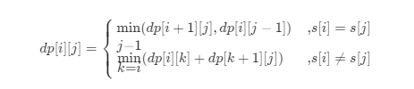

## 爱生气的书店老板

今天，书店老板有一家店打算试营业  customers.length  分钟。每分钟都有一些顾客（customers[i]）会进入书店，所有这些顾客都会在那一分钟结束后离开。

在某些时候，书店老板会生气。 如果书店老板在第 i 分钟生气，那么 grumpy[i] = 1，否则 grumpy[i] = 0。 当书店老板生气时，那一分钟的顾客就会不满意，不生气则他们是满意的。

书店老板知道一个秘密技巧，能抑制自己的情绪，可以让自己连续  X 分钟不生气，但却只能使用一次。

请你返回这一天营业下来，最多有多少客户能够感到满意的数量。

```
输入：customers = [1,0,1,2,1,1,7,5], grumpy = [0,1,0,1,0,1,0,1], X = 3
输出：16
解释：
书店老板在最后 3 分钟保持冷静。
感到满意的最大客户数量 = 1 + 1 + 1 + 1 + 7 + 5 = 16.

```

自己的解法：

```js
/**
 * @param {number[]} customers
 * @param {number[]} grumpy
 * @param {number} X
 * @return {number}
 */
var maxSatisfied = function (customers, grumpy, X) {
  var res = 0;
  for (let i = 0; i <= grumpy.length - X; i++) {
    let temp = customers.slice(i, i + X).reduce((x, y) => x + y, 0);
    let rest = 0;
    for (let j = 0; j < customers.length; j++) {
      if (j >= i && j < i + X) {
        continue;
      } else {
        if (grumpy[j] === 0) {
          rest += customers[j];
        }
      }
    }
    res = Math.max(res, rest + temp);
  }
  return res;
};
```

官方的，也就是，不做两次 for 循环，降低时间复杂度

```js
var maxSatisfied = function (customers, grumpy, X) {
  let total = 0;
  const n = customers.length;
  for (let i = 0; i < n; i++) {
    if (grumpy[i] === 0) {
      total += customers[i];
    }
  }
  let increase = 0;
  for (let i = 0; i < X; i++) {
    increase += customers[i] * grumpy[i];
  }
  let maxIncrease = increase;
  for (let i = X; i < n; i++) {
    increase =
      increase - customers[i - X] * grumpy[i - X] + customers[i] * grumpy[i];
    maxIncrease = Math.max(maxIncrease, increase);
  }
  return total + maxIncrease;
};
```

## dom.children 和 childrenNode

对于 Dom 元素。children 是指 DOM object 类型的子对象，不包括 tag 之间隐形存在的 textNode

而 childNode 包括 tag 之间隐形存在的 textNode

## 翻转图像

给定一个二进制矩阵  A，我们想先水平翻转图像，然后反转图像并返回结果。

水平翻转图片就是将图片的每一行都进行翻转，即逆序。例如，水平翻转  [1, 1, 0]  的结果是  [0, 1, 1]。

反转图片的意思是图片中的  0  全部被  1  替换， 1  全部被  0  替换。例如，反转  [0, 1, 1]  的结果是  [1, 0, 0]。

```
输入：[[1,1,0],[1,0,1],[0,0,0]]
输出：[[1,0,0],[0,1,0],[1,1,1]]
解释：首先翻转每一行: [[0,1,1],[1,0,1],[0,0,0]]；
     然后反转图片: [[1,0,0],[0,1,0],[1,1,1]]

来源：力扣（LeetCode）
链接：https://leetcode-cn.com/problems/flipping-an-image
著作权归领扣网络所有。商业转载请联系官方授权，非商业转载请注明出处。
```

```js
var flipAndInvertImage = function (A) {
  const n = A.length;
  const m = A[0].length;
  for (let i = 0; i < n; i++) {
    for (let j = 0; j < m / 2; j++) {
      //颠倒，外加反转，也就是异或^,因为这个是二进制数
      [A[i][j], A[i][m - 1 - j]] = [1 ^ A[i][m - 1 - j], 1 ^ A[i][j]];
    }
  }
  return A;
};
```

## 对象里面自带的 delete 操作

```js
let obj = {
  A: 1,
  B: 2,
};

delete obj.B;
//删除掉对象的B属性
```

## 二叉树的堂兄弟节点

在二叉树中，根节点位于深度 0 处，每个深度为 k 的节点的子节点位于深度 k+1 处。

如果二叉树的两个节点深度相同，但 父节点不同 ，则它们是一对堂兄弟节点。

我们给出了具有唯一值的二叉树的根节点 root ，以及树中两个不同节点的值 x 和 y 。

只有与值 x 和 y 对应的节点是堂兄弟节点时，才返回 true 。否则，返回 false。

来源：力扣（LeetCode）
链接：https://leetcode-cn.com/problems/cousins-in-binary-tree
著作权归领扣网络所有。商业转载请联系官方授权，非商业转载请注明出处。

```
输入：root = [1,2,3,4], x = 4, y = 3
输出：false

输入：root = [1,2,3,null,4,null,5], x = 5, y = 4
输出：true
```

解题思路：根据题目所讲，我们需要知道的只有两个信息量，一个是节点的深度，一个是节点的父节点。而我们在对树进行深度遍历 dfs 的时候，可以把这两个作为参数，传给下一次递归。所以用一次深度遍历，便可以解决问题

```js
/**
 * Definition for a binary tree node.
 * function TreeNode(val, left, right) {
 *     this.val = (val===undefined ? 0 : val)
 *     this.left = (left===undefined ? null : left)
 *     this.right = (right===undefined ? null : right)
 * }
 */
/**
 * @param {TreeNode} root
 * @param {number} x
 * @param {number} y
 * @return {boolean}
 */
var isCousins = function (root, x, y) {
  let depth_x = 0;
  let depth_y = 0;
  let father_x = null;
  let father_y = null;
  let found_x = false;
  let found_y = false;
  var dfs = (node, depth, parent) => {
    if (!node) {
      return;
    }
    if (node.val === x) {
      [depth_x, father_x, found_x] = [depth, parent, true];
    } else if (node.val === y) {
      [depth_y, father_y, found_y] = [depth, parent, true];
    }
    if (found_x && found_y) return;
    dfs(node.left, depth + 1, node);
    if (found_x && found_y) return;
    dfs(node.right, depth + 1, node);
  };
  dfs(root, 0, null);
  if (depth_x === depth_y && father_x.val !== father_y.val) {
    return true;
  } else {
    return false;
  }
};
```

## 1442. 形成两个异或相等数组的三元组数目

给你一个整数数组 arr 。

现需要从数组中取三个下标 i、j 和 k ，其中 (0 <= i < j <= k < arr.length) 。

a 和 b 定义如下：

a = arr[i] ^ arr[i + 1] ^ ... ^ arr[j - 1]
b = arr[j] ^ arr[j + 1] ^ ... ^ arr[k]
注意：^ 表示 按位异或 操作。

请返回能够令 a == b 成立的三元组 (i, j , k) 的数目。

来源：力扣（LeetCode）
链接：https://leetcode-cn.com/problems/count-triplets-that-can-form-two-arrays-of-equal-xor
著作权归领扣网络所有。商业转载请联系官方授权，非商业转载请注明出处。

```
输入：arr = [2,3,1,6,7]
输出：4
解释：满足题意的三元组分别是 (0,1,2), (0,2,2), (2,3,4) 以及 (2,4,4)

输入：arr = [1,1,1,1,1]
输出：10
```

```
解题思路：
Si=arr[0]^arr[1]^...^arr[i-1]
Sj= arr[0]^arr[1]^...^arr[i-1]^arr[i]^...^arr[j-1]
//根据异或本身等于零，推出
a => Si^Sj

b=>Sj^Sk+1

a=b =>  Si^Sj=Sj^Sk+1 =>Si=Sk+1
```

```js
/**
 * @param {number[]} arr
 * @return {number}
 */
var countTriplets = function (arr) {
  //根据推算可以推算出 Si= Sk+1
  let res = [0];
  for (let num of arr) {
    res.push(res[res.length - 1] ^ num); //算出每个Si
  }
  let n = arr.length;
  let ans = 0;
  for (let i = 0; i < n; i++) {
    for (let j = i + 1; j < n; j++) {
      for (k = j; k < n; k++) {
        if (res[i] === res[k + 1]) ans++;
      }
    }
  }
  return ans;
};
```

## 奇怪的打印机

有台奇怪的打印机有以下两个特殊要求：

打印机每次只能打印由 同一个字符 组成的序列。
每次可以在任意起始和结束位置打印新字符，并且会覆盖掉原来已有的字符。
给你一个字符串 s ，你的任务是计算这个打印机打印它需要的最少打印次数。

来源：力扣（LeetCode）
链接：https://leetcode-cn.com/problems/strange-printer
著作权归领扣网络所有。商业转载请联系官方授权，非商业转载请注明出处。

```
输入：s = "aaabbb"
输出：2
解释：首先打印 "aaa" 然后打印 "bbb"。

输入：s = "aba"
输出：2
解释：首先打印 "aaa" 然后在第二个位置打印 "b" 覆盖掉原来的字符 'a'。
```

解题思路：
动态规划部分
（基于第一种代码 len 从短到长，与官方题解略有不同）

动态规划数组 dp[i][j]：表示打印区间 [i, j][i,j] 所需要的最小次数
初始化：将所有位置初始化为 0x3f3f3f3f，表示该状态不可达；同时对于 dp[i][i] ，初始化为 11，因为打印一个位置上的字母需要打印一次（比较显然）。
转移方程：
这里有两种情况，当 `s[i]=s[j]` 时， 第 ii 位或者第 jj 位的字母可以搭便车，在一个子状态中多打印一位而来，而不需要多打印一次；当 `s[i]!==s[j]`,这个时候我们就需要遍历`[i,j-1]`，找到一个分割点，使得` dp[i][分割点]+dp[分割点+1][j]`最小。


到这个部分动态规划的基本原理就已经讲解完毕了，剩下的编码相对于这个部分来说，还是相对容易的。如果觉得很难，还是要多做字符串 dp 的题目，对这些题目的基本套路有所了解。以我自己的经验来看，我觉得这道题目其实和回文串的 dp 是有很多相似之处的。

为什么官方题解中要让 ii 从后往前遍历？
我在代码二中，写了一下 ii 从前向后遍历的情况，可以看到，非常难受。
我们可以分析一下 i,j,ki,j,k 三大变量的特点。

ii :
从后向前： n-1→0n−1→0
从前向后： 0→n-10→n−1
jj :
从后向前：从 i+1 开始，往右端点(n-1)移动，这里有 i < j

从前向后：从 i-1 开始，往左端点(00)移动，这里有 j < i

kk : 从 ii 开始，向 jj 移动

同时还有另一个特性，dp[i][j]中默认了 i<ji<j；因此在从前向后遍历中，因为有 j < ij<i，需要不断地写 dp[j][i]，这真是太难受了。

除了细节上的差距，大体上还是相同的，可以看个人喜好进行选择。

```js
/**
 * @param {string} s
 * @return {number}
 */
var strangePrinter = function (s) {
  let n = s.length;
  let f = new Array(n).fill(0).map(() => new Array(n).fill(0));
  for (let i = n - 1; i >= 0; i--) {
    f[i][i] = 1;
    for (let j = i + 1; j < n; j++) {
      if (s[i] === s[j]) {
        f[i][j] = f[i][j - 1];
      } else {
        let min = Number.MAX_SAFE_INTEGER;
        for (let k = i; k < j; k++) {
          min = Math.min(min, f[i][k] + f[k + 1][j]);
        }
        f[i][j] = min;
      }
    }
  }
  return f[0][n - 1];
};
```

## 2 的幂

给你一个整数 n，请你判断该整数是否是 2 的幂次方。如果是，返回 true ；否则，返回 false 。

如果存在一个整数 x 使得  n == 2x ，则认为 n 是 2 的幂次方。

来源：力扣（LeetCode）
链接：https://leetcode-cn.com/problems/power-of-two
著作权归领扣网络所有。商业转载请联系官方授权，非商业转载请注明出处。

```
输入：n = 1
输出：true
解释：2^0 = 1
```

解题思路：利用位运算 `n & (n-1) => 其实就是二进制树n 和二进制数n-1进行与运算`

```js
/**
 * @param {number} n
 * @return {boolean}
 */
var isPowerOfTwo = function (n) {
  return n > 0 && (n & (n - 1)) === 0;
};
```

## 4 的幂

给定一个整数，写一个函数来判断它是否是 4 的幂次方。如果是，返回 true ；否则，返回 false 。

整数 n 是 4 的幂次方需满足：存在整数 x 使得 n == 4x

来源：力扣（LeetCode）
链接：https://leetcode-cn.com/problems/power-of-four
著作权归领扣网络所有。商业转载请联系官方授权，非商业转载请注明出处。

```
输入：n = 16
输出：true

输入：n = 5
输出：false
```

解题思路：如果是 4 的幂，前提一定是 2 的幂，所以他一定满足之前我们的 2 的幂，然后 4^x=(1+3)^x 所以结果除模的话一定是 1。所以这也是一个判断条件

```js
/**
 * @param {number} n
 * @return {boolean}
 */
var isPowerOfFour = function (n) {
  return n > 0 && (n & (n - 1)) == 0 && n % 3 === 1;
};
```

## 零钱兑换

给定不同面额的硬币和一个总金额。写出函数来计算可以凑成总金额的硬币组合数。假设每一种面额的硬币有无限个。

来源：力扣（LeetCode）
链接：https://leetcode-cn.com/problems/coin-change-2
著作权归领扣网络所有。商业转载请联系官方授权，非商业转载请注明出处。

```
输入: amount = 5, coins = [1, 2, 5]
输出: 4
解释: 有四种方式可以凑成总金额:
5=5
5=2+2+1
5=2+1+1+1
5=1+1+1+1+1

输入: amount = 3, coins = [2]
输出: 0
解释: 只用面额2的硬币不能凑成总金额3。

```

```js
/**
 * @param {number} amount
 * @param {number[]} coins
 * @return {number}
 */
var change = function (amount, coins) {
  let dp = new Array(amount + 1).fill(0);
  dp[0] = 1;
  for (let coin of coins) {
    for (let i = coin; i <= amount; i++) {
      dp[i] += dp[i - coin];
    }
  }
  return dp[amount];
};
```

## 斐波那契/爬楼梯

```
F(0) = 0,   F(1) = 1
F(N) = F(N - 1) + F(N - 2), 其中 N > 1.

斐波那契数列由 0 和 1 开始，之后的斐波那契数就是由之前的两数相加而得出。

答案需要取模 1e9+7（1000000007），如计算初始结果为：1000000008，请返回 1。

来源：力扣（LeetCode）
链接：https://leetcode-cn.com/problems/fei-bo-na-qi-shu-lie-lcof
著作权归领扣网络所有。商业转载请联系官方授权，非商业转载请注明出处。
```

解题思路：应该用数组的方法来接，如果用递归 直接写 fn= fn-1 + fn-2 的话，时间复杂度太高了

```js
/**
 * @param {number} n
 * @return {number}
 */
var fib = function (n) {
  let n1 = 0;
  let n2 = 1;
  let sum = 0;
  if (n == 0) return sum;
  if (n == 1) return 1;
  for (let i = 2; i <= n; i++) {
    sum = (n1 + n2) % 1000000007;
    n1 = n2;
    n2 = sum;
  }
  return sum;
};
```

## 二进制手表

给你一个整数 turnedOn ，表示当前亮着的 LED 的数量，返回二进制手表可以表示的所有可能时间。你可以 按任意顺序 返回答案。

```
输入：turnedOn = 1
输出：["0:01","0:02","0:04","0:08","0:16","0:32","1:00","2:00","4:00","8:00"]

来源：力扣（LeetCode）
链接：https://leetcode-cn.com/problems/binary-watch
著作权归领扣网络所有。商业转载请联系官方授权，非商业转载请注明出处。
```

解题思路：总共十个灯，高四位表示 h，低六位表示 m。所以我们可以遍历总共 2^10 种情况，来把符合条件的时间装进数组里。（10 位二进制数中为 1 的数目等于 turnedon,h<12&&m<60）

```js
/**
 * @param {number} turnedOn
 * @return {string[]}
 */
var readBinaryWatch = function (turnedOn) {
  let ans = [];
  for (let i = 0; i < 1024; i++) {
    let h = i >> 6,
      m = i & 63; //与运算算出分钟的六位上的数
    if (
      h < 12 &&
      m < 60 &&
      i.toString(2).split("0").join("").length === turnedOn
    ) {
      let temp = h + ":" + (m < 10 ? "0" : "") + m;
      ans.push(temp);
    }
  }
  return ans;
};

var readBinaryWatch = function (turnedOn) {
  const ans = [];
  for (let h = 0; h < 12; ++h) {
    for (let m = 0; m < 60; ++m) {
      if (
        h.toString(2).split("0").join("").length +
          m.toString(2).split("0").join("").length ===
        turnedOn
      ) {
        ans.push(h + ":" + (m < 10 ? "0" : "") + m);
      }
    }
  }
  return ans;
};
```

## 字符串的排列

输入一个字符串，打印出该字符串中字符的所有排列。

你可以以任意顺序返回这个字符串数组，但里面不能有重复元素。

```
输入：s = "abc"
输出：["abc","acb","bac","bca","cab","cba"]
```

```js
var permutation = function (s) {
  let nums = Array.from(s).sort();
  let result = [],
    path = [];
  var backTrack = (used) => {
    if (path.length === nums.length) {
      result.push(path.slice().join(""));
      return;
    }
    for (let i = 0; i < nums.length; i++) {
      if (i > 0 && nums[i] === nums[i - 1] && used[i - 1] === false) {
        continue;
      }
      if (!used[i]) {
        used[i] = true;
        path.push(nums[i]);
        backTrack(used);
        path.pop();
        used[i] = false;
      }
    }
  };
  backTrack([]);
  return result;
};
```

## 二维数组的查找

在一个 n \* m 的二维数组中，每一行都按照从左到右递增的顺序排序，每一列都按照从上到下递增的顺序排序。请完成一个高效的函数，输入这样的一个二维数组和一个整数，判断数组中是否含有该整数。

来源：力扣（LeetCode）
链接：https://leetcode-cn.com/problems/er-wei-shu-zu-zhong-de-cha-zhao-lcof
著作权归领扣网络所有。商业转载请联系官方授权，非商业转载请注明出处。

解题思路：
获得当前下标位置的元素 num
如果 num 和 target 相等，返回 true
如果 num 大于 target，列下标减 1
如果 num 小于 target，行下标加 1

```js
/**
 * @param {number[][]} matrix
 * @param {number} target
 * @return {boolean}
 */
var findNumberIn2DArray = function (matrix, target) {
  if (matrix.length === 0 || matrix[0].length === 0 || matrix == null)
    return false;
  let rows = matrix.length;
  let columns = matrix[0].length;
  let i = 0,
    j = columns - 1;
  while (i < rows && j >= 0) {
    if (matrix[i][j] === target) {
      return true;
    } else if (matrix[i][j] > target) {
      j--;
    } else if (matrix[i][j] < target) {
      i++;
    }
  }
  return false;
};
```

## 旋转数组的最小数字

把一个数组最开始的若干个元素搬到数组的末尾，我们称之为数组的旋转。输入一个递增排序的数组的一个旋转，输出旋转数组的最小元素。例如，数组  [3,4,5,1,2] 为 [1,2,3,4,5] 的一个旋转，该数组的最小值为 1。

来源：力扣（LeetCode）
链接：https://leetcode-cn.com/problems/xuan-zhuan-shu-zu-de-zui-xiao-shu-zi-lcof
著作权归领扣网络所有。商业转载请联系官方授权，非商业转载请注明出处。

```
输入：[3,4,5,1,2]
输出：1
```

解题思路：二分查找

```js
/**
 * @param {number[]} numbers
 * @return {number}
 */
var minArray = function (numbers) {
  let low = 0;
  let high = numbers.length - 1;
  while (low < high) {
    let privot = low + Math.floor((high - low) / 2);
    if (numbers[privot] < numbers[high]) {
      high = privot;
    } else if (numbers[privot] > numbers[high]) {
      low = privot + 1;
    } else {
      high--;
    }
  }
  return numbers[low];
};
```
## H的指数

给定一位研究者论文被引用次数的数组（被引用次数是非负整数）。编写一个方法，计算出研究者的 h 指数。

h 指数的定义：h 代表“高引用次数”（high citations），一名科研人员的 h 指数是指他（她）的 （N 篇论文中）总共有 h 篇论文分别被引用了至少 h 次。且其余的 N - h 篇论文每篇被引用次数 不超过 h 次。

例如：某人的 h 指数是 20，这表示他已发表的论文中，每篇被引用了至少 20 次的论文总共有 20 篇。

 

来源：力扣（LeetCode）
链接：https://leetcode-cn.com/problems/h-index
著作权归领扣网络所有。商业转载请联系官方授权，非商业转载请注明出处。

```
输入：citations = [3,0,6,1,5]
输出：3 
解释：给定数组表示研究者总共有 5 篇论文，每篇论文相应的被引用了 3, 0, 6, 1, 5 次。
     由于研究者有 3 篇论文每篇 至少 被引用了 3 次，其余两篇论文每篇被引用 不多于 3 次，所以她的 h 指数是 3。

```

```js
/**
 * @param {number[]} citations
 * @return {number}
 */
var hIndex = function (citations) {
    citations.sort((a, b) => a - b)
    let h = 0, i = citations.length - 1;
    //从大到小排序，然后当循环进行到 citations[i]===h的时候，刚好i个>=h N-i个<=h
    while (i >= 0 && citations[i] > h) {
        h++;
        i--;
    }
    return h
};
```