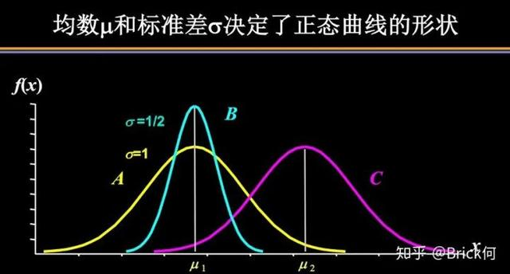

### deviation 偏差

standard deviation 标准偏差:各数据偏离平均数的距离（离均差）的平均数，它是**离均差平方和平均后的平方根**。用 σ 表示。因此，标准差也是一种平均数。标准差是方差的算术平方根。　标准差能反映一个数据集的离散程度。平均数相同的，标准差未必相同。

方差：所有数与平均数的差的平方的平均数 = ((x1-m)^2+ (x2-m)^2+....+(xn-m)^2)/n

标准差是方差的平方根

根据正态分布（normally distributed）的原则： 落在一个标准差之内的概率约为 68%，落在两个标准差之内的概率约为 95%，落在三个标准差之内的概率是 99.73%
（一般记住三个标准差就行了）,所以可以认为正态分布曲线是一条基于平均数左右对称的曲线，均数和标准差决定了这条曲线的形状

### 一些数

- mean 平均数
- odd integer 奇数 consecutive odd integer 连续性奇数
- even integer 偶数

- positive integer 正整数
- negative integer 负整数

## 排列组合

$A_n^m = \frac{n!}{(n-m)!}$

$C_n^m = \frac{n!}{(n-m)! m!}$

