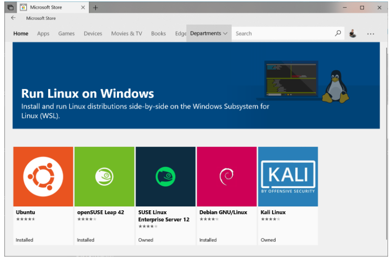

# docker desktop

参考链接： https://docs.docker.com/docker-for-windows/install/

## 需要 wsl2

win10 我用的版本新一点，是 19 点几，它支持 wsl2，所以我只需要到 Microsoft 商店安装 linux 发行版



然后点击获取，安装之后，点击启动，然后为新的 Linux 发行版创建一个用户账号和密码。

## 启动 docker desktop 报错

```
C:\Program Files\Docker\Docker\Resources\bin\docker.exe: error during connect: Post http://%2F%2F.%2Fpipe%2Fdocker_engine/v1.39/containers/create: open //./pipe/docker_engine: The system cannot find the file specified. In the default daemon configuration on Windows, the docker client must be run elevated to connect. This error may also indicate that the docker daemon is not running.
```

解决办法：
打开 powershell，输入

```
cd "C:\Program Files\Docker\Docker"

./DockerCli.exe -SwitchDaemon
```
