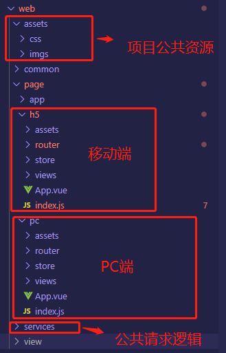

# egg+vue 实战二——多页面配置

## 引子

在第一篇的时候，我们已经知道如何起一个 egg+vue 的前后端兼具的项目了，也知道如何写接口，建表以及前后端相关的联调。

除了 webpack 打包需分环境配置，以及服务端渲染等更加企业化的配置，其他的配置我们已经基本配置好了，但是还是只限 PC 端的。

对此，我想新起一个新分支，做项目的多页面配置。

## 移动端适配的方案

- 响应式布局：依靠前端 CSS 对各种屏幕尺寸进行适配

1. 技术实现：Media Query 媒体查询、百分比流式布局、栅格系统……
2. 优缺点：

优点：

    设计元素很容易被复用，设计成本低

    前端只需要维护一套CSS代码

    桌面端与移动端的设计十分接近，令用户感到“熟悉”

    不需要任何服务器端的支持

缺点：

     设计需求复杂时，前端的开发成本没有任何减轻

     桌面和移动端的资源会被同等的下载到客户端，影响性能

     如果JS不写两套，桌面端的交互和移动端的交互很难针对平台作出差异

- 多套页面

1. 技术实现

前端实现两套逻辑，分别兼容桌面、移动设备

通过 UA、特性检测在前端做设备判断，对资源进行异步加载，渲染不同模版，使用不同的业务逻辑

前端的模块化可以帮助解决这个问题，比如针对不同的平台加载不同的模块

2. 优缺点

优点：移动端和 PC 端的代码不需要糅合在一起，可以针对平台做出差异

缺点： 桌面端和移动端会被同等地下载到客户端，影响性能

## 实现

很显然，我们项目里是采用了第二种，多套页面的方式，因为我们移动端可能有些交互的逻辑跟 PC 端还是有区别的，采用第一种响应式布局的话，比较难对项目进行重构和维护。

当然，具体采用什么方案，还是跟实际的场景和需求决定。

### 前端重构

首先需要两个入口

```js
//webpack.config.js

...,
  entry: {
    pc: "app/web/page/pc/index.js",//PC端入口
    h5: "app/web/page/h5/index.js",//移动端入口
  },
  ...
```

因为项目规划了两个入口了，所以我们项目的结构也需要做相应的改变，把原来`app/web/page`目录下，重构为 `app/web/page/pc`和`app/web/page/h5`两个目录。然后拆分出来之后，项目的结构如下。node 后端的项目结构不变。



然后因为项目结构重构导致的文件路径更改，所以我们的 alias.js 文件也要做相应的更改

```js
"use strict";

const path = require("path");
const fs = require("fs");
const rootPath = fs.realpathSync(process.cwd()); //项目的根目录
const resolve = (relativePath) => path.resolve(rootPath, relativePath);
const commonPath = resolve("app/web/common"); //公共目录
// const projectPath = resolve('app/web/page/app'); //旧版本单页面的 子项目，前端项目的根目录
const projectPath = resolve("app/web"); //子项目，前端项目的根目录
const pcPath = resolve("app/web/page/pc"); // PC项目根目录
const h5Path = resolve("app/web/page/h5"); // h5项目根目录

module.exports = {
  COMMON: commonPath,
  "@": projectPath, // 子项目根目录

  /**废弃的旧版本的单页面的一些通用路径 */
  // '@router': path.resolve(projectPath, 'router'), // 子项目组件库
  //'@store': path.resolve(projectPath, 'store'), // 子项目vuex,双端的状态应该各自维护一份
  // "@views": path.resolve(projectPath, "views"), // 子项目页面
  "@assets": path.resolve(projectPath, "assets"), //子项目公共资源,双端公用的一些公共资源
  "@services": path.resolve(projectPath, "services"), // 子项目接口api库,因为请求的逻辑是双端共用的

  "@pc": pcPath, //PC项目根目录
  "@h5": h5Path, //h5项目根目录
};
```

### 服务端重构

前端不同的入口我们已经写好了，至于怎么做不同终端适配的区分，适配到不同的入口文件，这是服务端做的事情。

原理：因为我们发起请求的时候，在请求头有包含 `user-agent`，里面有我们设备的信息,我们可以通过这个信息做相关的区分，让流量到达不同的入口文件去

在`controller/index.js`

```js
"use strict";

const Controller = require("egg").Controller;
const path = require("path");
class AppController extends Controller {
  async render(ctx) {
    //客户端渲染
    const { app } = this;
    const { mode = "csr" } = ctx.query;
    if (mode === "csr") {
      this.ctx.logger.info(`AppController, ctx.url is ${this.ctx.request.url}`);
      // renderClient 前端渲染，Node层只做 layout.html和资源依赖组装，渲染交给前端渲染。与服务端渲染的差别你可以通过查看运行后页面源代码即可明白两者之间的差异
      // app.js 对应 webpack entry 的 app, 构建后文件存在 app/view 目录

      //在流量进入node层之后，根据请求头的user-agent，来区分设备类型，然后进入渲染不同的入口文件
      const device = this.ctx.helper.checkDevice(
        ctx.request.headers["user-agent"]
      );
      if (device.isPhone || device.isAndroid || device.isTablet) {
        await this.ctx.renderClient(
          "h5.js",
          {
            url: this.ctx.url,
            env: this.ctx.app.config.env,
          },
          { layout: path.join(app.baseDir, "app/web/view/layout.html") }
        );
      } else {
        await this.ctx.renderClient(
          "pc.js",
          {
            url: this.ctx.url,
            env: this.ctx.app.config.env,
          },
          { layout: path.join(app.baseDir, "app/web/view/layout.html") }
        );
      }
    } else {
      //服务端渲染
      await this.ctx.render("app.js", { url: this.ctx.url });
    }
  }
}

module.exports = AppController;
```

至于`checkDevice`的方法，我们的定义在 `extend/helper.js`

```js
"use strict";

module.exports = {
  /**
   * 检查设备
   */
  checkDevice(userAgent) {
    const isWindowsPhone = /(?:Windows Phone)/.test(userAgent);
    const isSymbian = /(?:SymbianOS)/.test(userAgent) || isWindowsPhone;
    const isAndroid = /(?:Android)/.test(userAgent);
    const isFireFox = /(?:Firefox)/.test(userAgent);
    const isTablet =
      /(?:iPad|PlayBook)/.test(userAgent) ||
      (isAndroid && !/(?:Mobile)/.test(userAgent)) ||
      (isFireFox && /(?:Tablet)/.test(userAgent));
    const isPhone = /(?:iPhone)/.test(userAgent) && !isTablet;
    const isPc = !isPhone && !isAndroid && !isSymbian;

    return {
      isPhone,
      isAndroid,
      isTablet,
      isPc,
    };
  },
};
```

## 运行项目

同样是 `npm run dev` 运行项目。用谷歌浏览器，切换不同的终端，我们会发现，浏览器加载的是不同的入口文件，PC 端加载 pc.js，移动端加载 h5.js。这样大概的项目移动端适配就完成了

## 后续问题

1. 如果 egg 服务端有需要发请求给额外的服务的话，一般是在服务端采用 curl 的方式:

```js
async showapi() {
    const { ctx } = this;
    // 获取post 请求参数
    let count = ctx.request.body.count;
    const url = 'https://route.showapi.com/1211-1';
    const result = await ctx.curl(url,{
      method: 'POST', // 设置请求方式 默认是GET
      dataType: 'json',
      contentType: 'json', // 默认是 form,把传过去的内容转化为json
      data: {
        count: count,
        showapi_appid: '3****1',
        showapi_sign: 'a**********************4'
      }
    });
    ctx.body = {
      result: result
    }
  };

  //router.js
  router.post('/httpclient/showapi', controller.httpClient.showapi);
```
