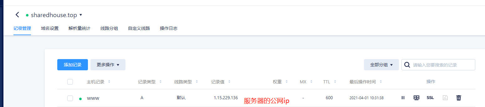
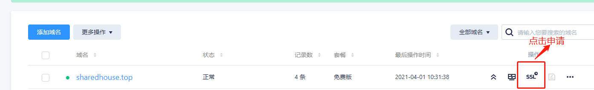
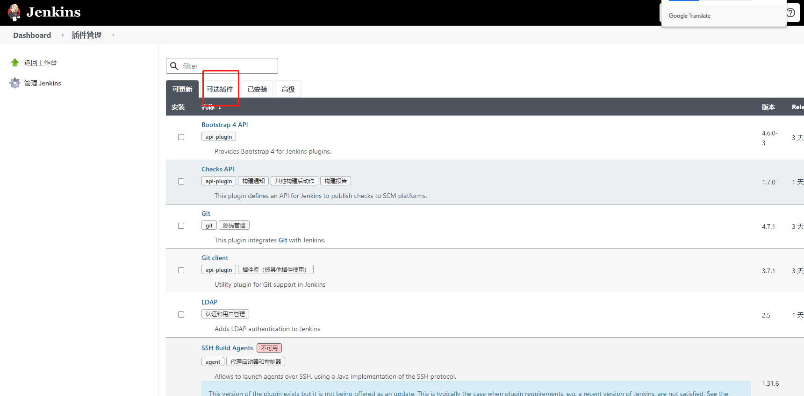
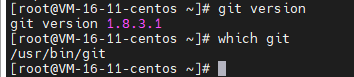
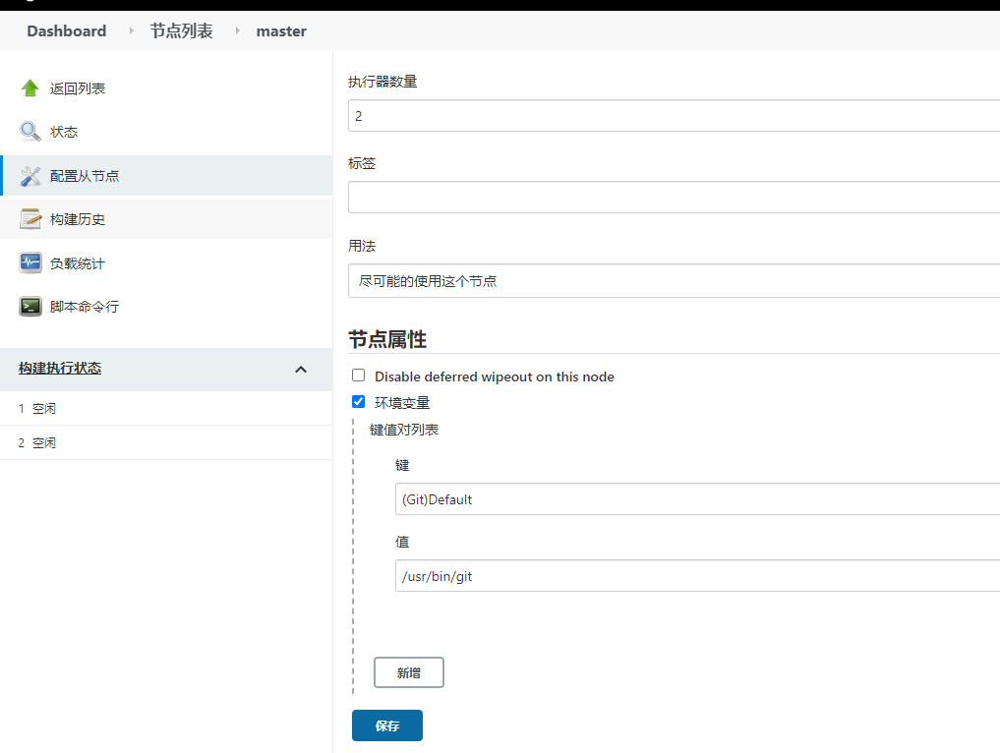
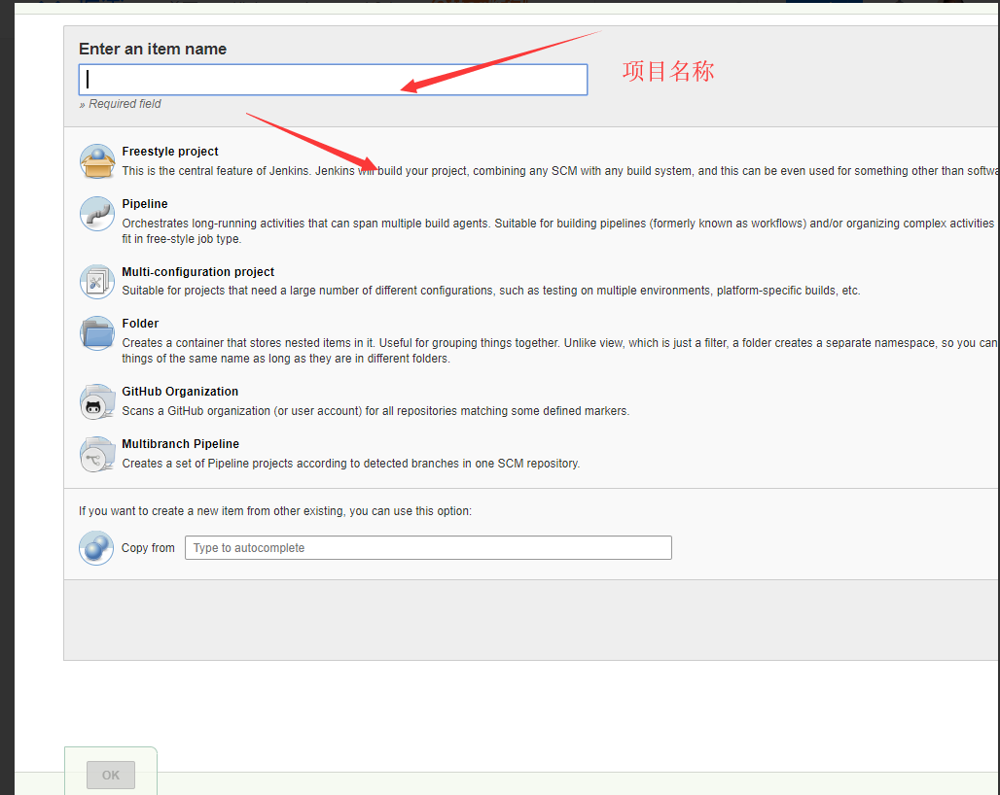
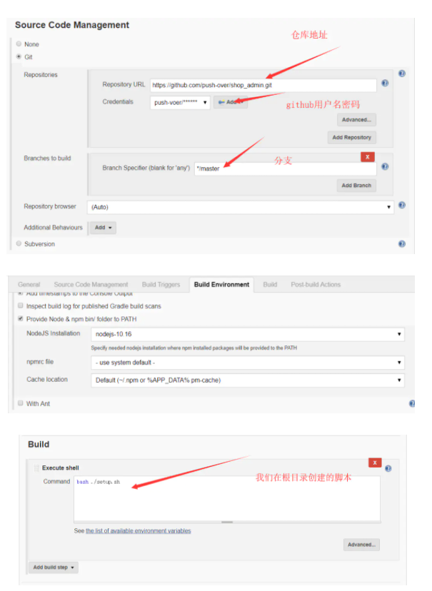
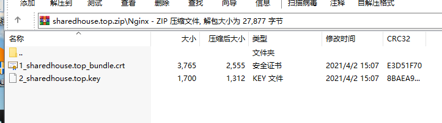

# 项目自动化部署

## 自动化部署的概念

是需要用到 docker 容器的，在企业开发中,服务是放在 docker 里面的，自动化部署，是通过 GitHubd 等平台提交代码，然后触发构建脚本，把我们最新的代码构建为最新的镜像，然后 docker run 最新的镜像，这样就可以把我们的服务跑起来。而帮我们做这些事情的通通由一个名为 jenkins 的东西帮我们搞定

## 购买云服务器和域名

先做的是将购买的域名添加域名解析，映射到我们购买的云服务器的公网 ip,然后给域名添加 SSL 证书，建立 https 安全连接。

1.添加域名映射



2. 添加 SSL 证书



## 配置服务器环境

### docker

```
//1安装
yum -y install docker

//2测试

docker version (不要安装1.3.1，务必安装最新的)
//3启动docker

systemctl start docker

//4查看docker 状态

systemsctl status docker

其他的docker操作
//拉取镜像

docker pull skiychan/nginx-php7

//查看启动好的容器

docker ps

//容器重启
docker restart

//docker 服务重启

systemctl restart docker

```

## docker-compose

```
第一种方式：

可以在安装之前先更新一下curl

yum update curl

下载

sudo curl -L https://github.com/docker/compose/releases/download/1.20.0/docker-compose-`uname -s`-`uname -m` -o /usr/local/bin/docker-compose

安装

chmod +x /usr/local/bin/docker-compose

查看版本

docker-compose version

第二种方式：

安装pip

yum -y install epel-release
yum -y install python-pip

确认版本

pip --version

更新pip

pip install --upgrade pip

安装docker-compose

pip install docker-compose

查看版本

docker-compose version

```

## jenkins (用 docker-compose 安装 jenkins)

在服务器的 home 文件夹下创建 jenkins 文件夹

创建三个文件

1. docker-compose.yml

```
version: '3'
services:
  jenkins:
    image: 'jenkins/jenkins:lts'
    container_name: jenkins
    restart: always
    ports:
      - '8080:8080'
      - '50000:50000'
    volumes:
      - '/var/jenkins_home:/var/jenkins_home'
```

2. docker_run_install_jenkins.sh

```
#!/bin/bash

docker run --name jenkins \
           -d \
           -p 8080:8080 \
           -p 50000:50000 \
           -v /var/jenkins_home:/var/jenkins_home \
           --restart always \
           jenkins/jenkins:lts
```

3. pre_install_jenkins.sh

```
#!/bin/bash

mkdir -p /var/jenkins_home
chown -R 1000:1000 /var/jenkins_home
```

然后在 Jenkins 目录执行以下命令

```
# 给脚本授权
chmod u+x *.sh
# 创建Jenkins数据目录（用作持久卷）
./pre_install_jenkins.sh
# 启动Jenkins容器
docker-compose up -d
```

### ERROR: Couldn't connect to Docker daemon at http+docker://localhost - is it running?

主要原因是 docker 不是系统服务方式启动

解决办法：

1. 启动 docker 服务

```
service docker start
```

2. 生成自启动服务

```
systemctl enable docker.service
```

3. 查看服务状态, active 状态为 active(running)

```
systemctl status docker.service
```

docker-compose 成功之后，运行 `docker logs -f jenkins`查看 jenkins 日志

找到 Jenkins Initial Password 的日志，比如：

```
Jenkins initial setup is required. An admin user has been created and a password generated.
Please use the following password to proceed to installation:

<Initial Admin Password>

This may also be found at: /var/jenkins_home/secrets/initialAdminPassword
```

访问 Jenkins 网址 http://[server_ip]:8080，输入上面生成的初始密码，按照提示安装到成功完成。

然后使用推荐插件，注册新用户

然后我们点击系统设置，插件管理可以安装两个插件

```
NodeJS Plugin
Publish Over SSH
```



## 出现的问题

### error cloning remote repo 'origin'的解决方法

解决方法：

由于我是要将项目构建在 linux 虚拟机中，所以需要在任务指定运行的节点上配置服务器上 git 的运行地址。

1. 查找并复制 Git 在服务器上的运行地址；

```
yum install git

git version

which git

```



2. 在 jenkins 上，系统管理->节点管理->LinuxEvn，配置 git 在 linux 虚拟机上的运行地址
   

3. 保存，再次构建

### service must be a mapping, not a NoneType.

docker-compose.yml 文件，需要有两个空格的缩进的，详细见正确的 yml 文件格式

### service must be a mapping, not a NoneType.

需要安装最新的 docker-1.3.1 的 docker 会出现问题

### 当从老版本的 docker 更新为最新的 docker 时，docker-compose up -d 指令报错 unkown runtime specified docker-runc。

在查阅资料后，得知因为「当您从不兼容的版本升级 docker 并且升级后无法启动 docker 容器时会出现这种情况」，解决办法如下：

```
[root@template-centos7 /root]#grep -rl 'docker-runc' /var/lib/docker/containers/ | xargs sed -i 's/docker-runc/runc/g'
[root@template-centos7 /root]#systemctl stop docker
[root@template-centos7 /root]#systemctl start docker


```

### 构建产物在哪里

构建产物在 jenkins 文件夹里面的有一个 workspaces 文件夹,里面有我们构建的产物

### 构建任务

jenkins 创建项目





任务创建完之后，我们便可点击构建，然后选择控制台，等待构建的结果，如果构建成功。我们可以在我们服务器输入

```
docker ps
```

看到我们在 `docker-compose.yml 里面写的那些容器已经启动，而`且处于稳定状态。这样我们的服务就部署在容器上，然后开放了 7001 端口作为对外访问接口

# 手动部署

## 购买云服务器和域名

先做的是将购买的域名添加域名解析，映射到我们购买的云服务器的公网 ip,然后给域名添加 SSL 证书，建立 https 安全连接。

1.添加域名映射


2. 添加 SSL 证书


## 服务器环境配置

根据项目需求，我们需要在服务器配置`node,git,nginx,mysql`。

### 如何连接服务器

首先腾讯云是有提供服务器 powershell 的。输入我们 root 用户的密码，便可以连接。

但是我们，总不能天天登腾讯云官网是吧，而且涉及到文件传输的时候，这也是 powershell 做不到的事情，所以这时候我推荐一个巨好用的连接远程服务器的软件：`mobaXterm`，用过的都说好，而且还有小游戏

以下操作都在 mobaXterm 中执行,连接上我们的服务器，我们开始装环境吧.

其实还没接触过服务器的同学，先不要对服务器这个在你印象中只有一个终端的东西感到恐惧，其实这只是因为系统不同的原因，windows 是因为有图形化界面，但是到底都离不开，文件系统，存储，这些东西。所以 linux 就是抽象的操作系统。

而环境部署，服务器跟本地其实都一样，我们本地跑项目需要 node,需要 mysql,拉代码需要 git，服务器上同样也需要，其实服务器也是可以当作一台电脑,只不过系统不同。而 nginx 的作用是负载均衡，道理也很简单，我们本地只是我们在访问，但是服务器可能同时有好多人都在访问我们的网页，所以这时候 nginx 的负载均衡的作用就显现出来了。

## node

```
1、下载node二进制安装包
  wget https://nodejs.org/dist/v10.13.0/node-v10.13.0-linux-x64.tar.xz
2、解压
  tar xvf node-v10.13.0-linux-x64.tar.xz
3、创建软链接，使node和npm全局有效
  ln -s /root/node-v10.13.0-linux-x64/bin/node /usr/local/bin/node
  ln -s /root/node-v10.13.0-linux-x64/bin/npm /usr/local/bin/npm
4、查看node和npm版本，如果显示版本号，说明安装成功
  node -v
  npm -v
5、软件默认安装在/root/node-v10.13.0-linux-x64/目录下
```

安装完，输入 `npm -v`和` node -v`能显示相应的版本，就表明安装成功

## mysql

由于 CentOS 的 yum 源中没有 MySQL，需要到 MySQL 的官网下载 yum repo 配置文件。

```
wget https://dev.mysql.com/get/mysql57-community-release-el7-9.noarch.rpm
```

然后进行 repo 的安装

```
rpm -ivh mysql57-community-release-el7-9.noarch.rpm
```

执行完成后会在/etc/yum.repos.d/目录下生成两个 repo 文件 mysql-community.repo mysql-community-source.repo。

使用 yum 命令完成 mysql 的安装

必须进入` /etc/yum.repos.d/`目录后再执行以下脚本

```
yum install mysql-server //安装命令

systemctl start mysql //启动mysql

//获取安装时的临时密码（在第一次登陆时就是用这个密码
grep 'temporary password' /var/log/mysqld.log
```

登录:

执行 `mysql -u root -p`指令，然后输入密码(刚刚获取的临时密码)

登录成功之后修改密码

修改密码时，MySQL 会进行密码强度校验，不满足校验时会报异常：

```
ERROR 1819 (HY000): Your password does not satisfy the current policy requirements
```

但是我们通常都喜欢设置成更简单的密码，所以我们可以如下操作：

```
set global validate_password_policy=0;
set global validate_password_length=4;
ALTER USER 'root'@'localhost' IDENTIFIED BY 'root';
```

以上就完成 mysql 的安装

### 数据导入

因为我们本地已经有数据库了，而且前后端联调是之前自己在本地做的，所以我们只需要把本地数据库导出一份 sql 文件,然后在服务器的 mysql 导入便可.

1. 将本地数据库信息导出为.sql 文件。cmd 进入终端，执行以下指令：

```
mysqldump -u root -p miniprogram > C:\Users\linjuntao\sharehouse.sql
```

或者有 debeaver 客户端的同学可以，之前右键你们想导出的数据库-点击工具-dump 数据库，把我们的数据库导出。然后我们可以在 `C:\Users\linjuntao\`目录下看到对应的 sql 文件

2. 然后在我们的服务器创建一个相同名字的数据库，(sql 语句注意要分号)

```
create database sharehouse;
```

进入数据库：

```
use sharehouse;
```

设置数据库编码：

```
set names utf8;
```

3. 把我们本地生成的 sql 文件，上传到 /root/user 文件夹

用 MobaXterm 可以采用拖拉拽的方式，而且文件的其他操作，软件也提供。

4. 然后登录我们的服务器的数据库，执行

```
source /root/user/sharehouse.sql;
```

如果导入成功，我们便可以执行`use sharehouse; show tables; `看到我们本地数据库中的表在服务器中也是存在的。

## nginx

执行命令：

```
yum -y install nginx
```

安装完后输入 nginx -v，若显示 nginx 版本号则表示安装成功。

### 上传 SSL 证书

在服务器新建目录: `/data/release/nginx`（/data 文件本身存在，只需在里面新建 release 文件夹和 nginx 文件夹即可）

使用我们的 mobaxterm 把证书上传到该文件夹下面



上传完证书之后，就可以开始配置 nginx，进入服务器的`/etc/nginx/conf.d`目录，新建一个`sharedhouse.conf`文件，写入如下配置：

```
upstream sharedhouse {
    server localhost:7001; # 你的项目服务端启动的地址
    keepalive 8;
}

server {
    listen      80;
    server_name www.sharedhouse.top; # 你的域名

    rewrite ^(.*)$ https://$server_name$1 permanent;
}

server {
    listen      443;
    server_name www.sharedhouse.top; # 你的域名

    ssl on;

    ssl_certificate           /data/release/nginx/1_sharedhouse.top_bundle.crt; #你的证书
    ssl_certificate_key       /data/release/nginx/2_sharedhouse.top.key; # 你的证书
    ssl_session_timeout       5m;
    ssl_protocols             TLSv1 TLSv1.1 TLSv1.2;
    ssl_ciphers               ECDHE-RSA-AES256-GCM-SHA384:ECDHE-RSA-AES128-GCM-SHA256:DHE-RSA-AES256-GCM-SHA384:ECDHE-RSA-AES256-SHA384:ECDHE-RSA-AES128-SHA256:ECDHE-RSA-AES256-SHA:ECDHE-RSA-AES128-SHA:DHE-RSA-AES256-SHA:DHE-RSA-AES128-SHA;
    ssl_session_cache         shared:SSL:50m;
    ssl_prefer_server_ciphers on;

    location / {
        proxy_pass http://sharedhouse;
        proxy_http_version 1.1;
        proxy_set_header Upgrade $http_upgrade;
        proxy_set_header Connection 'upgrade';
        proxy_set_header Host $host;
        proxy_cache_bypass $http_upgrade;
    }
}
```

配置成功后，输入 nginx 回车，即可启动 nginx。此时通过配置的域名访问服务器（http://www.sharedhouse.top），会显示Nginx详情页。

如果访问 http://你的域名/sharedhouse 会自动跳转到 HTTPS 上，并显示 502 Bad Gateway，则表示配置成功。

如果上传的 weapp.conf 文件发生了修改，需要重启 nginx：`nginx -s reload`。

如果出现 `nginx: [emerg] bind() to [::]:80 failed (98: Address already in use)`的报错，可以执行 `netstat -ntpl` 指令查看进程，将占用 80 端口的进程 kill 掉，或执行 `fuser -n tcp 80` 直接查看占用 80 端口的进程有哪些，依次 kill 掉即可。

# 服务端下载源码

我这边建议使用 git,拉去源码。服务器新建目录 /data/release/node-app,然后进入该目录，执行 git clone 命令(前期是先安装 git)。

然后执行`npm i --registry=https://registry.npm.taobao.org --production`
安装生产环境下的依赖，然后启动我们的项目服务：

```
npm run start //我们看到我们的服务部署在 7001端口的时候便是部署成功.(记得云服务器开放7001端口)
```

至此云服务器的环境已经完全搭建好了。

## 存在问题

### mysql 导入报错 [Err] 1273 - Unknown collation: 'utf8mb4_0900_ai_ci'

是因为数据库两边的字符集不一样，可能服务器的数据库字符集里面没有`utf8mb4_0900_ai_ci`，而我们本地传的 sql 文件里面的字符集是 utf8mb4_0900_ai_ci，所以报错。

解决办法可以把 sql 文件里面的有关`utf8mb4_0900_ai_ci` 通通改成 `utf8_general_ci`

### debeaver 如何连接远程数据库

如果每次数据有变更都要将本地数据库的 sql 导出再导入远程数据库，就十分麻烦，但直接在 XShell 中操作远程数据库，在非可视化的界面输入各种数据库操作执行也十分繁琐，所以我们可以用 `debeaver` 连接远程数据库（`debeaver` 既可以连接本地数据库也可以连接远程数据库进行操作）。

但是按照本地数据库的链接方式来连接远程数据库时，会出现以下报错：

```
message from server: "Host '221.4.34.96' is not allowed to connect to this MySQL server"
```

这是权限问题导致的，我们可以在远程数据库中修改对 Host '221.4.34.96'的权限来解决：

```
mysql -u root -p

GRANT ALL ON *.* to root@'221.4.34.96' IDENTIFIED BY 'put-your-password';

FLUSH PRIVILEGES;

exit

```

在这个过程中可能涉及密码不符合要求的问题，可以修改密码强度：

```
// 查看当前安全变量值
mysql> SHOW VARIABLES LIKE 'validate_password%';

// 设置
set global validate_password_policy=0;
set global validate_password_length=4;

```
