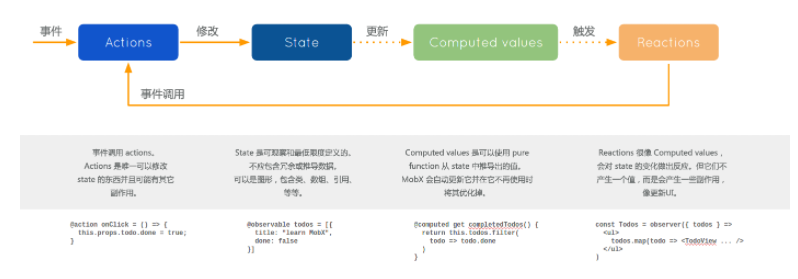

# Mobx

mobx 是一个状态管理的库，通过透明的函数式响应变成 (transparently applying functional reactive programming-TFRP)，让状态管理变得简单和可拓展。任何源自应用状态的东西例如：UI、数据序列化、服务器通讯等都应该**自动的获得**。

对于应用开发中的常见问题，React 和 MobX 都提供了最优和独特的解决方案。React 提供了优化 UI 渲染的机制， 这种机制就是通过使用虚拟 DOM 来减少昂贵的 DOM 变化的数量。MobX 提供了优化应用状态与 React 组件同步的机制，这种机制就是使用响应式虚拟依赖**状态图表**，它只有在真正需要的时候才更新并且永远保持是最新的。
