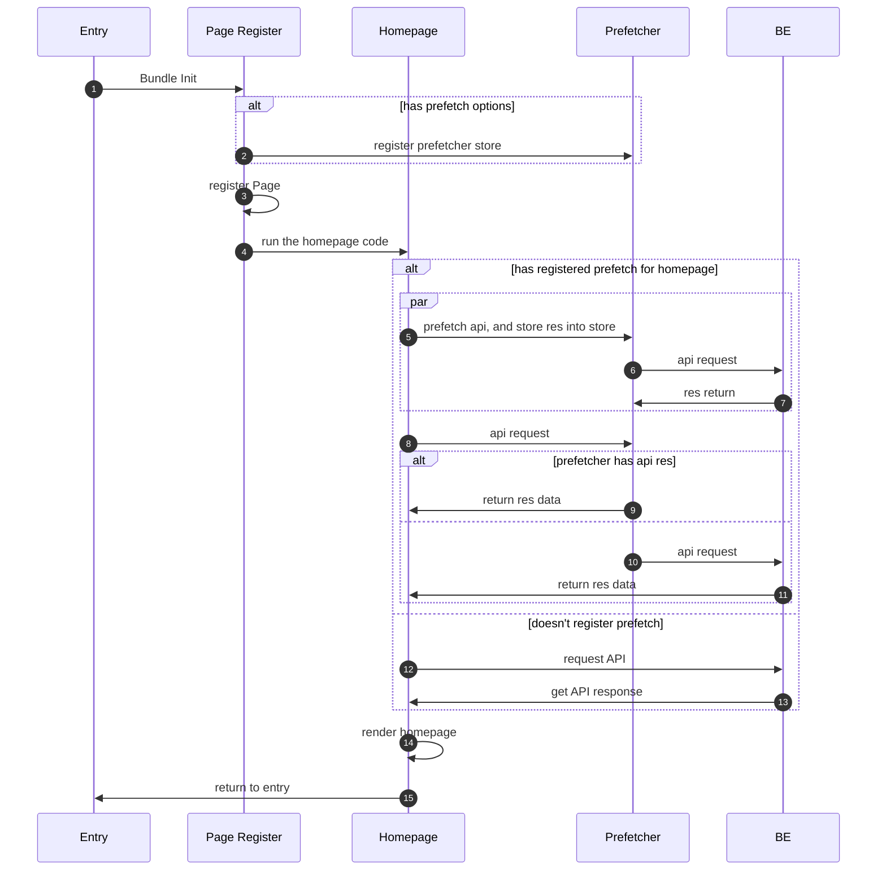

```mermaid
sequenceDiagram
autonumber

participant A as Entry
participant B as Page Register
participant H as Homepage
participant P as Prefetcher
participant E as BE

A ->>B: Bundle Init
alt has prefetch options
B->>P: register prefetcher store
end
B->>B: register Page
B->>H: run the homepage code
alt has registered prefetch for homepage
par
H->>P: prefetch api, and store res into store
P->>E: api request
E->>P: res return
end
H->>P: api request
alt prefetcher has api res
P->>H: return res data
else
P->>E: api request
E->>H: return res data
end

else doesn't register prefetch
H->>E: request API
E->>H: get API response 
end

H->>H: render homepage
H->>A: return to entry
```
