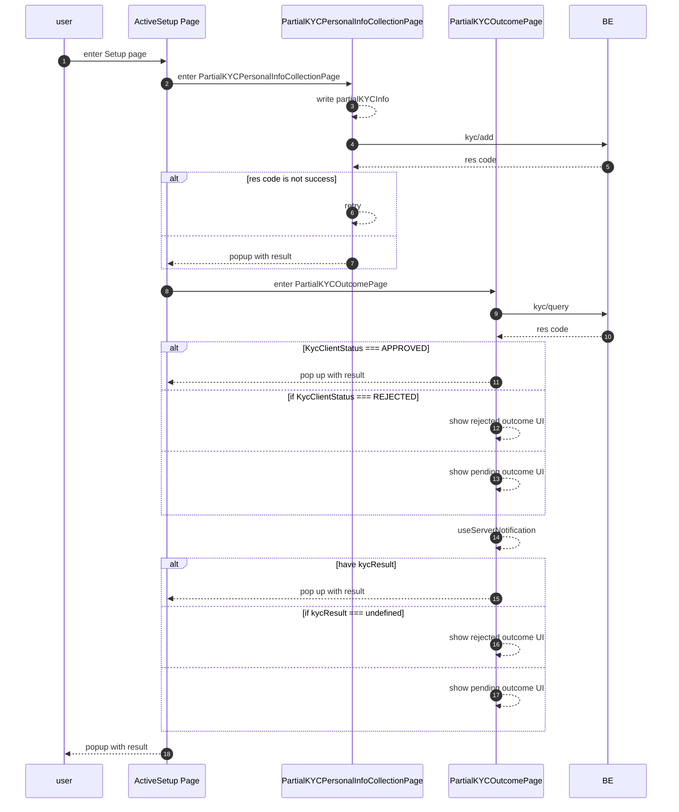

```mermaid
sequenceDiagram
autonumber

participant A as user
participant S as ActiveSetup Page
participant B as PartialKYCPersonalInfoCollectionPage
participant C as PartialKYCOutcomePage
participant D as BE

A->> S: enter Setup page
S->>B: enter PartialKYCPersonalInfoCollectionPage
B-->>B: write partialKYCInfo
B->>D: kyc/add
D-->>B: res code
alt res code is not success
B-->>B: retry
else
B-->>S: popup with result
end
S->>C: enter PartialKYCOutcomePage
C->>D: kyc/query
D-->>C: res code
alt KycClientStatus === APPROVED
C-->>S: pop up with result
else if KycClientStatus === REJECTED
C-->>C: show rejected outcome UI
else
C-->>C: show pending outcome UI
end
C-->>C: useServerNotification
alt have kycResult
C-->>S: pop up with result
else if kycResult === undefined
C-->>C: show rejected outcome UI
else
C-->>C: show pending outcome UI
end
S-->>A: popup with result
```