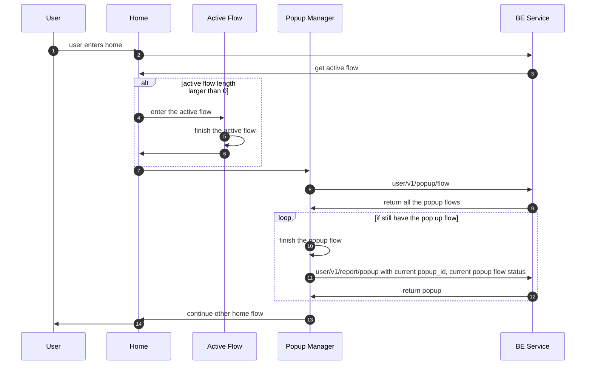
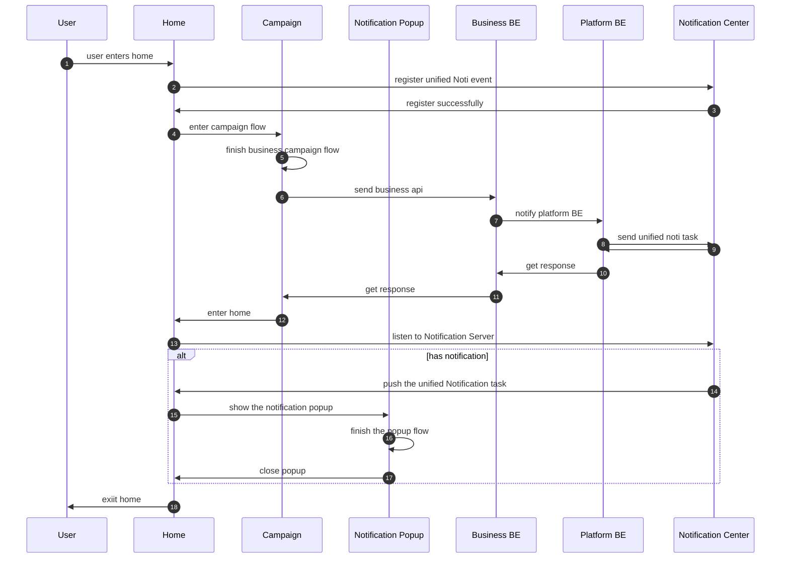
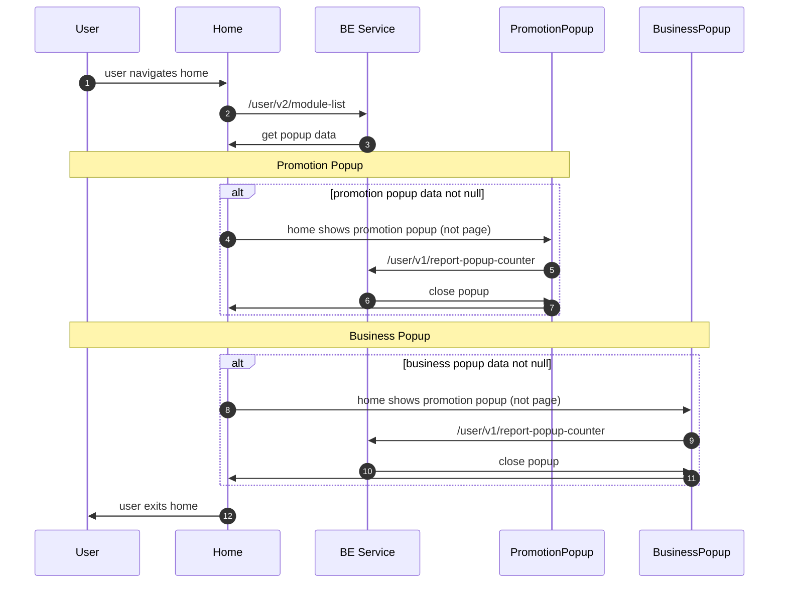
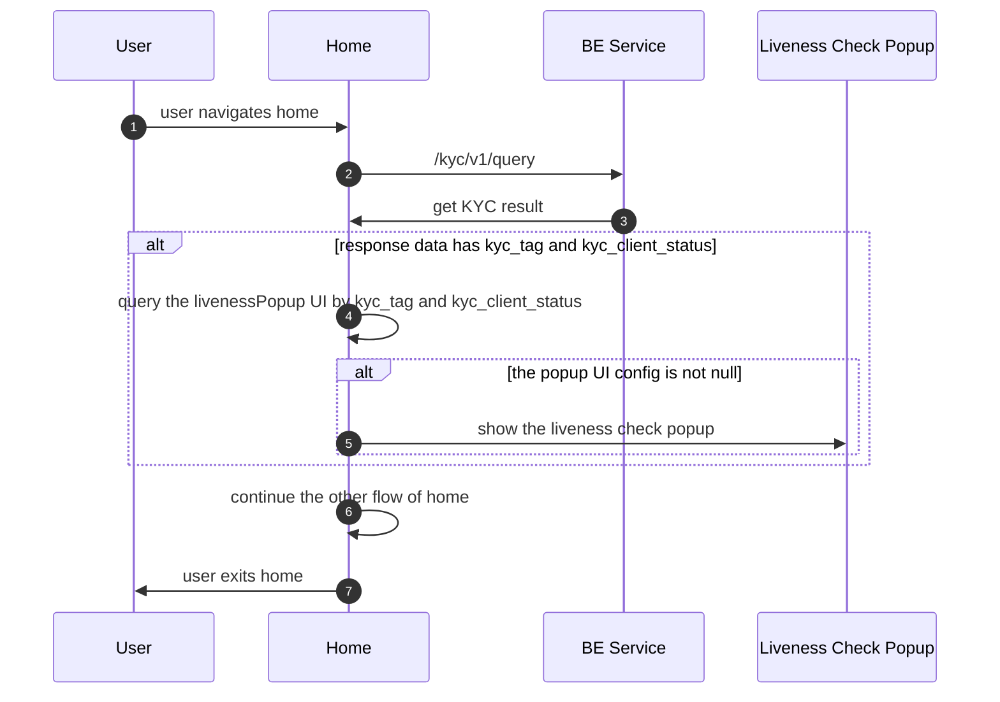
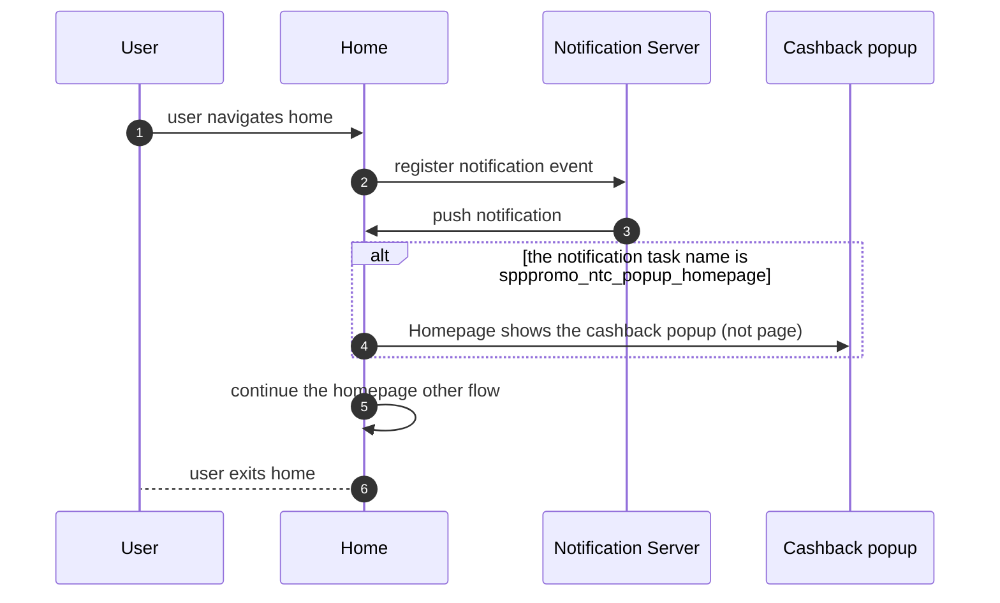
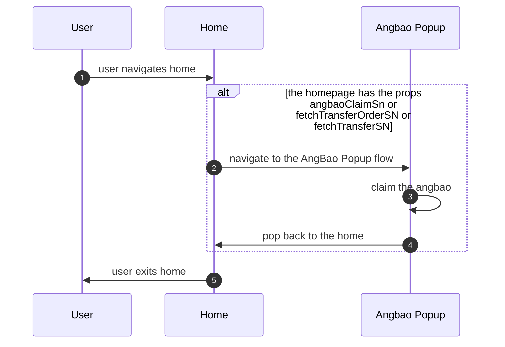
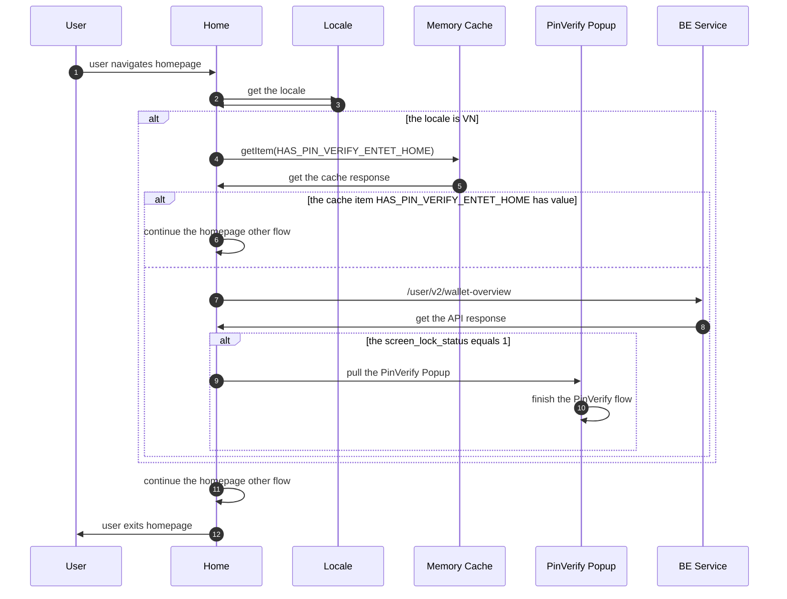
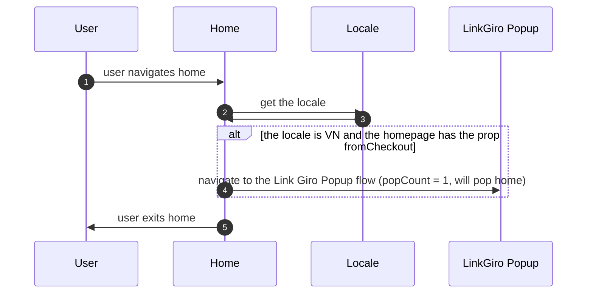
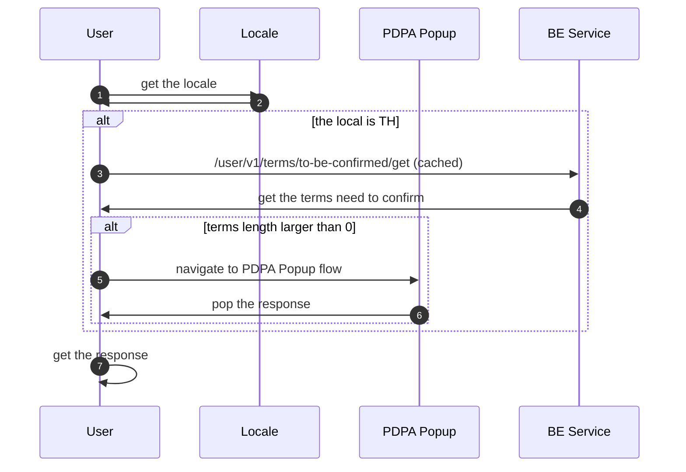

```mermaid
sequenceDiagram
autonumber

participant U as User
participant H as Home
participant A as Active Flow
participant P as Popup Manager
participant B as BE Service

U->>H: user enters home
H->>B: 
B->>H: get active flow
alt active flow length larger than 0
  H->>A: enter the active flow
  A->>A: finish the active flow
  A->>H: 
end
 H->>P: 
 P->>B: user/v1/popup/flow
 B->>P: return all the popup flows
 loop if still have the pop up flow
  P->>P: finish the popup flow
  P->>B: user/v1/report/popup with current popup_id, current popup flow status
  B->>P: return popup
 end
 P->>H: continue other home flow
 H->>U: 
```

```mermaid
sequenceDiagram
autonumber

participant U as User
participant H as Home
participant C as Campaign
participant F as Notification Popup
participant B as Business BE
participant P as Platform BE
participant N as Notification Center

U->>H: user enters home
H->>N: register unified Noti event
N->>H: register successfully
H->>C: enter campaign flow
C->>C: finish business campaign flow
C->>B: send business api
B->>P: notify platform BE
P->>N: send unified noti task
N->>P: 
P->>B: get response
B->>C: get response
C->>H: enter home
H->>N: listen to Notification Server
alt has notification
N->>H: push the unified Notification task
H->>F: show the notification popup
F->>F: finish the popup flow
F->>H: close popup
end
H->>U: exiit home
```

```mermaid
sequenceDiagram
autonumber
  participant U as User
  participant H as Home
  participant B as BE Service
  participant P as PromotionPopup
  participant S as BusinessPopup

U->>H: user navigates home
H->>B: /user/v2/module-list
B->>H: get popup data
Note over U,P: Promotion Popup
alt promotion popup data not null
  H->>P: home shows promotion popup (not page)
  P->>B: /user/v1/report-popup-counter
  B->>P: close popup
  P->>H: 
end
Note over U,S: Business Popup
alt business popup data not null
  H->>S: home shows promotion popup (not page)
  S->>B: /user/v1/report-popup-counter
  B->>S: close popup
  S->>H: 
end

H->>U: user exits home

```

```mermaid
sequenceDiagram
autonumber

  participant U as User
  participant H as Home
  participant B as BE Service
  participant L as Liveness Check Popup

U->>H: user navigates home
H->>B: /kyc/v1/query
B->>H: get KYC result
alt response data has kyc_tag and kyc_client_status
  H->>H: query the livenessPopup UI by kyc_tag and kyc_client_status
  alt the popup UI config is not null
  H->>L: show the liveness check popup
  end
end
H->>H: continue the other flow of home
H->>U: user exits home
```

```mermaid
sequenceDiagram
autonumber
  participant U as User
  participant H as Home
  participant N as Notification Server
  participant C as Cashback popup

U->>H: user navigates home
H->>N: register notification event
N->>H: push notification
alt the notification task name is spppromo_ntc_popup_homepage
H->>C: Homepage shows the cashback popup (not page)
end
H->>H: continue the homepage other flow
H-->U: user exits home
```

```mermaid
sequenceDiagram
autonumber
participant U as User
participant H as Home
participant A as Angbao Popup

U->>H: user navigates home
alt the homepage has the props angbaoClaimSn or fetchTransferOrderSN or fetchTransferSN
  H->>A: navigate to the AngBao Popup flow
  A->>A: claim the angbao
  A->>H: pop back to the home
end
H->>U: user exits home
```

```mermaid
sequenceDiagram
autonumber

participant U as User
participant H as Home
participant O as Locale
participant M as Memory Cache
participant P as PinVerify Popup
participant B as BE Service

U->>H: user navigates homepage
H->>O: get the locale
O->>H: 
alt the locale is VN
  H->>M: getItem(HAS_PIN_VERIFY_ENTET_HOME)
  M->>H: get the cache response
  alt the cache item HAS_PIN_VERIFY_ENTET_HOME has value
  H->>H: continue the homepage other flow
  else
  H->>B: /user/v2/wallet-overview
  B->>H: get the API response
    alt the screen_lock_status equals 1
    H->>P: pull the PinVerify Popup
    P->>P: finish the PinVerify flow
    end
  end
end
H->>H: continue the homepage other flow
H->>U: user exits homepage

```

```mermaid
sequenceDiagram
autonumber
participant U as User
participant H as Home
participant O as Locale
participant L as LinkGiro Popup

U->>H: user navigates home
H->>O: get the locale
O->>H: 
alt the locale is VN and the homepage has the prop fromCheckout
  H->>L: navigate to the Link Giro Popup flow (popCount = 1, will pop home)
end
H->>U: user exits home
```

```mermaid
sequenceDiagram
autonumber

participant U as User
participant L as Locale
participant P as PDPA Popup
participant B as BE Service

U->>L: get the locale
L->>U: 
alt the local is TH
U->>B: /user/v1/terms/to-be-confirmed/get (cached)
B->>U: get the terms need to confirm
alt terms length larger than 0
  U->>P: navigate to PDPA Popup flow
  P->>U: pop the response
end
end
U->>U: get the response
```