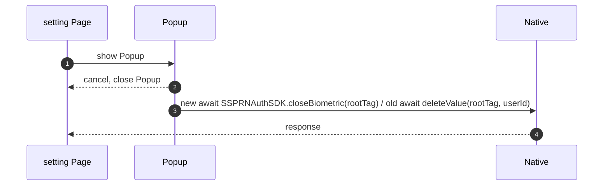
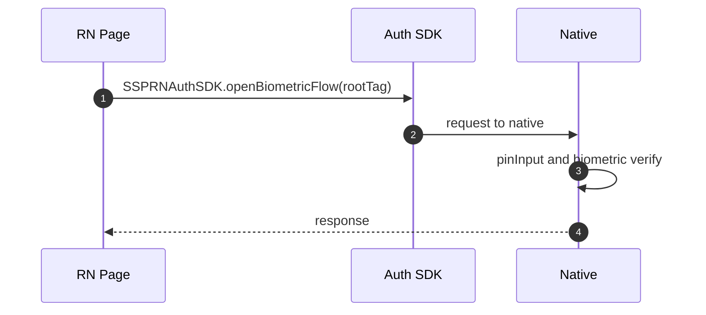
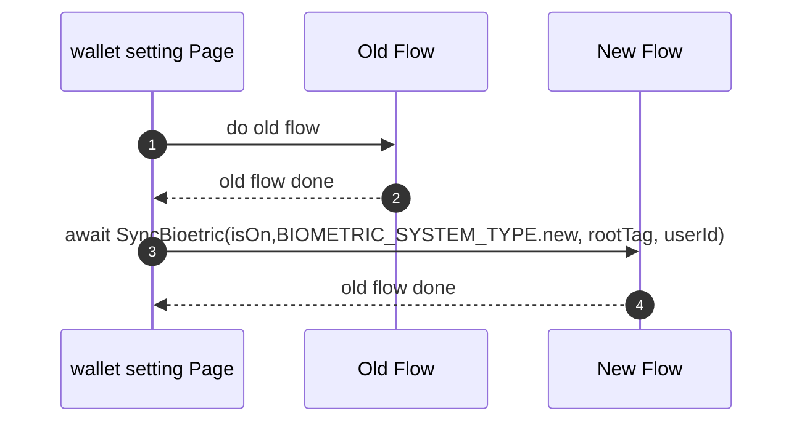
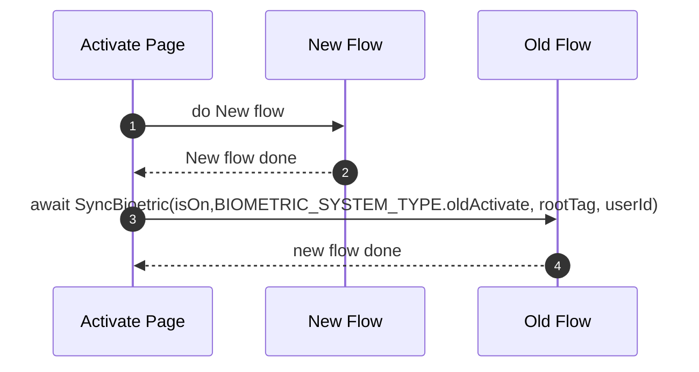
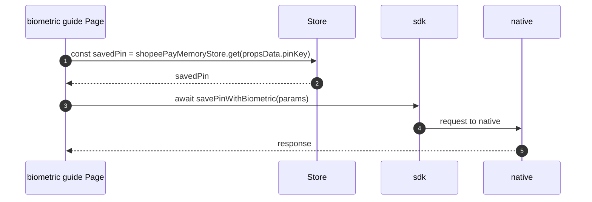
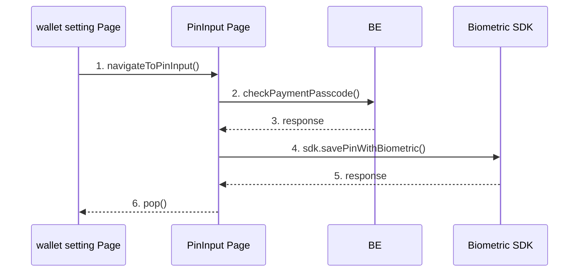
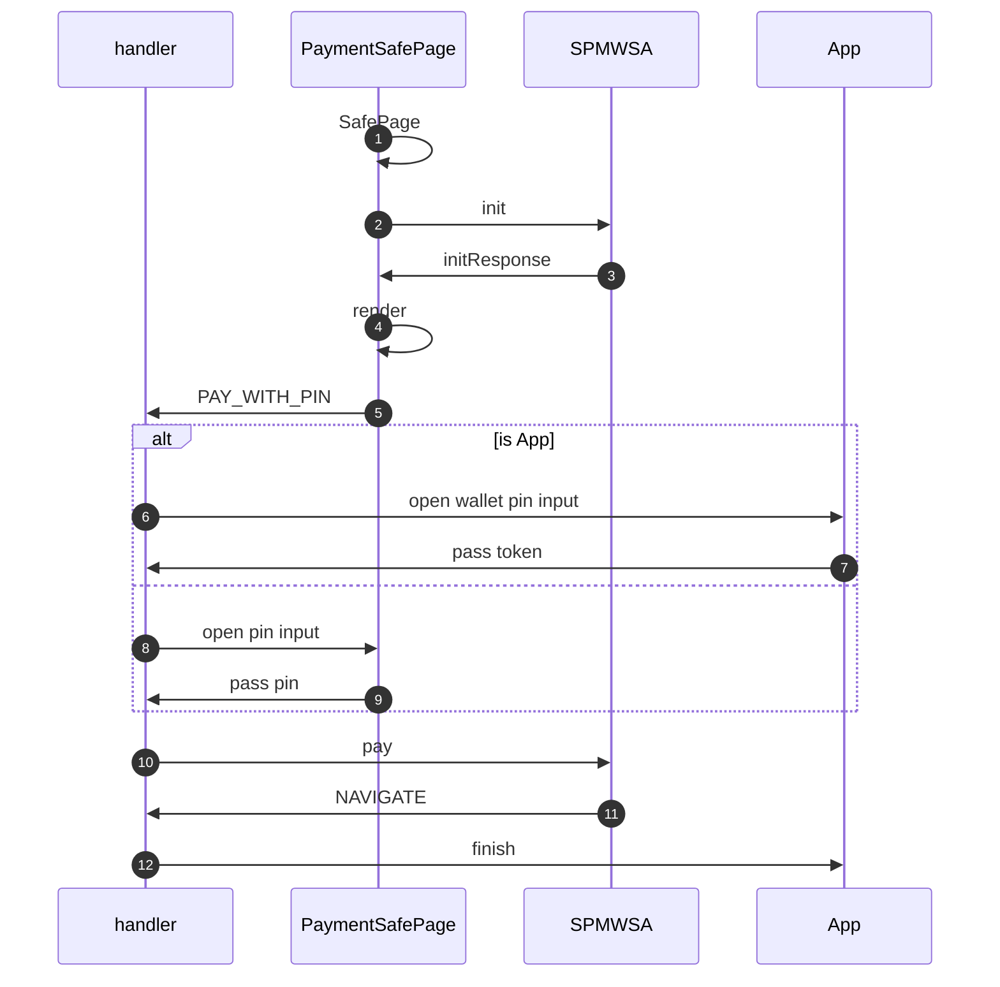

```mermaid
sequenceDiagram
autonumber
participant A  as setting Page
participant P  as Popup
participant B  as Native

A->>P: show Popup
P-->>A: cancel, close Popup

P->> B : new await SSPRNAuthSDK.closeBiometric(rootTag) / old await deleteValue(rootTag, userId);
B-->>A: response

```

```mermaid
sequenceDiagram
autonumber
RN Page ->> Auth SDK: SSPRNAuthSDK.openBiometricFlow(rootTag)
Auth SDK ->> Native:  request to native
Native->> Native:  pinInput and biometric verify
Native -->> RN Page : response

```

pin setting

```mermaid
sequenceDiagram
autonumber
participant A  as wallet setting Page
participant B  as Old Flow
participant C  as New Flow
A->> B : do old flow
B-->> A : old flow done
A->> C : await SyncBioetric(isOn,BIOMETRIC_SYSTEM_TYPE.new, rootTag, userId)
C-->> A : old flow done
```

biometric setup

```mermaid
sequenceDiagram
autonumber
participant A  as Activate Page
participant B  as New Flow
participant C  as Old Flow
A->> B : do New flow
B-->> A : New flow done
A->> C : await SyncBioetric(isOn,BIOMETRIC_SYSTEM_TYPE.oldActivate, rootTag, userId)
C-->> A : new flow done
```

old Activate

```mermaid
sequenceDiagram
autonumber
participant A as biometric guide Page
participant B as Store
participant C as sdk
participant D as native

A->> B: const savedPin = shopeePayMemoryStore.get(propsData.pinKey)
B-->>A: savedPin
A->> C : await savePinWithBiometric(params)
C->> D :  request to native
D-->> A: response
```

```mermaid
sequenceDiagram
autonumber
participant A as biometric guide Page
participant B as Store
participant C as sdk
participant D as native

A->> B: const savedPin = shopeePayMemoryStore.get(propsData.pinKey)
B-->>A: savedPin
A->> C : await savePinWithBiometric(params)
C->> D :  request to native
D-->> A: response
```

```mermaid
sequenceDiagram

wallet setting Page->> PinInput Page: 1. navigateToPinInput()
PinInput Page ->> BE : 2. checkPaymentPasscode()
BE -->> PinInput Page: 3. response
PinInput Page ->> Biometric SDK: 4. sdk.savePinWithBiometric()
Biometric SDK -->> PinInput Page: 5. response
PinInput Page -->> wallet setting Page : 6. pop()
```

```mermaid
sequenceDiagram
autonumber
participant H as handler
participant P as PaymentSafePage
participant W as SPMWSA
participant A as App
P->>P: SafePage
P->>W: init
W->>P: initResponse
P->>P: render
P->>H: PAY_WITH_PIN
alt is App
H->>A: open wallet pin input
A->>H: pass token
else
H->>P: open pin input
P->>H: pass pin
end
H->>W: pay
W->>H: NAVIGATE
H->>A: finish
```
