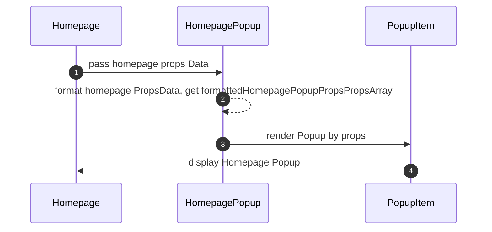
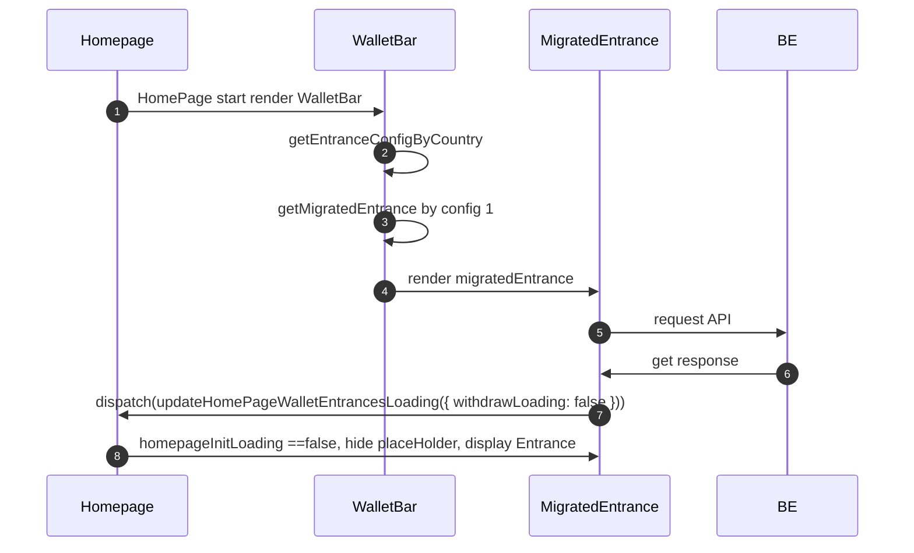
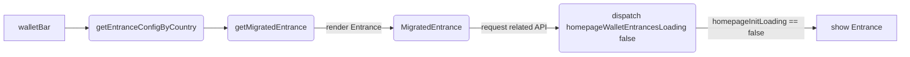
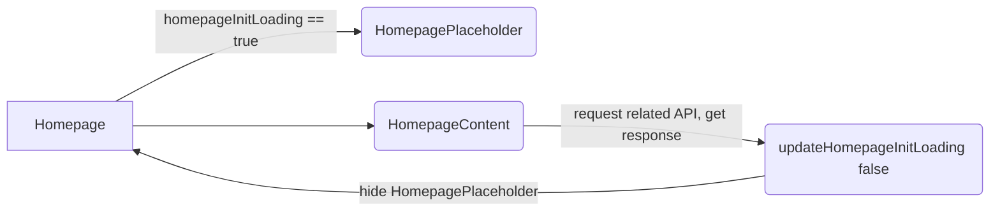

```mermaid
sequenceDiagram
autonumber

participant H as Homepage
participant P as HomepagePopup
participant I as PopupItem

H ->>P: pass homepage props Data
P -->>P: format homepage PropsData, get formattedHomepagePopupPropsPropsArray

P->>I: render Popup by props
I-->>H: display Homepage Popup
```

```mermaid
sequenceDiagram
autonumber

participant H as Homepage
participant W as WalletBar
participant M as MigratedEntrance
participant B as BE

H->>W: HomePage start render WalletBar
W->>W: getEntranceConfigByCountry
W->>W: getMigratedEntrance by config 1
W->>M: render migratedEntrance
M->>B: request API
B->>M: get response
M->>H: dispatch(updateHomePageWalletEntrancesLoading({ withdrawLoading: false })) 
H->>M: homepageInitLoading ==false, hide placeHolder, display Entrance
```

```mermaid
graph LR

W[walletBar] -->A(getEntranceConfigByCountry)
A-->B(getMigratedEntrance)
B-->|render Entrance| C(MigratedEntrance)
C-->|request related API|D(dispatch homepageWalletEntrancesLoading false)
D-->|homepageInitLoading == false|E[show Entrance]
```

```mermaid
graph LR

H[Homepage] --> |homepageInitLoading == true| P(HomepagePlaceholder)

H -->C(HomepageContent)
C -->|request related API, get response| D(updateHomepageInitLoading false)
D-->|hide HomepagePlaceholder| H
```
