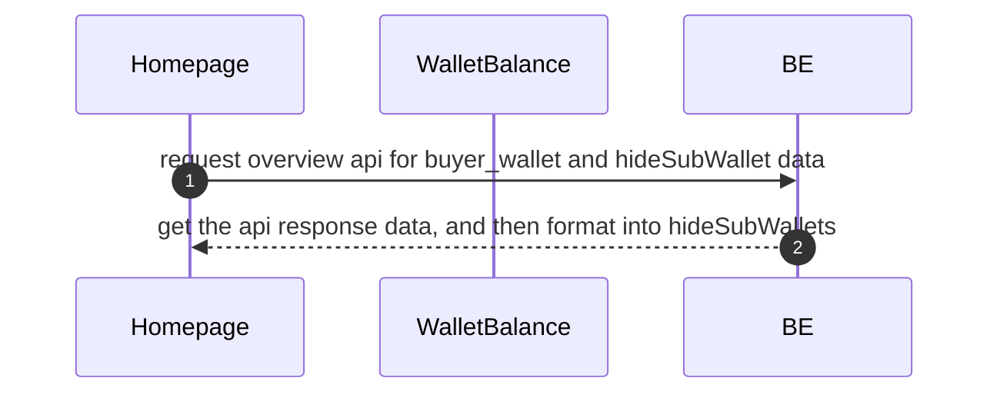
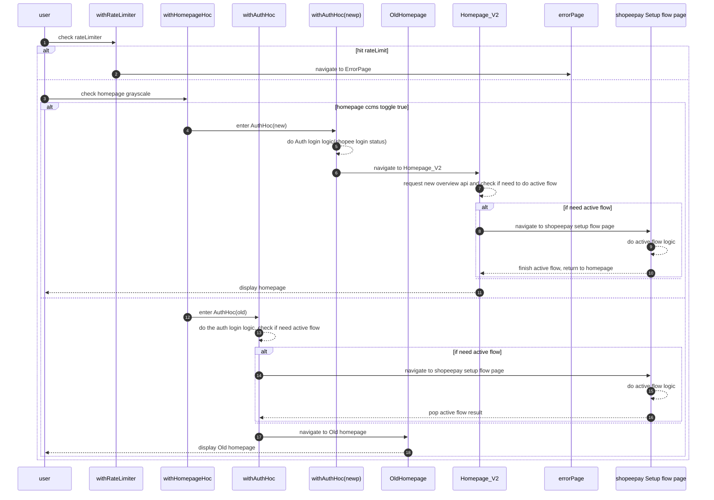
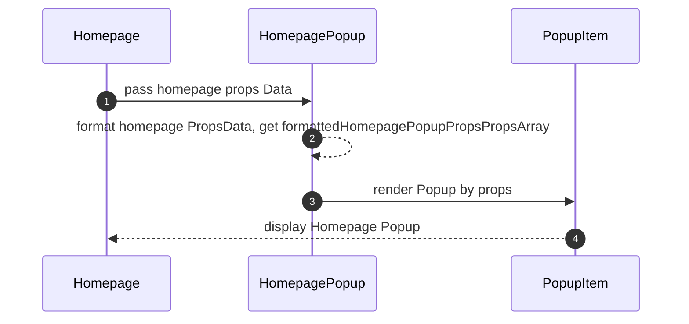
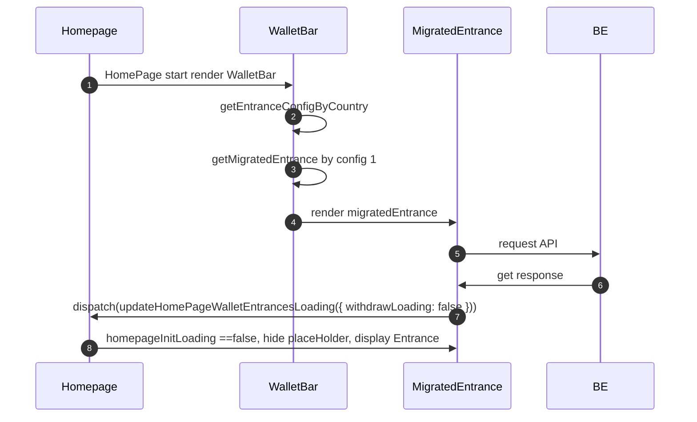
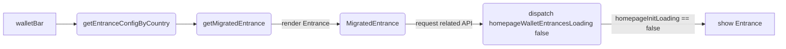
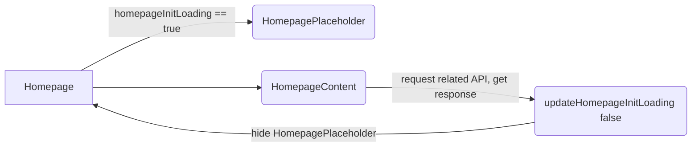

```mermaid
sequenceDiagram
autonumber

participant A as Homepage
participant B as WalletBalance
participant Z as BE 

A->>Z: request overview api for buyer_wallet and hideSubWallet data
Z-->>A: get the api response data, and then format into hideSubWallets
```

```mermaid
sequenceDiagram
autonumber

participant U as user
participant R as withRateLimiter
participant H as withHomepageHoc
participant A as withAuthHoc
participant N as withAuthHoc(newp)
participant O as OldHomepage
participant V as Homepage_V2
participant E as errorPage
participant S as shopeepay Setup flow page

U ->> R: check rateLimiter
alt hit rateLimit
R->>E:  navigate to ErrorPage
else
U ->> H: check homepage grayscale
alt homepage ccms toggle true
H ->> N : enter AuthHoc(new)
N -->>N: do Auth login logic(shopee login status)
N ->> V: navigate to Homepage_V2
V -->>V: request new overview api and check if need to do active flow
alt if need active flow
V ->> S: navigate to shopeepay setup flow page
S -->>S: do active flow logic
S -->>V: finish active flow, return  to homepage
else
end
V-->>U: display homepage
else
H ->> A: enter AuthHoc(old)
A -->> A: do the auth login logic, check if need active flow
alt if need active flow
A ->>S: navigate to shopeepay setup flow page
S -->>S: do active flow logic
S -->>A: pop active flow result
else
end
A ->>O: navigate to Old homepage
O -->>U: display Old homepage
end
end
```

```mermaid
sequenceDiagram
autonumber

participant H as Homepage
participant P as HomepagePopup
participant I as PopupItem

H ->>P: pass homepage props Data
P -->>P: format homepage PropsData, get formattedHomepagePopupPropsPropsArray

P->>I: render Popup by props
I-->>H: display Homepage Popup
```

```mermaid
sequenceDiagram
autonumber

participant H as Homepage
participant W as WalletBar
participant M as MigratedEntrance
participant B as BE

H->>W: HomePage start render WalletBar
W->>W: getEntranceConfigByCountry
W->>W: getMigratedEntrance by config 1
W->>M: render migratedEntrance
M->>B: request API
B->>M: get response
M->>H: dispatch(updateHomePageWalletEntrancesLoading({ withdrawLoading: false }))
H->>M: homepageInitLoading ==false, hide placeHolder, display Entrance
```

```mermaid
graph LR

W[walletBar] -->A(getEntranceConfigByCountry)
A-->B(getMigratedEntrance)
B-->|render Entrance| C(MigratedEntrance)
C-->|request related API|D(dispatch homepageWalletEntrancesLoading false)
D-->|homepageInitLoading == false|E[show Entrance]
```

```mermaid
graph LR

H[Homepage] --> |homepageInitLoading == true| P(HomepagePlaceholder)

H -->C(HomepageContent)
C -->|request related API, get response| D(updateHomepageInitLoading false)
D-->|hide HomepagePlaceholder| H
```

## 首页变慢的原因
以后每次首页的开发都需要关注一下首页的渲染次数，渲染次数的增加，很有可能会导致首页变慢，因为js的执行是单线程，它是需要去优先做render的事情的。所以渲染次数的增加，会导致其他异步的操作都要往后稍稍。

## 容灾