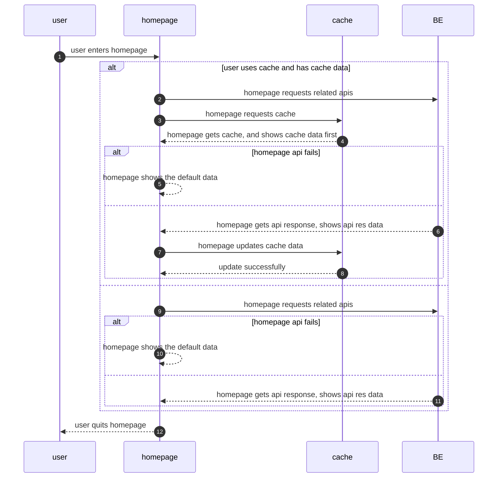
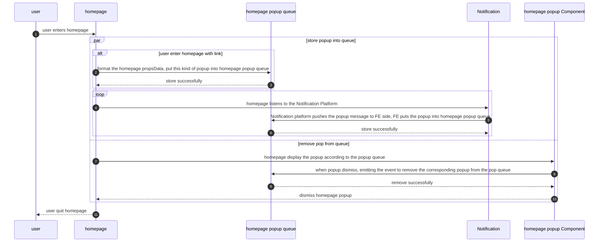
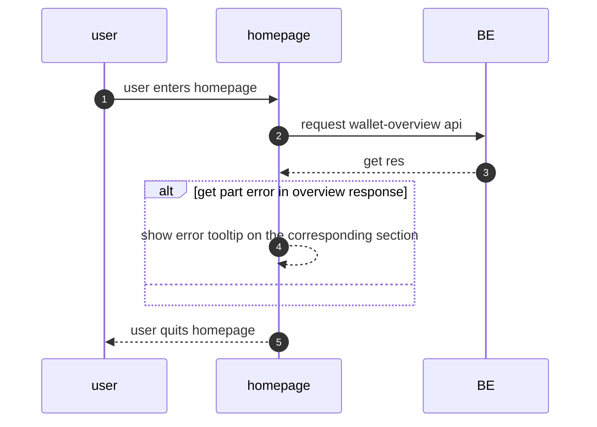
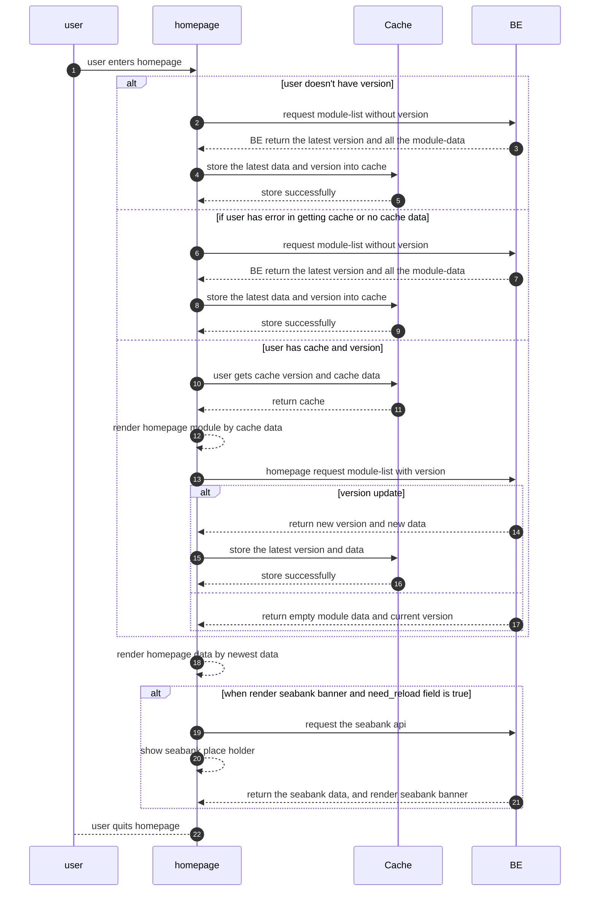
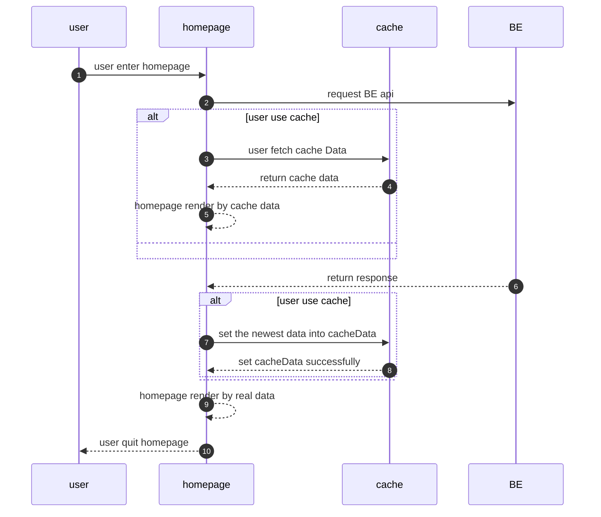

when homepage use backup data as disaster recovery

```mermaid
sequenceDiagram
autonumber

participant A as user
participant H as homepage
participant C as cache
participant B as BE

A->>H: user enters homepage

alt user uses cache and has cache data
H->>B: homepage requests related apis
H->>C: homepage requests cache
C-->>H: homepage gets cache, and shows cache data first
 alt homepage api fails
H-->>H: homepage shows the default data
 else

B-->>H: homepage gets api response, shows api res data
H->>C: homepage updates cache data
C-->>H: update successfully
end
else
H->>B: homepage requests related apis
 alt homepage api fails
H-->>H: homepage shows the default data
 else
 B-->>H: homepage gets api response, shows api res data
 end

end
H-->>A: user quits homepage
```

homepage popup

```mermaid
sequenceDiagram
autonumber
participant A as user
participant H as homepage
participant Q as homepage popup queue
participant N as Notification
participant P as homepage popup Component

A->>H: user enters homepage
par store popup into queue
alt user enter homepage with link
H->>Q: format the homepage propsData, put this kind of popup into homepage popup queue
Q-->>H: store successfully
else
end
loop
H ->> N: homepage listens to the Notification Platform
N->> Q: Notification platform pushes the popup message to FE side, FE puts the popup into homepage popup queue
Q-->>N: store successfully
end
and remove pop from queue
H->>P: homepage display the popup according to the popup queue
P->>Q: when popup dismiss, emitting the event to remove the corresponding popup from the pop queue
Q-->>P: remove successfully
P-->>H: dismiss homepage popup
end
H-->>A: user quit homepage
```

disaster recovery

```mermaid
sequenceDiagram
autonumber

participant A as user
participant H as homepage
participant B as BE

A->>H: user enters homepage
H->>B: request wallet-overview api
B-->>H: get res
alt get part error in overview response
H-->>H: show error tooltip on the corresponding section
else
end
H-->>A: user quits homepage
```

homepage version control

```mermaid
sequenceDiagram
autonumber

participant A as user
participant H as homepage
participant C as Cache
participant B as BE

A->>H: user enters homepage

alt user doesn't have version
H->>B: request module-list without version
B-->>H: BE return the latest version and all the module-data
H->>C: store the latest data and version into cache
C-->>H: store successfully
else if user has error in getting cache or no cache data
H->>B: request module-list without version
B-->>H: BE return the latest version and all the module-data
H->>C: store the latest data and version into cache
C-->>H: store successfully
else user has cache and version
H->>C: user gets cache version and cache data
C-->>H: return cache
H-->>H: render homepage module by cache data
H->>B: homepage request module-list with version
alt version update
B-->>H: return new version and new data
H->>C: store the latest version and data
C-->>H: store successfully
else
B-->>H: return empty module data and current version
end
end
H-->>H: render homepage data by newest data
alt when render seabank banner and need_reload field is true
H->>B: request the seabank api
H-->>H: show seabank place holder
B-->>H: return the seabank data, and render seabank banner
end
H-->A: user quits homepage
```

homepage cache control

```mermaid
sequenceDiagram
autonumber

participant A as user
participant H as homepage
participant C as cache
participant B as BE

A->>H: user enter homepage
H->>B: request BE api
alt user use cache
H->>C: user fetch cache Data
C-->>H: return cache data
H-->>H: homepage render by cache data
else
end
B-->>H: return response
alt user use cache
H->>C: set the newest data into cacheData
C-->>H: set cacheData successfully
else
end
H-->>H: homepage render by real data
H-->>A: user quit homepage
```
