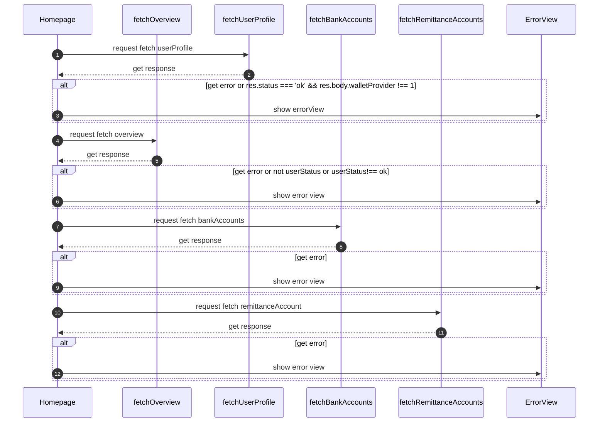
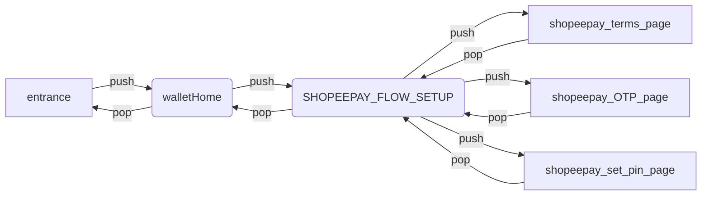
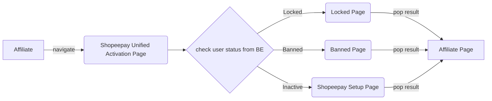

```mermaid
sequenceDiagram
autonumber
participant H as Homepage
participant A as fetchOverview
participant B as fetchUserProfile
participant D as fetchBankAccounts
participant E as fetchRemittanceAccounts
participant C as ErrorView

H->>B: request fetch userProfile
B-->>H: get response
alt get error or res.status === 'ok' && res.body.walletProvider !== 1
H->>C: show errorView
else
end
H->>A: request fetch overview
A-->>H: get response
alt get error or not userStatus or userStatus!== ok
H->>C: show error view
else
end
H->>D: request fetch bankAccounts
D-->>H: get response
alt get error
H->>C: show error view
else
end
H->>E: request fetch remittanceAccount
E-->>H: get response
alt get error
H->>C: show error view
else
end

```

```mermaid
graph LR
O[entrance] --> |push| A
A--> |pop| O
A(walletHome) --> |push| B(SHOPEEPAY_FLOW_SETUP)
B --> |pop| A
B --> |push| C[shopeepay_terms_page]
C --> |pop| B
B --> |push| D[shopeepay_OTP_page]
D --> |pop| B
B --> |push| E[shopeepay_set_pin_page]
E --> |pop| B
```

```mermaid
graph LR

A[Affiliate] -->|navigate| B(Shopeepay Unified Activation Page)
B-->C{check user status from BE}
C-->|Locked|D(Locked Page)
C-->|Inactive|F(Shopeepay Setup Page)
C-->|Banned|E(Banned Page)
D-->|pop result|G[Affiliate Page]
E-->|pop result|G[Affiliate Page]
F-->|pop result|G[Affiliate Page]
```
