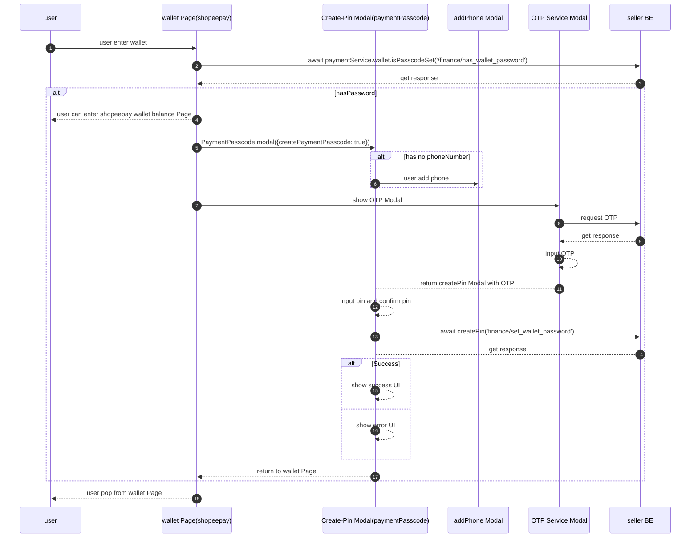
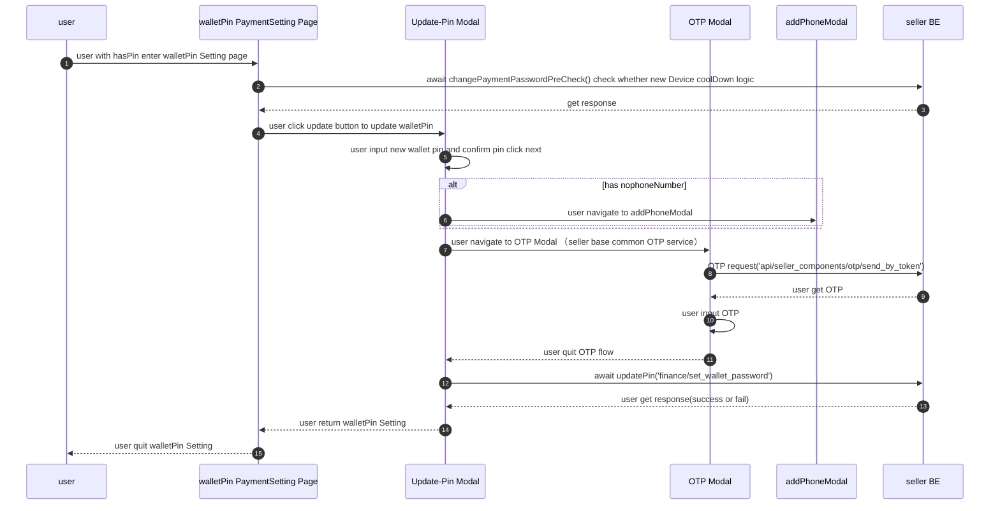
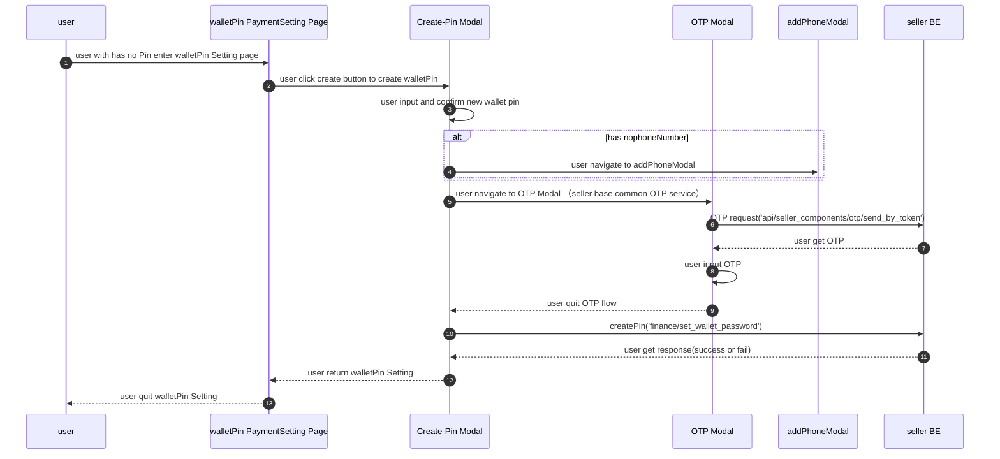
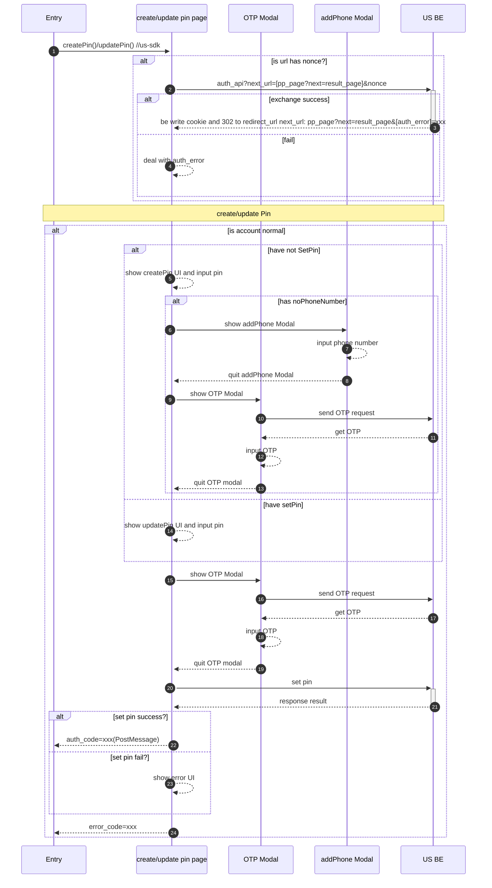
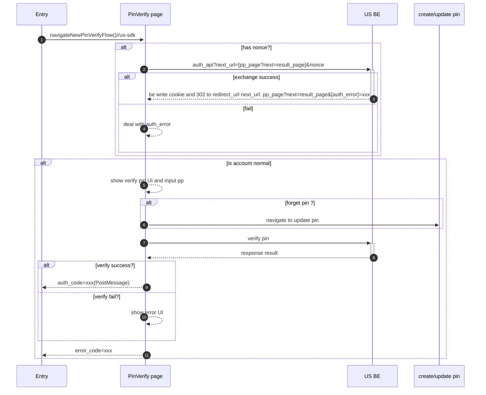
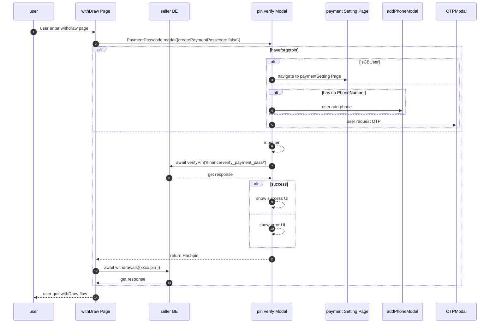

```ts
//sdk

//new PC pin verify
import { pinVerify } from "us-sdk";
export const interface inputParams {
next: string; // next url
return_url: string;
nonce: string;
origin: string; // target url pinVerify page will postMessage
extraData: JSON String; //some params from caller side to pinVerify Page
}
//sdk will return result 
const result = await pinVerify(params:inputParams);
```

## pc-create-pin wallet



pc-create (paymentSetting)



create Pin PinSetting (PC seller version)



## new createPin/UpdatePin



## new pin verify



## pc-pin-verify



现在只有 paymentSetting 一个更改密码的地方，没有 basic Setting
