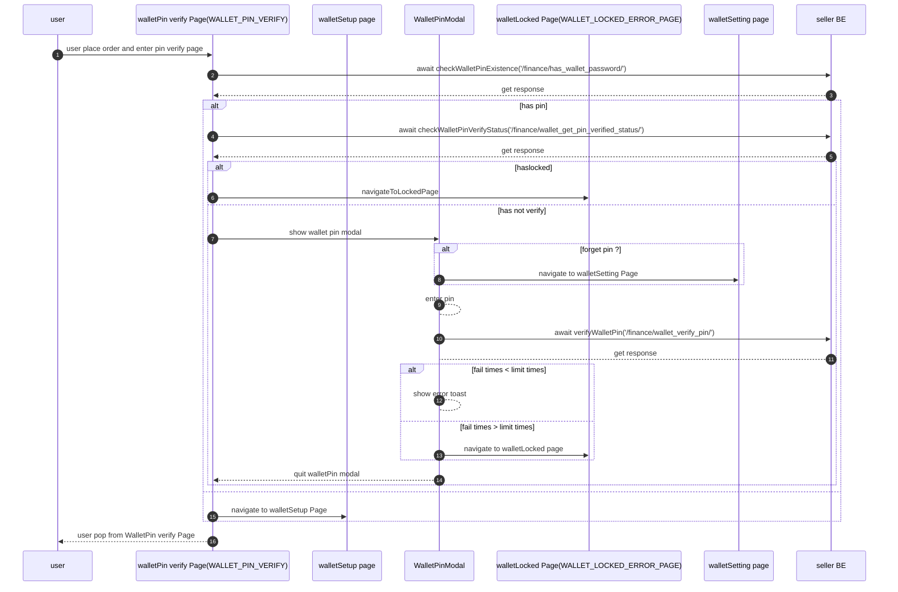
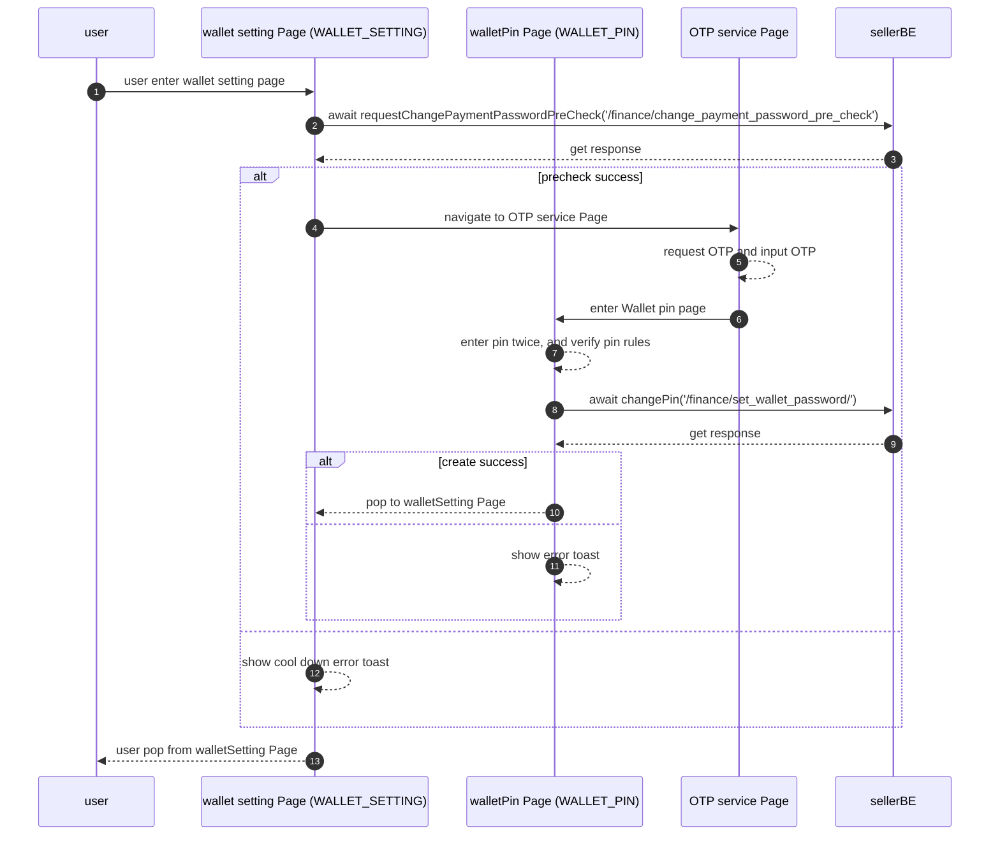
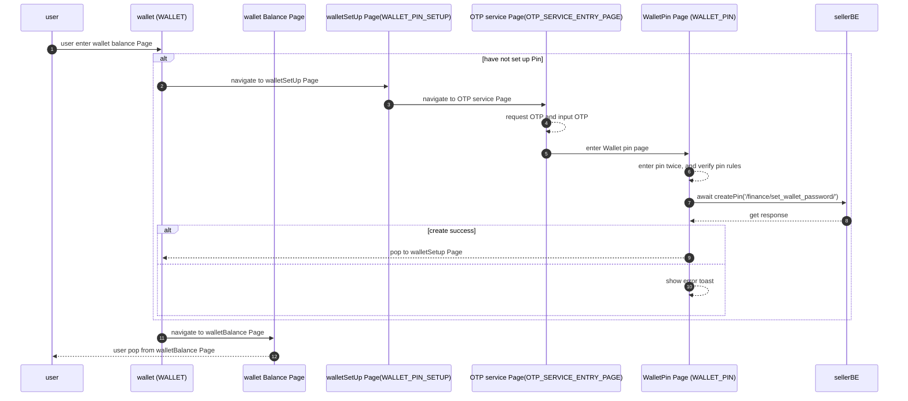

pinVerify

```mermaid
sequenceDiagram
autonumber
participant A  as  user
participant B as walletPin verify Page(WALLET_PIN_VERIFY)
participant C as walletSetup page
participant D as WalletPinModal
participant E as walletLocked Page(WALLET_LOCKED_ERROR_PAGE)
participant G as walletSetting page
participant F as seller BE

A->>B: user place order and enter pin verify page
B->>F: await checkWalletPinExistence('/finance/has_wallet_password/')
F-->>B: get response
alt has pin
B->>F: await checkWalletPinVerifyStatus('/finance/wallet_get_pin_verified_status/')
F-->>B: get response
 alt haslocked
 B->>E: navigateToLockedPage
 else has not verify
 B->>D: show wallet pin modal
  alt forget pin ?
  D->>G: navigate to walletSetting Page
  end
 D-->D: enter pin
 D->>F: await verifyWalletPin('/finance/wallet_verify_pin/')
 F-->D: get response
  alt fail times < limit times
  D-->D: show error toast
  else fail times > limit times
  D->>E: navigate to walletLocked page
  end
 D-->>B: quit walletPin modal
 end
else
B->>C: navigate to walletSetup Page
end
B-->>A: user pop from WalletPin verify Page
```

wallet setting

```mermaid
sequenceDiagram
autonumber
participant A  as  user
participant B  as  wallet setting Page (WALLET_SETTING)
participant C  as walletPin Page (WALLET_PIN)
participant E as OTP service Page
participant D  as sellerBE


A->>B: user enter wallet setting page
B->>D: await requestChangePaymentPasswordPreCheck('/finance/change_payment_password_pre_check')
D-->>B: get response
alt precheck success
B->>E: navigate to OTP service Page
E-->>E: request OTP and input OTP
E->>C: enter Wallet pin page
C-->>C: enter pin twice, and verify pin rules
C->>D: await changePin('/finance/set_wallet_password/')
D-->>C: get response
alt create success
C-->>B: pop to walletSetting Page
else
C-->>C: show error toast
end
else
B-->>B: show cool down error toast
end
B-->>A: user pop from walletSetting Page
```

create pin when first enter wallet

```mermaid
sequenceDiagram
autonumber
participant A  as  user
participant D  as  wallet (WALLET)
participant B  as  wallet Balance Page
participant C  as  walletSetUp Page(WALLET_PIN_SETUP)
participant E  as OTP service Page(OTP_SERVICE_ENTRY_PAGE)
participant F  as  WalletPin Page (WALLET_PIN)
participant G  as sellerBE

A->>D: user enter wallet balance Page
alt have not set up Pin
D->>C: navigate to walletSetUp Page
C->>E: navigate to OTP service Page
E-->>E: request OTP and input OTP
E->>F: enter Wallet pin page
F-->>F: enter pin twice, and verify pin rules
F->>G: await createPin('/finance/set_wallet_password/')
G-->>F: get response
alt create success
F-->>D: pop to walletSetup Page
else
F-->>F: show error toast
end
end
D->>B: navigate to walletBalance Page
B-->>A: user pop from walletBalance Page
```
