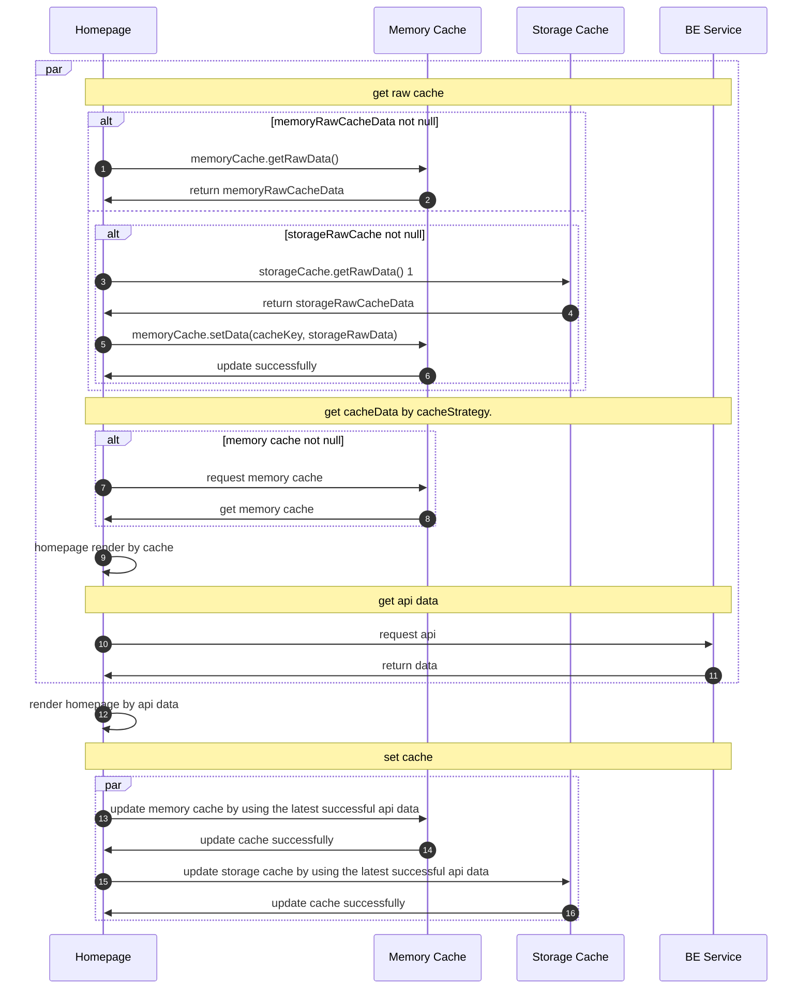
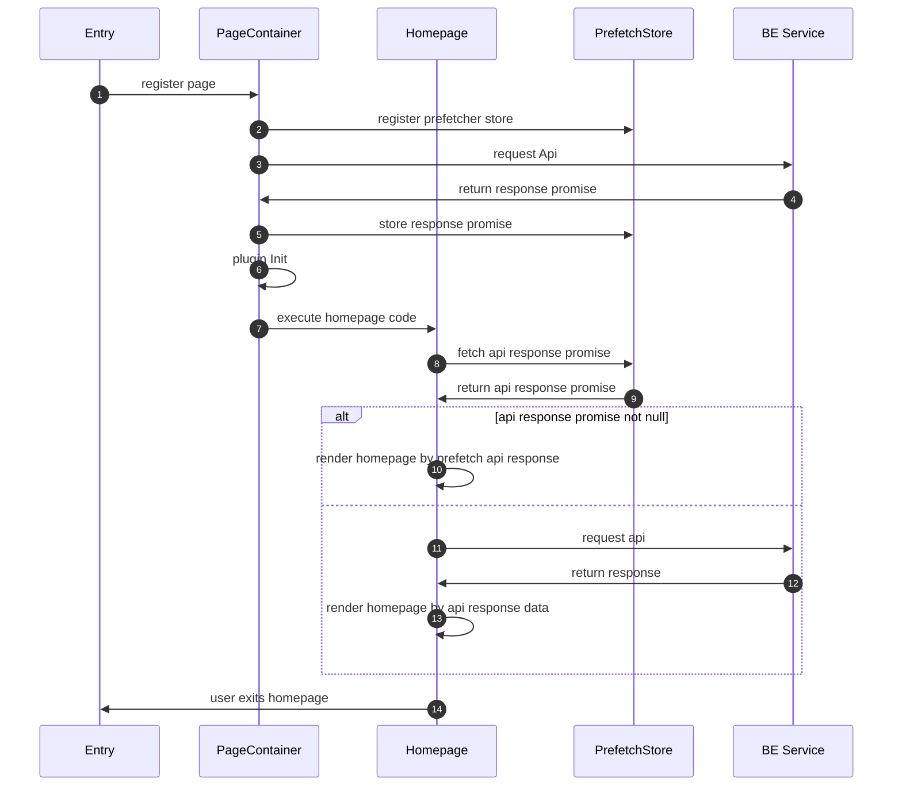
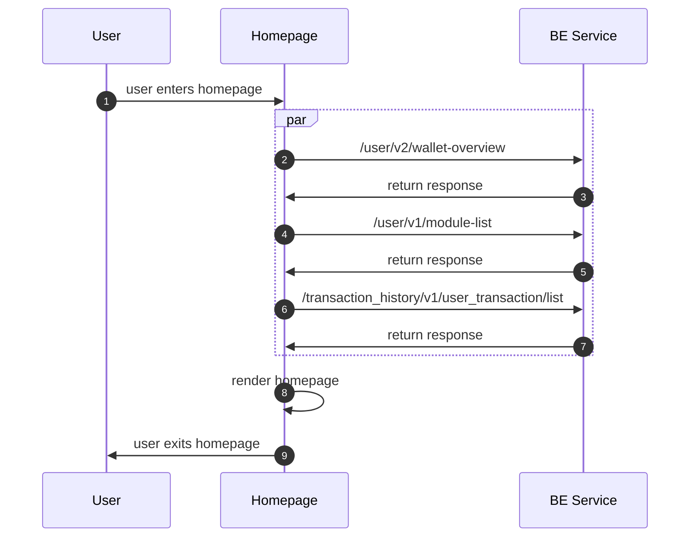
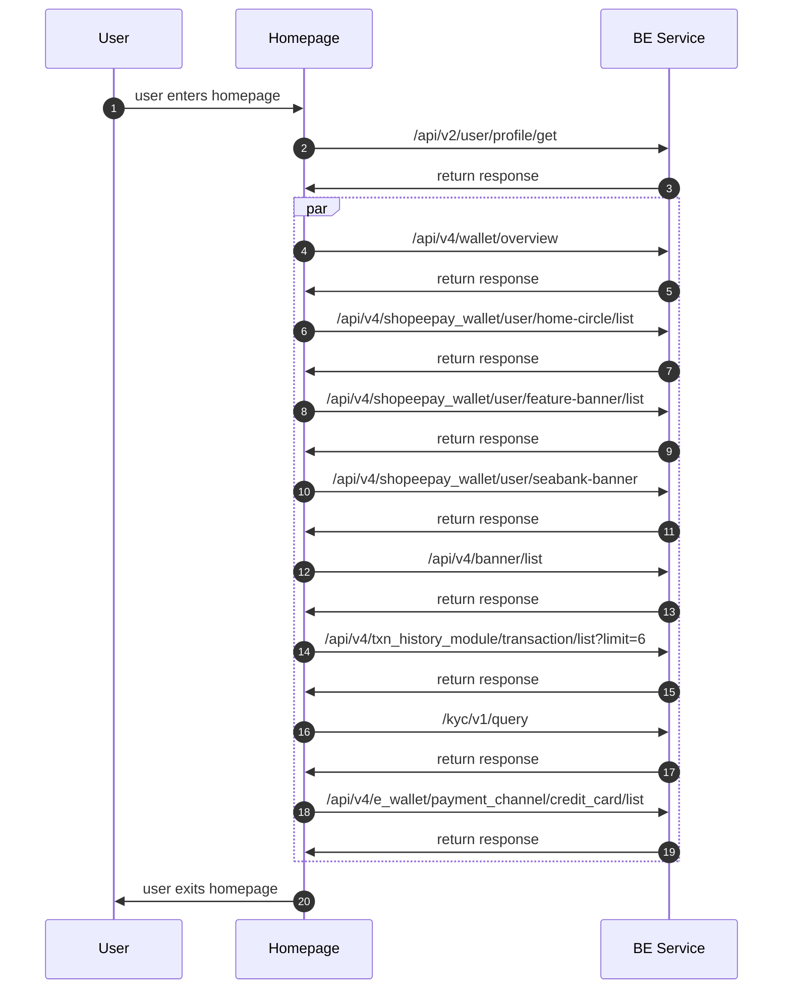

```mermaid
sequenceDiagram
autonumber

participant H as Homepage
participant C as Memory Cache
participant D as Storage Cache
participant B as BE Service

par
Note over H,B: get raw cache 
alt memoryRawCacheData not null
H->>C: memoryCache.getRawData()
C->>H: return memoryRawCacheData
else 
alt storageRawCache not null
H->>D: storageCache.getRawData() 1
D->>H: return storageRawCacheData
H->>C: memoryCache.setData(cacheKey, storageRawData)
C->>H: update successfully
end
end
Note over H,B: get cacheData by cacheStrategy.
alt memory cache not null
H->>C: request memory cache
C->>H: get memory cache
end
H->>H: homepage render by cache

Note over H,B: get api data
H->>B: request api
B->>H: return data
end
H->>H: render homepage by api data

Note over H,B: set cache
par
H->>C: update memory cache by using the latest successful api data
C->>H: update cache successfully
H->>D: update storage cache by using the latest successful api data
D->>H: update cache successfully
end
```

```mermaid
sequenceDiagram
autonumber

participant E as Entry
participant A as PageContainer
participant H as Homepage
participant P as PrefetchStore
participant B as BE Service

E->>A: register page

A->>P: register prefetcher store
A->>B: request Api
B->>A: return response promise
A->>P: store response promise
A->>A: plugin Init
A->>H: execute homepage code
H->>P: fetch api response promise
P->>H: return api response promise
alt api response promise not null
H->>H: render homepage by prefetch api response
else
H->>B: request api
B->>H: return response
H->>H: render homepage by api response data
end
H->>E: user exits homepage

```

```mermaid
sequenceDiagram
autonumber

participant U as User
participant H as Homepage
participant B as BE Service

U->>H: user enters homepage
par
H->>B: /user/v2/wallet-overview
B->>H: return response

H->>B: /user/v1/module-list
B->>H: return response

H->>B: /transaction_history/v1/user_transaction/list
B->>H: return response
end
H->>H: render homepage
H->>U: user exits homepage


```

```mermaid
sequenceDiagram
autonumber

participant U as User
participant H as Homepage
participant B as BE Service

U->>H: user enters homepage
H->>B:  /api/v2/user/profile/get
B->>H: return response

par

H->>B: /api/v4/wallet/overview
B->>H: return response

H->>B: /api/v4/shopeepay_wallet/user/home-circle/list
B->>H: return response
H->>B: /api/v4/shopeepay_wallet/user/feature-banner/list
B->>H: return response
H->>B: /api/v4/shopeepay_wallet/user/seabank-banner
B->>H: return response
H->>B: /api/v4/banner/list
B->>H: return response
H->>B: /api/v4/txn_history_module/transaction/list?limit=6
B->>H: return response
H->>B: /kyc/v1/query
B->>H: return response
H->>B: /api/v4/e_wallet/payment_channel/credit_card/list
B->>H: return response
end
H->>U: user exits homepage
```
