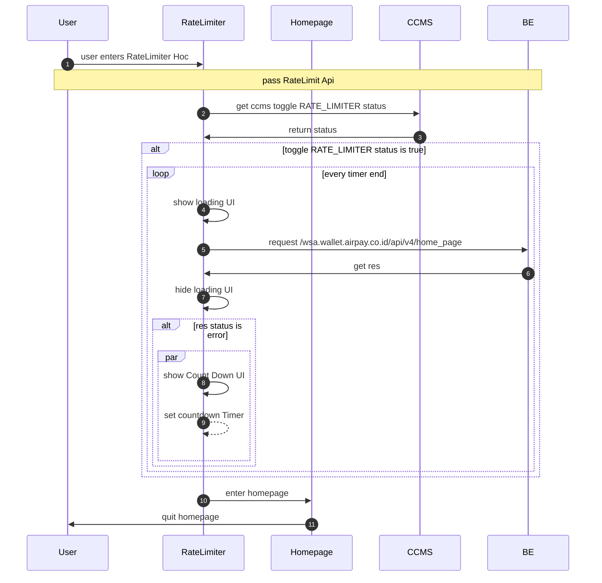
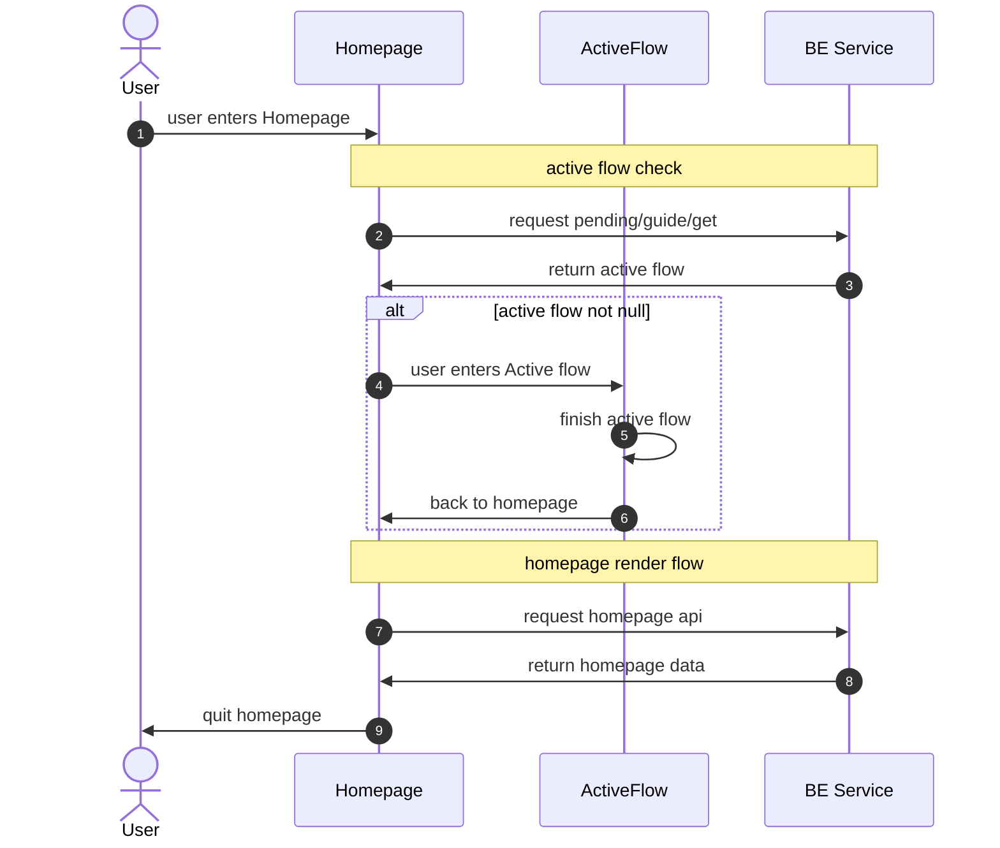
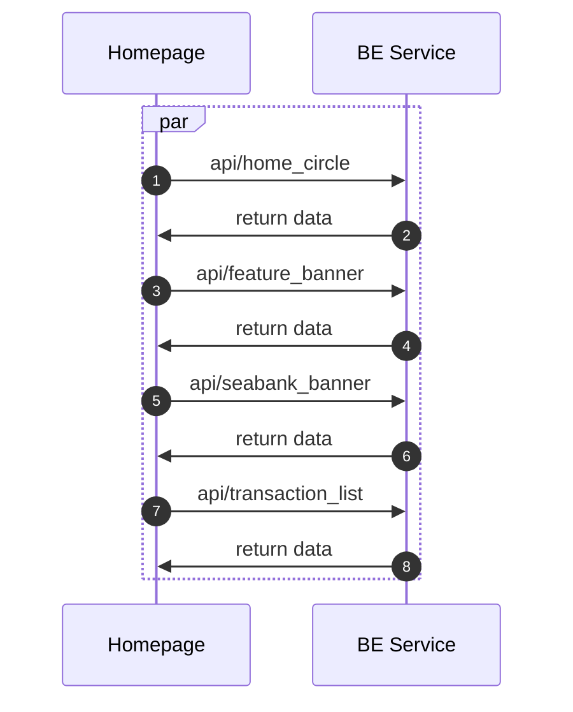

```
+------------------------------+
|         Prefetcher<T>        |
+------------------------------+
| - prefetchStore: PrefetchStore<T> |
| - shouldPrefetch: boolean    |
+------------------------------+
| + constructor()              |
| + register(pageName: string, fetcher: Fetcher) |
| + prefetch(pageName: string, pageParams: Object): boolean |
| + has(key: string): boolean  |
| + peek(key: string): T \| undefined |
| + get(key: string): T \| undefined |
| + set(key: string, data: T): Promise<boolean> |
| + setIsPrefetching(shouldPrefetch: boolean): void |
| + isCurrentlyPrefetching(): boolean |
| + withPrefetch(fn: () => Promise<any> \| void): Promise<any> \| void |
+------------------------------+

+------------------------------+
|       PrefetchStore<T>       |
+------------------------------+
| - store: Map<string, T>      |
| - timestamps: Map<string, number> |
| - expiryMS: number           |
| - timeoutIds: Map<string, TimeoutID> |
+------------------------------+
| + constructor(expiryMS?: number) |
| + set(key: string, data: T): boolean |
| + has(key: string): boolean  |
| + get(key: string): T \| void |
| + pop(key: string): T \| void |
| - _hasExpired(timestamp: number): boolean |
| - _delete(key: string): void |
| - _checkPrefetchRequestTimeout(key: string): void |
| - _clearTimeout(key: string): void |
+------------------------------+

```








