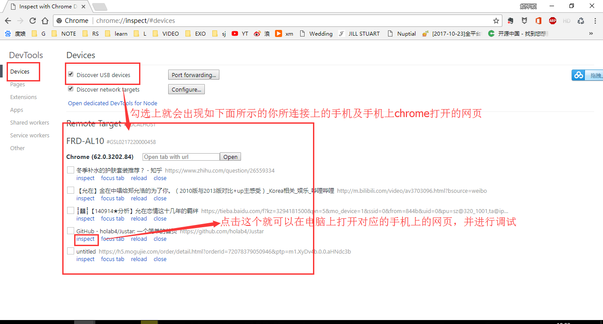

# vue 项目配置移动端适配(vw)

## 前提

## rem(根据根，html 的字体大小)兼容性相对比较好

rem 实际上是把屏幕分成了 **分辨率宽度/根字体大小** 个栅格，这是个十分巧妙的办法，尤其适应类似文章页面文字较多的情况，而 em 其实是依据**父元素的 font-size**，原理和 rem 是完全一样的，比较适合**相对较局部**的自适应问题

rem 实现页面自适应
结合 media 媒体查询，将 html 的 font-size 设置为 (屏幕宽度/设计图宽度)\*16px

如果想要改 HTML 文件的 font-zize，直接在 css 中加

```css
html {
  font-size: 14px;
}
```

## vw(新特性，兼容性对老浏览器相对叫差)

## vh 和 vw

根据 CSS3 规范，视口单位主要包括以下 4 个：“视口”所指为**浏览器内部的可视区域大小**，

1. vw : 1vw 等于视口宽度的 1%
2. vh : 1vh 等于视口高度的 1%
3. vmin : 选取 vw 和 vh 中最小的那个
4. vmax : 选取 vw 和 vh 中最大的那个

兼容性问题可以采取就是使用 viewport 的`polyfill`：`Viewport Units Buggyfill`来解决

## 参考文章

https://www.jianshu.com/p/1f1b23f8348f

## 开发过程中需要的插件

1. postcss-px-to-viewport 这个插件来转换 vw

2. postcss-viewport-units 这个插件将让你无需关注 content 的内容，插件会自动帮你处理。比如插件处理后的代码：

上面这两个插件，都是自己开发的时候，用的是 px 来开发，然后通过 webpack 插件来实现构建过程中转换成 vw 的

当然我们可以一开始就用 vw 来写元素的宽高度，这样的应用出来的确是移动端适配的，所以我们只需要考虑到兼容性的问题

```
//在vue项目中引入一个规划好的scss文件
//base.scss
$primary: #1966ff;

$themeColor: #089cfd;
$btnColor: #1966ff;
$btnHover: #1979ff;
$btnActive: #1442cc;

$menuTextColor: #6a6a73;
$menuActiveAfter: #ffffff;
$menuActiveTextColor: #ffffff;

$vwBase: 750; // 设计稿宽750px

@function vw($px) {
  @return ($px / $vwBase) * 100vw;
}

// 处理elementui多个massage消息并存
.el-message {
  top: 20px !important;
  transition: none;
}

//然后我们在vue文件的开发过程中只需要引入这个scss文件，然后我们设计稿规定的32px的元素只需要写成 vw(32)在编译的过程就会自动换算成vw。

div{
  height:vw(32)
  width: vw(100)
}
```

## 如何解决兼容性问题

https://www.jianshu.com/p/b26dce4d548f


## 移动端web项目，怎么本地在手机测试
https://jingyan.baidu.com/article/295430f192e3440c7e0050b4.html

简单点说就是手机和电脑连同一个wifi,然后手机访问电脑的ip+项目开启的端口号

例如 http://172.24.69.124:7500便可以连接上


## PC如何调试移动端的web网页

## 真机调试(没成功过)
https://blog.csdn.net/yutao_1234/article/details/80031655

## 摸索出来的新方法
电脑下个android studio，然后装虚拟机，因为android studio 有各个版本号的Android镜像，所以拿来本地调试各大安卓版本的兼容性再好不过了。但是前提是电脑内存要足够大，至少16G以上

下完android studio之后，记得要勾选AVD，然后打开AMD，新建虚拟机，下一个你想要的Android 版本的镜像，然后配置好你这台虚拟机的参数，开机便可。

然后在虚拟机打开chrome，输入你本地项目的地址，便可在虚拟机上看到手机网页，然后打开电脑上的chrome，在地址栏输入 `about:inspect `；你会看到在你虚拟机上打开的网页，点击inspect，便可以调试虚拟机上的网页。

