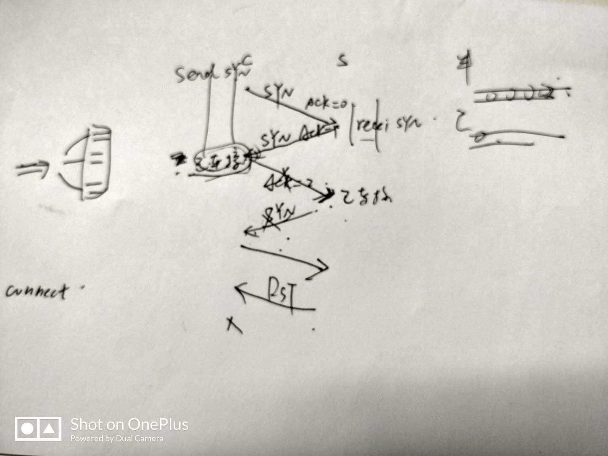
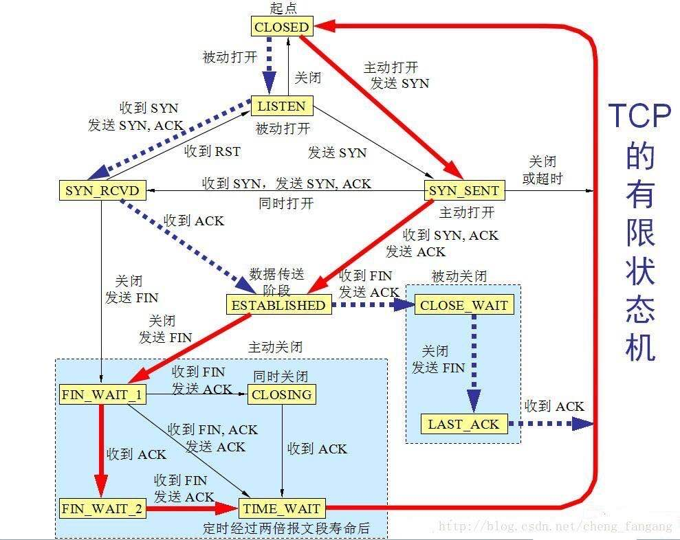

## IP 组播

它通过使用特定的 IP 组播地址，按照最大投递的原则，将 IP 数据包传输到一个组播群组（multicast 　 group）的主机集合。它的基本方法是：当某一个人向一组人发送数据时，它不必将数据向每一个人都发送数据，只需**将数据发送到一个特定的预约的组地址**，**所有加入该组的人**均可以收到这份数据。这样对发送者而言，数据只需发送一次就可以发送到所有接收者，**大大减轻了网络的负载和发送者的负担**。

### 优点

- 组播可以增强报文发送效率，控制网络流量，减少服务器和 CPU 负载；
- 组播可以优化网络性能，消除流量冗余；
- 组播可以适应分布式应用，当接收者数量发生变化时，网络流量的波动很平稳。

## TCP 的三次握手

https://www.cnblogs.com/bj-mr-li/p/11106390.html

### TCP 三次握手状态机

（1）CLOSED 状态时初始状态。

（2）LISTEN:被动打开，服务器端的 状态变为 LISTEN(监听)。被动打开的概念：连接的一端的应用程序通知操作系统，希望建立一个传入的连接。这时候操作系统为连接的这一端建立一个连 接。与之对应的是主动连接：应用程序通过主动打开请求来告诉操作系统建立一个连接。

（3）SYNRECVD:服务器端收到 SYN 后，状态为 SYN；发送 SYN ACK;

（4）SYN_SENTY:应用程序发送 SYN 后，状态为 SYN_SENT；

（5）ESTABLISHED:SYNRECVD 收到 ACK 后，状态为 ESTABLISHED； SYN_SENT 在收到 SYN ACK，发送 ACK，状态为 ESTABLISHED；

（6）CLOSE_WAIT:服务器端在收到 FIN 后，发送 ACK，状态为 CLOSE_WAIT；如果此时服务器端还有数据需要发送，那么就发送，直到数据发送完毕；此时，服务器端发送 FIN，状态变为 LAST_ACK;

（7）FIN_WAIT_1：应用程序端发送 FIN，准备断开 TCP 连接；状态从 ESTABLISHED——>FIN_WAIT_1；

（8）FIN_WAIT_2：应用程序端只收到服务器端得 ACK 信号，并没有收到 FIN 信号；说明服务器端还有数据传输，那么此时为半连接；

（9）TIME_WAIT:有两种方式进入 该状态：1、FIN_WAIT_1 进入：此时应用程序端口收到 FIN+ACK（而不是像 FIN_WAIT_2 那样只收到 ACK，说明数据已经发送完毕）并 向服务器端口发送 ACK；2、FIN_WAIT_2 进入：此时应用程序端口收到了 FIN，然后向服务器端发送 ACK；TIME_WAIT 是为了实现 TCP 全双工连接的可靠性关闭，用来重发可能丢失的 ACK 报文；需要持续 2 个 MSL(最大报文生存时间)：假设应用程序端口在进入 TIME_WAIT 后，2 个 MSL 时间内并没有收到 FIN,说明应用程序最后发出的 ACK 已经收到了；否则，会在 2 个 MSL 内在此收到 ACK 报文；

4.1.客户端应用程序的状态迁移图
客户端的状态可以用如下的流程来表示：
CLOSED->SYN_SENT->ESTABLISHED->FIN_WAIT_1->FIN_WAIT_2->TIME_WAIT->CLOSED
以上流程是在程序正常的情况下应该有的流程，从书中的图中可以看到，在建立连接时，当客户端收到 SYN 报文的 ACK 以后，客户端就打开了数据交互地连接。而结束连接则通常是客户端主动结束的，客户端结束应用程序以后，需要经历 FIN_WAIT_1，FIN_WAIT_2 等状态，这些状态的迁移就是前面提到的结束连接的四次握手。

4.2.服务器的状态迁移图
服务器的状态可以用如下的流程来表示：
CLOSED->LISTEN->SYN 收到->ESTABLISHED->CLOSE_WAIT->LAST_ACK->CLOSED
在建立连接的时候，服务器端是在第三次握手之后才进入数据交互状态，而关闭连接则是在关闭连接的第二次握手以后（注意不是第四次）。而关闭以后还要等待客户端给出最后的 ACK 包才能进入初始的状态。

4.3.其他状态迁移
书中的图还有一些其他的状态迁移，这些状态迁移针对服务器和客户端两方面的总结如下
LISTEN->SYN*SENT，对于这个解释就很简单了，服务器有时候也要打开连接的嘛。
SYN_SENT->SYN 收到，服务器和客户端在 SYN_SENT 状态下如果收到 SYN 数据报，则都需要发送 SYN 的 ACK 数据报并把自己的状态调整到 SYN 收到状态，准备进入 ESTABLISHED
SYN_SENT->CLOSED，在发送超时的情况下，会返回到 CLOSED 状态。
SYN*收到->LISTEN，如果受到 RST 包，会返回到 LISTEN 状态。
SYN\_收到->FIN_WAIT_1，这个迁移是说，可以不用到 ESTABLISHED 状态，而可以直接跳转到 FIN_WAIT_1 状态并等待关闭。

4.4.2MSL 等待状态
书中给的图里面，有一个 TIME_WAIT 等待状态，这个状态又叫做 2MSL 状态，说的是在 TIME_WAIT2 发送了最后一个 ACK 数据报以后，要进入 TIME_WAIT 状态，这个状态是防止最后一次握手的数据报没有传送到对方那里而准备的（注意这不是四次握手，这是第四次握手的保险状态）。这个状态在很大程度上保证了双方都可以正常结束，但是，问题也来了。

由于插口的 2MSL 状态（插口是 IP 和端口对的意思，socket），使得应用程序在 2MSL 时间内是无法再次使用同一个插口的，对于客户程序还好一些，但是对于服务程序，例如 httpd，它总是要使用同一个端口来进行服务，而在 2MSL 时间内，启动 httpd 就会出现错误（插口被使用）。为了避免这个错误，服务器给出了一个平静时间的概念，这是说在 2MSL 时间内，虽然可以重新启动服务器，但是这个服务器还是要平静的等待 2MSL 时间的过去才能进行下一次连接。

4.5.FIN_WAIT_2 状态
这就是著名的半关闭的状态了，这是在关闭连接时，客户端和服务器两次握手之后的状态。在这个状态下，应用程序还有接受数据的能力，但是已经无法发送数据，但是也有一种可能是，客户端一直处于 FIN_WAIT_2 状态，而服务器则一直处于 WAIT_CLOSE 状态，而直到应用层来决定关闭这个状态。
5.RST，同时打开和同时关闭
RST 是另一种关闭连接的方式，应用程序应该可以判断 RST 包的真实性，即是否为异常中止。而同时打开和同时关闭则是两种特殊的 TCP 状态，发生的概率很小。

## TCP 的四次挥手

## Socket 通信

**网络上的两个程序通过一个双向的通信连接实现数据的交换，这个连接的一端称为一个 socket**，建立网络通信连接至少要一对端口号(socket)。socket 本质是编程接口 API，对 TCP/IP 的封装，TCP/IP 也要提供可供程序员做网络开发所用的接口，这就是 Socket 编程接口。

socket 利用客户/服务器模式巧妙地解决了进程之间建立通信连接的问题。服务器 socket 半相关为全局所公认非常重要。读者不妨考虑一下，两个完全随机的用户进程之间如何建立通信？假如通信双方没有任何一方的 socket 固定，就好比打电话的双方彼此不知道对方的电话号码，要通话是不可能的。

## 进程间通信的方式

socket 通信方式是进程通信的一种,先列举一下进程通信的种类:1）管道：管道是一种半双工的通信方式，数据只能单向流动，而且只能在具有亲缘关系的进程之间使用。进程的 亲缘关系通常是指父子进程关系。2）有名管道（FIFO）：有名管道也是半双工的通信方式，但是允许在没有亲缘关系的进程之间使用，管道是先进 先出的通信方式。3）信号量：信号量是一个计数器，可以用来控制多个进程对共享资源的访问。它常作为一种锁机制，防止某进程 正在访问共享资源时，其他进程也访问该资源。因此，主要作为进程间以及同一进程内不同线程之间的同步手 段。4）消息队列：消息队列是有消息的链表，存放在内核中并由消息队列标识符标识。消息队列克服了信号传递信息 少、管道只能承载无格式字节流以及缓冲区大小受限等缺点。5）信号 ( sinal ) ：信号是一种比较复杂的通信方式，用于通知接收进程某个事件已经发生。6）共享内存( shared memory) 共享内存就是映射一段能被其他进程所访问的内存，这段共享内存由一个进程创建，但多个进程都可以访问。共享内存是最快的 IPC 方式，它是针对其他进程间通信方式运行效率低而专门设计的。它往往与其他通信机制 如信号量，配合使用，来实现进程间的同步和通信。7）套接字( socket ) ：套接字也是一种进程间通信机制，与其他通信机制不同的是，它可用于不同机器间的进程 通信。
